セキュリティシグナル
===

> [!IMPORTANT]
> AWS CloudTrailは[約5分ごと](https://docs.aws.amazon.com/awscloudtrail/latest/userguide/how-cloudtrail-works.html#:~:text=CloudTrail%20publishes%20log%20files%20multiple%20times%20an%20hour%2C%20about%20every%205%20minutes.%20These)にログファイルを公開します。Signals Explorerでシグナルを確認するには、数分待つ必要がある場合があります。

1. Datadogで、**[Security > Cloud SIEM > Signals](https://app.datadoghq.com/security?query=@workflow.rule.type:(%22Log%20Detection%22%20OR%20%22Signal%20Correlation%22)&product=siem)** に移動します。

2. Signals Explorerで、攻撃によってトリガーされたシグナルを確認します：

    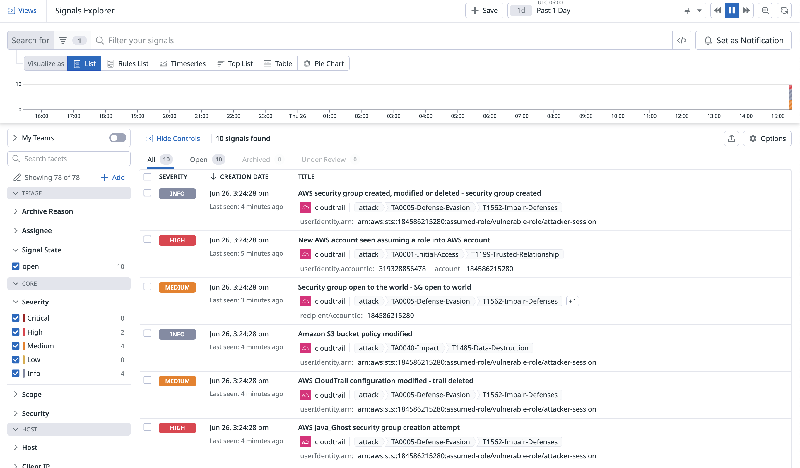

    攻撃によっていくつかのシグナルが生成されました！

3. シグナルのトリアージを開始します。**Severity**ファセットを使用して、`Info`または`Low`の重要度ステータスを持つ[シグナルをフィルタリング](https://app.datadoghq.com/security?query=%40workflow.rule.type%3A%28%22Log%20Detection%22%20OR%20%22Signal%20Correlation%22%29%20-status%3A%28low%20OR%20info%29&agg_m=count&agg_m_source=base&agg_t=count&column=time&fromUser=false&order=desc&product=siem&start=1710285623265&end=1710372023265&paused=false)します。

    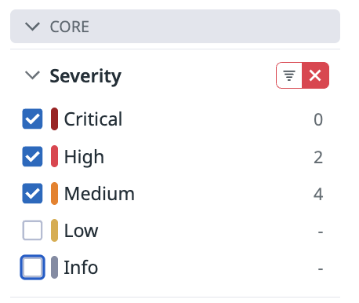

    次のクエリフィルタをコピー＆ペーストすることもできます：

    ```copy
    -status:(low OR info)
    ```

4. **AWS Java_Ghost security group creation attempt**シグナルを見つけます。このシグナルは`high`重要度です。

    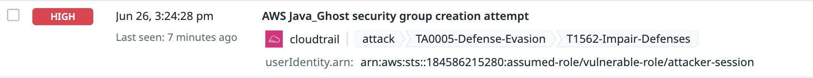

    > [!NOTE]
    > これは攻撃の最後のアクションだったため、最後に到着するシグナルになる可能性があります。待っている間、他のセキュリティシグナルを開いて探索してみてください。攻撃に関連する検知ルールのいくつかを探索することもできます。
    >
    > - **[AWS IAM AdministratorAccess policy was applied to a user](https://app.datadoghq.com/security/configuration/siem/rules/edit/def-000-sd5)**
    > - **[AWS CloudTrail configuration modified - trail deleted](https://app.datadoghq.com/security/configuration/siem/rules/edit/cf4-844-4a00)**
    > - **[Security group open to the world](https://app.datadoghq.com/security/configuration/siem/rules/edit/6f3-c4d-9f0)**
    >
    > **AWS Java_Ghost security group creation attempt**シグナルを確認するのに5分以上待つ必要はありません。

5. シグナルをクリックして、サイドパネルでシグナルを開きます。

    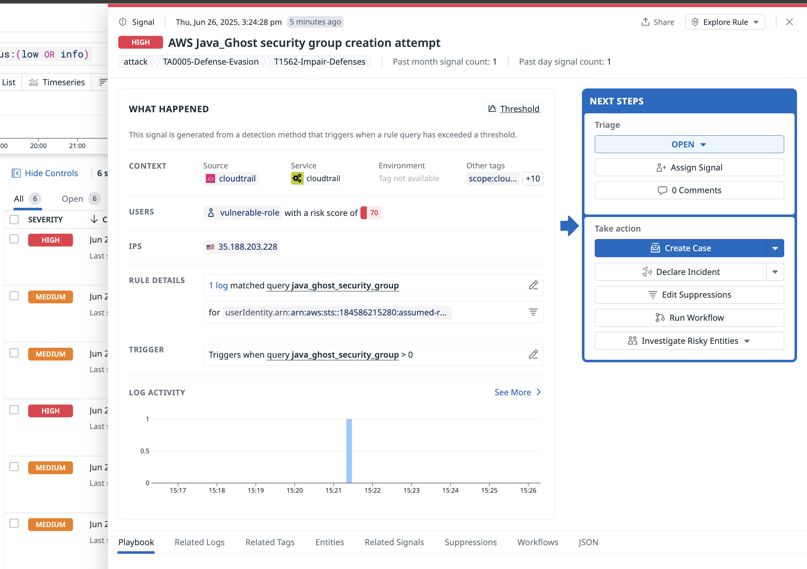

6. **Playbook**セクションを見つけます。このセクションには、ルールの説明、ルールの背後にある戦略、推奨されるトリアージと対応手順が含まれています。

    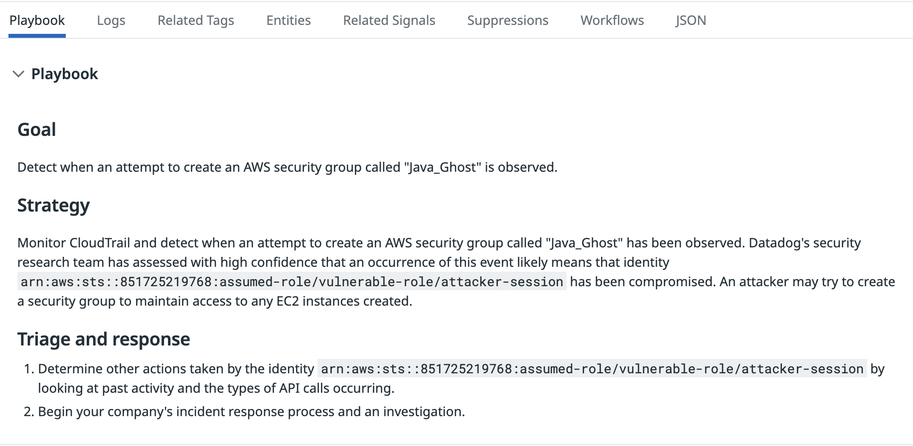

    > [!NOTE]
    > この情報は、次のラボアクティビティでより詳細に使用します。今のところ、基本的なコンポーネントとナビゲーションに慣れてください。

7. **Related Logs**をクリックして、このシグナルに関連するログを確認します。

    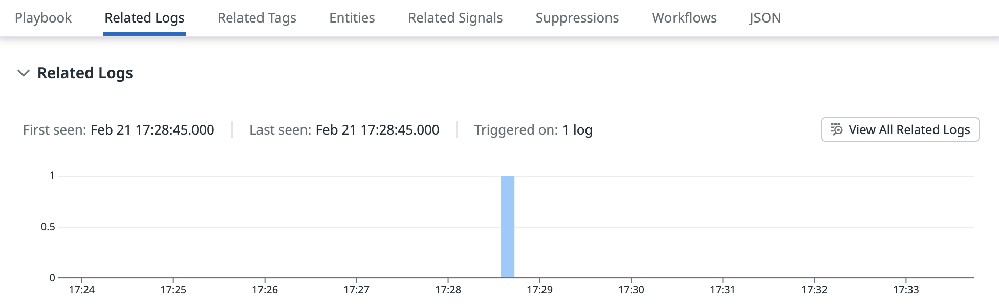

8. **Previewing 1 related log**の下で、ログをクリックして詳細なログビューを開きます。

    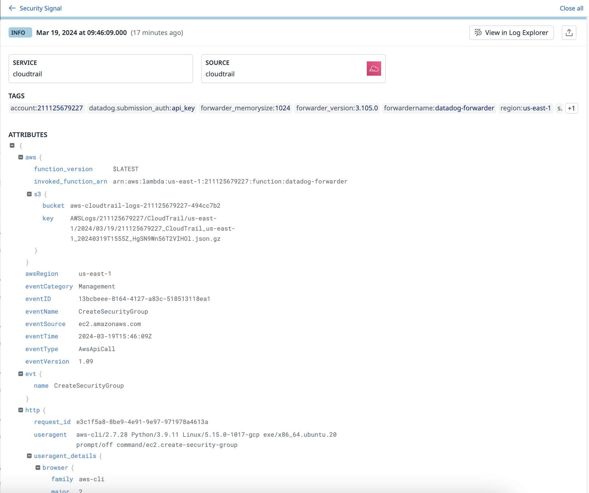

9. 左上の**Security Signal**をクリックして、シグナルに戻ります。

    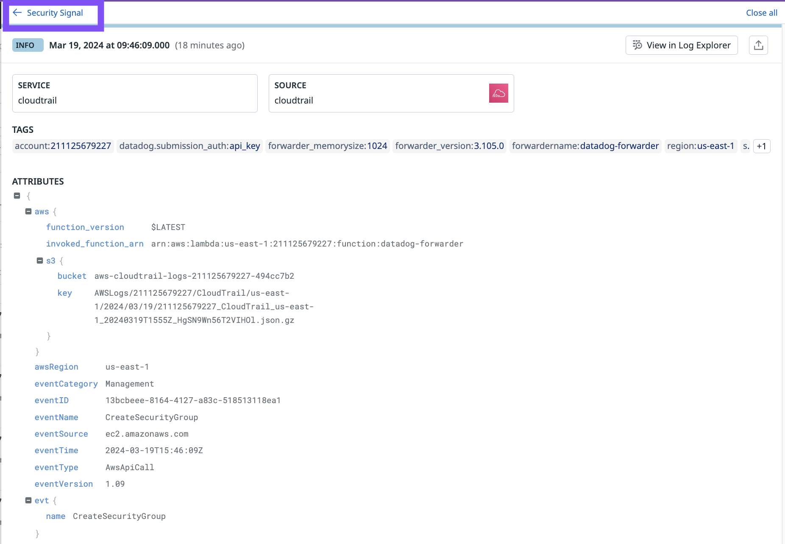

10. **Related Signals**をクリックして、関連するアクティビティを確認します。

    

11. **Entities**をクリックして、このセキュリティシグナルに関連して検知されたIAMエンティティとアイデンティティを記述するグラフを表示します。

    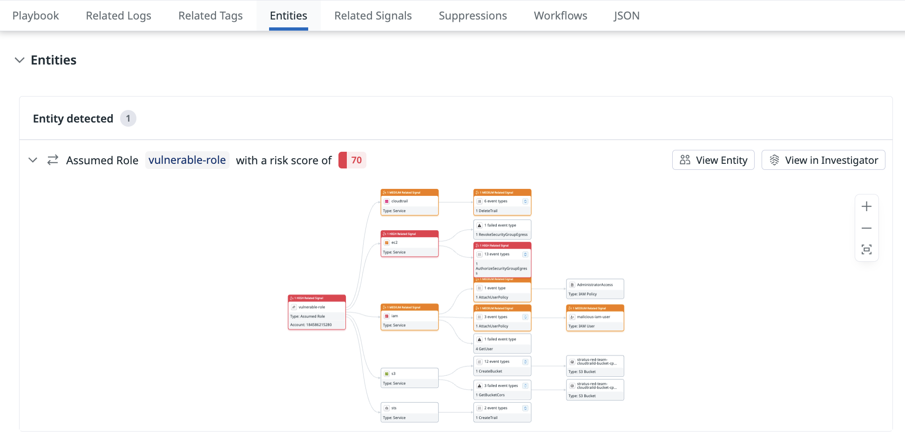

    このグラフについては、次のラボアクティビティで詳しく学びます。

12. セキュリティシグナルの右上隅にある**Explore Rule**をクリックします。

13. **Edit Rule**をクリックして、セキュリティシグナルから直接検知ルールを開きます。

    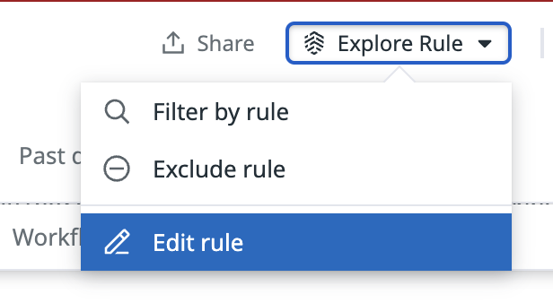

    検知ルールが新しいタブで開きます。これはOOTB検知ルールです。

    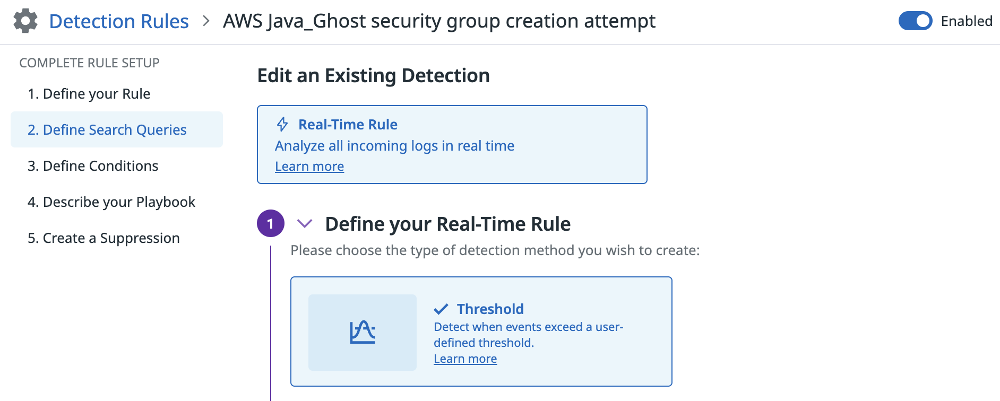

14. 新しいタブを閉じて、**AWS Java_Ghost security group creation attempt**シグナルに戻ります。

セキュリティシグナルとSignals Explorerに慣れたので、**Playbook**を使用して調査を開始します。

シグナルステータスを割り当てる
===
**AWS Java_Ghost security group creation attempt**シグナルと、同じ時間枠で生成された他のcriticalまたはhigh重要度のシグナルから調査を開始することにします。

関連するシグナルの状態とユーザー割り当てを設定することから始めます。これにより、同僚にあなたが対応していることを知らせます。

1. `esc`キーを使用するか、Xアイコンをクリックして、**AWS Java_Ghost security group creation attempt**シグナルから一時的に退出します。

2. [Signals Explorer](https://app.datadoghq.com/security?query=%40workflow.rule.type%3A%28%22Log%20Detection%22%20OR%20%22Signal%20Correlation%22%29%20status%3A%28critical%20OR%20high%29%20&column=time&fromUser=true&order=desc&product=siem&start=1710243626363&end=1710258026363&paused=false)で、次のクエリフィルタを使用します：
   
    ```copy
    status:(critical OR high)
    ```  

3. チェックボックスを選択して、すべてのシグナルを一度に選択します。

    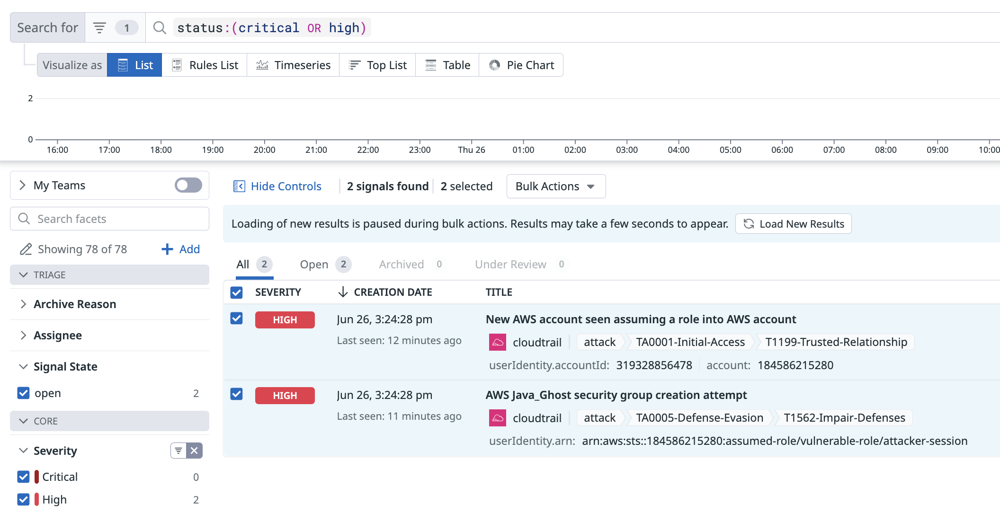

4. シグナルリストの上にある**Bulk Actions**ドロップダウンを使用して、両方のシグナルの状態を**Under Review**に設定します。

    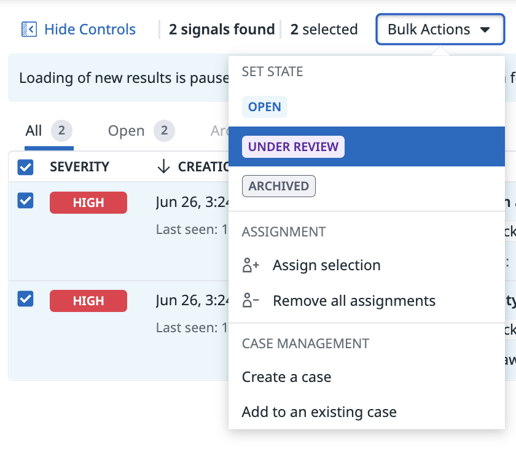

5. 警告がポップアップ表示されます。**Change Status**をクリックして変更を確認します。

    

6. 両方のシグナルがまだ選択されていることを確認します。

    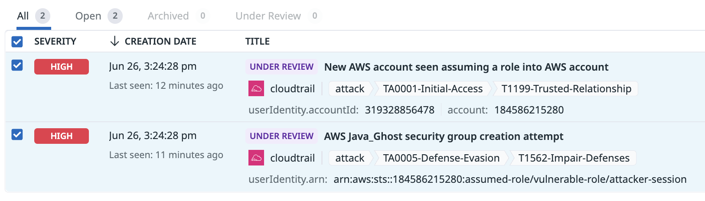

7. **Bulk Actions**ドロップダウンで、**Assign Selection**を選択します。

    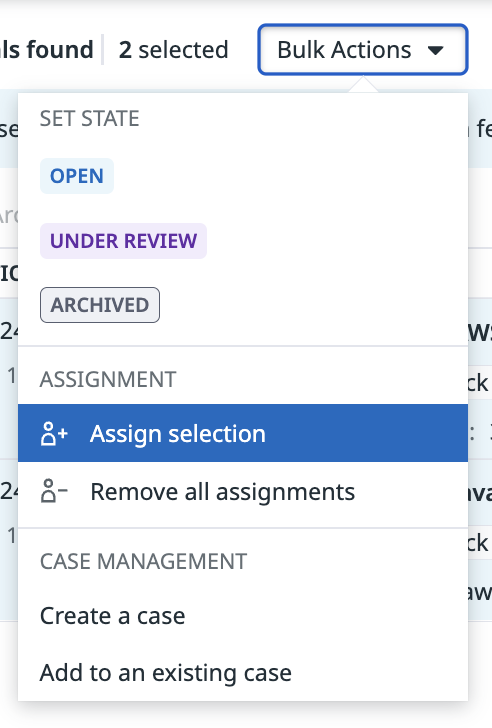

8. `assign to me`と注釈されたユーザーを選択して、シグナルを自分に割り当てます。

    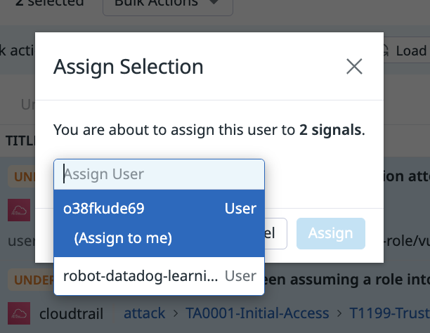

9. **Assign**をクリックします。

    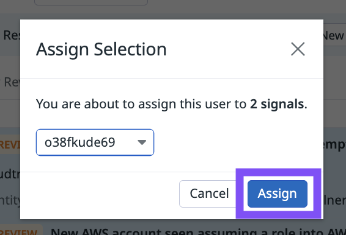

10. **[Signals Explorer](https://app.datadoghq.com/security)** で、両方のシグナルが`UNDER REVIEW`のステータスを持ち、Datadogトライアルアカウントユーザーに割り当てられました。

    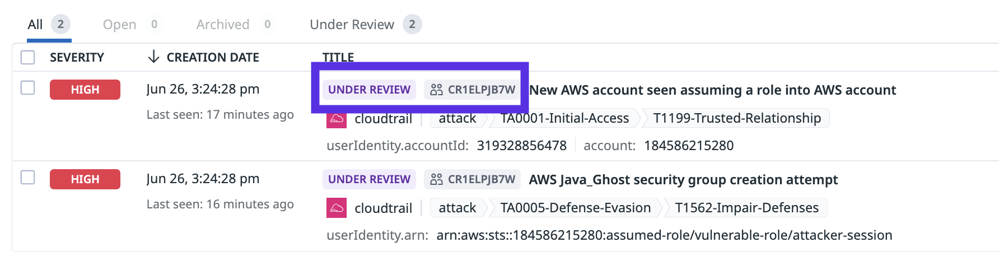

これで、チームはどのシグナルがレビュー中で、誰が調査を主導しているかを迅速に確認できます。
   
Cloud SIEM Investigatorを開く
===

次の手順に従って、**AWS Java_Ghost security group creation attempt**シグナルの調査を続けます：

1. [Signals Explorer](https://app.datadoghq.com/security?query=%40workflow.rule.type%3A%28%22Log%20Detection%22%20OR%20%22Signal%20Correlation%22%29%20status%3A%28critical%20OR%20high%29%20&column=time&fromUser=true&order=desc&product=siem&start=1710243626363&end=1710258026363&paused=false)で、**AWS Java_Ghost security group creation attempt**シグナルを開きます。

2. **Playbook**セクションに戻ります。

        

3. **Triage and Response**の下に記載されている手順を読みます。

    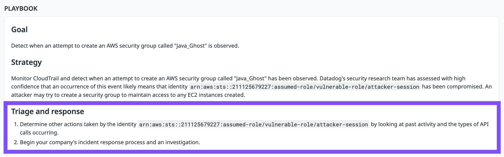

4. 最初のトリアージステップは、このイベントの原因となったAWS IAMアイデンティティによって実行された他のアクションを特定することです。これはCloud SIEM Investigatorを使用して行うことができます。

   1. シグナルで、**Entities**タブをクリックします。

   2. **View in Investigator**をクリックします。

       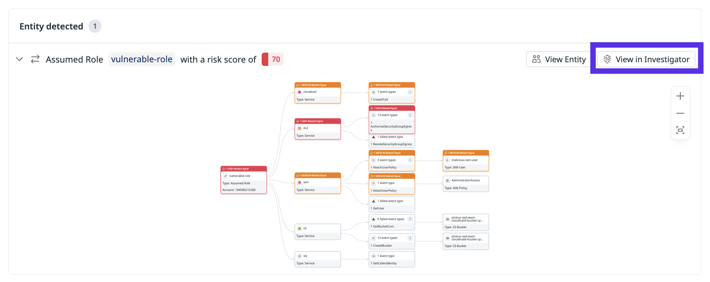

   3. Cloud SIEM Investigatorが新しいタブで開きます。

       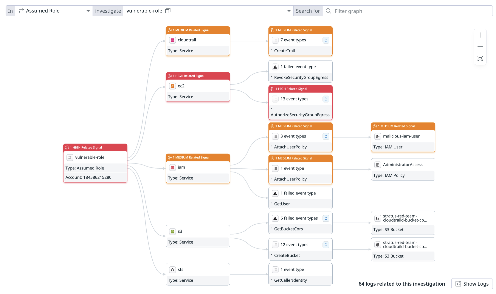

ここでは、選択した時間枠で`vulnerable-role`が実行したアクションの概要を一目で確認できます。

   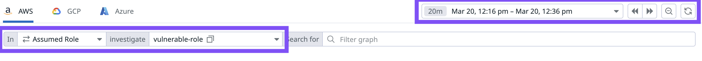

> [!IMPORTANT]
> データが表示されない場合は、時間枠を**Past 4 Hours**に設定してください。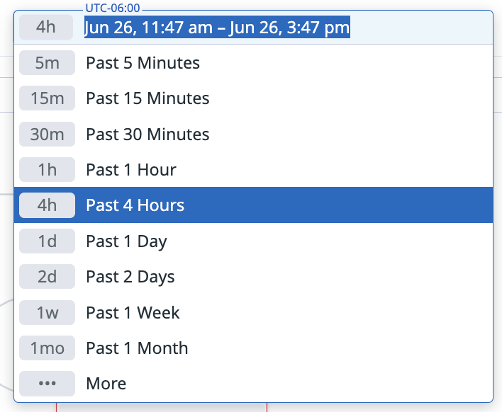

Cloud SIEM Investigatorを使用する
===

> [!NOTE]
> Investigatorグラフをクリックしてドラッグし、画面上でグラフの位置を変更できます。

次に、Cloud SIEM Investigatorを使用してさらに調査します。

1. **vulnerable-role**にカーソルを合わせて、選択した時間枠でこのアイデンティティによって実行されたアクションを記述する注釈を表示します。

    

2. **s3**にカーソルを合わせて、特定のパスを強調表示して注釈を付けます。

    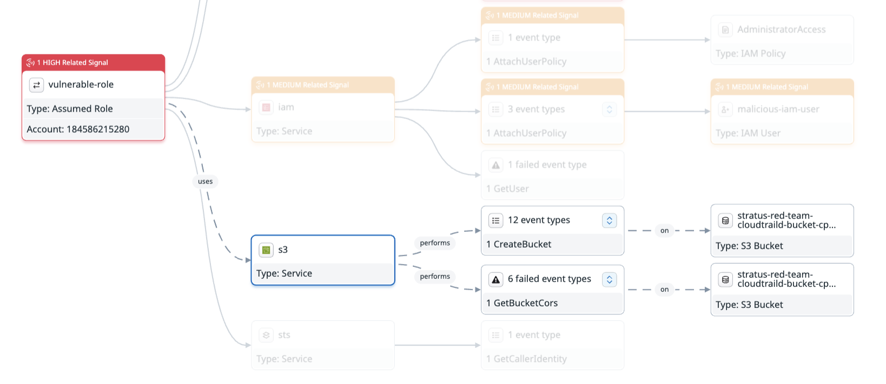

    この例では、注釈は`vulnerable-role`エンティティがs3サービスを使用して複数のリソースで複数のイベントタイプを実行することを記述しています。

3. **ec2**サービスのノードをクリックして、**View related signals**をクリックします。

    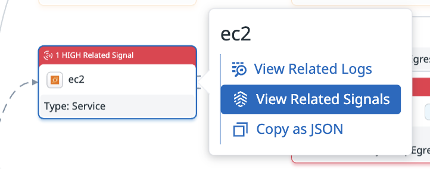

    セキュリティシグナルのリストがサイドパネルで開きます。これらのシグナルは、指定された時間枠でこのアイデンティティによって生成されたec2イベントに関連しています。

4. `esc`キーを使用するか、バックグラウンドのCloud SIEM investigatorをクリックして、セキュリティシグナルパネルを閉じます。

アクティビティのまとめ
===
素晴らしい！Cloud SIEM Signals ExplorerとCloud SIEM Investigatorを使用して、侵入攻撃を検知し調査しました。

この時点で、調査を続けるにはいくつかの方法があります。複数の疑わしいイベントが`vulnerable-role`から発生していることがわかるため、他の損害を修復する前に、このアクセスポイントを遮断することに焦点を当てることにします。

**Next**ボタンを使用して次のラボアクティビティに進んでください。

