攻撃者のアクセスポイントを調査する
=== 
このアクティビティでは、**[Cloud SIEM Investigator](https://app.datadoghq.com/security/investigator/aws?id=vulnerable-role&name=vulnerable-role&type=role)** を使用して、これらの`vulnerable-role`アクションを取り巻く状況についてより詳しい情報を見つけることができるか確認します。

> [!NOTE]
> データが表示されない場合は、時間が**Past 4 Hours**に設定されていることを確認してください。
> 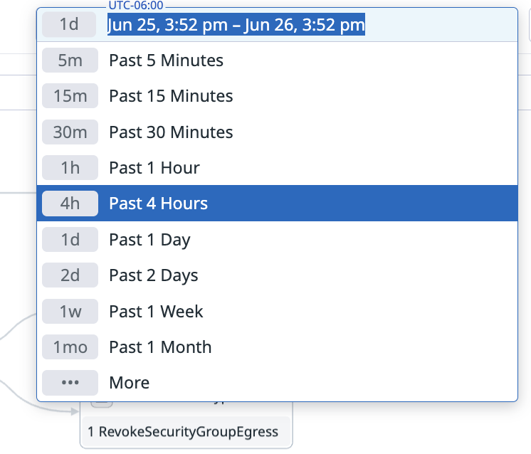

1. Cloud SIEM investigatorで、**vulnerable-role**ノードにカーソルを合わせます。

   1. **vulnerable-role**ノードをクリックします。

   2. **View Related Logs**をクリックします。

        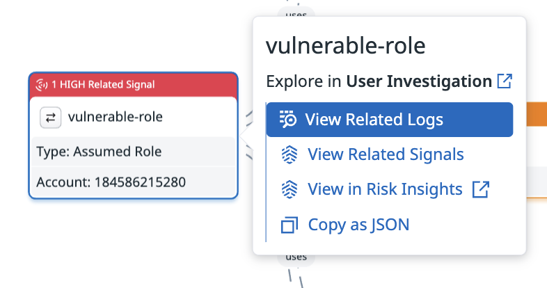

   3. **SESSION NAME**列に注意してください。AWSでIAMロールが引き受けられるたびに、ロールセッションが作成されます。多くの疑わしいイベントが`attacker-session`セッションから発生していることがわかります。

       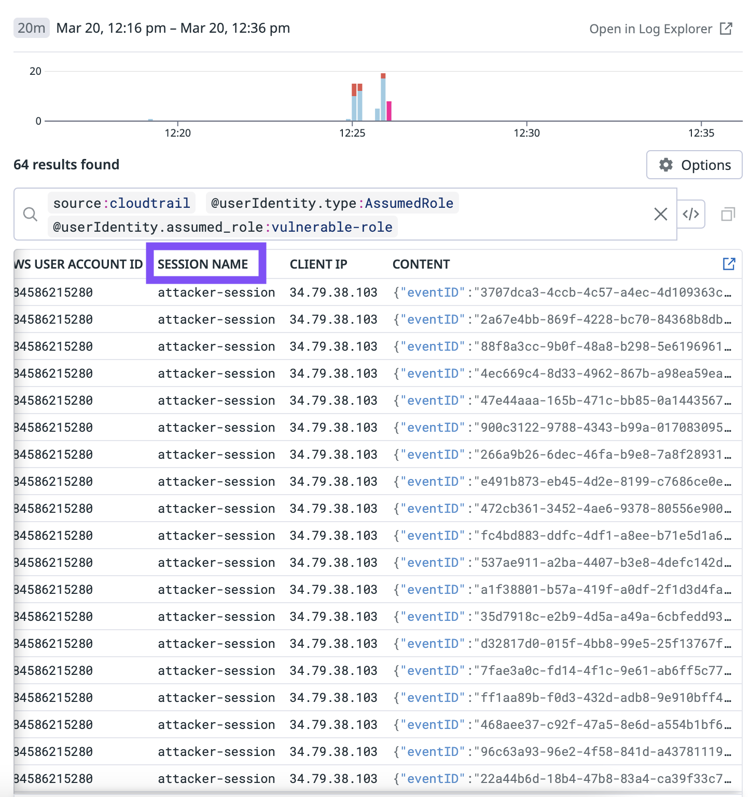

       `attacker-session`について詳しく知るには、好みに応じて多くの方法があります。1つの戦略は、ログをクエリすることです。これはCloud SIEM Investigatorから実行できます。

2. ログクエリフィルタを次のように変更します：
    
    ```copy
    @evt.name:AssumeRole @requestParameters.roleSessionName:attacker-session
    ``` 
    
    これで、`attacker-session`が作成された単一のイベントを明確に確認できます。

    **AWS USER ACCOUNT ID**の下で、`AssumeRole`アクションがID `[[ アタッカー用のAWSアカウントID ]]`を持つAWSアカウントから実行されたことがわかります。この情報は、完全なログの詳細を表示することでも確認できます。

3. ログ行をクリックして、ログの詳細を開きます。

    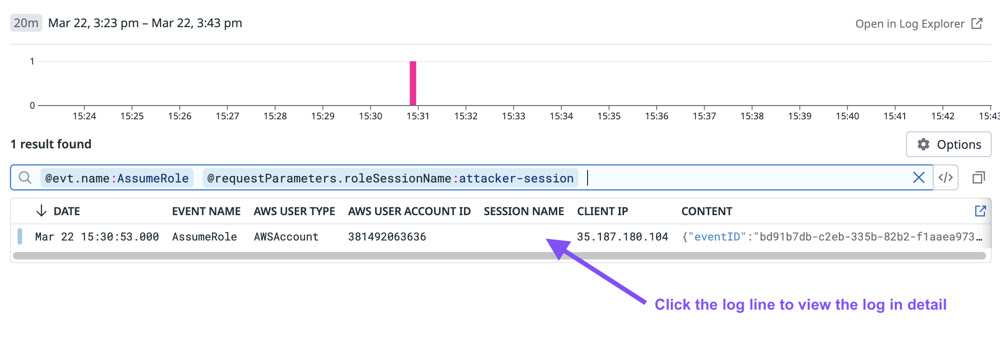

    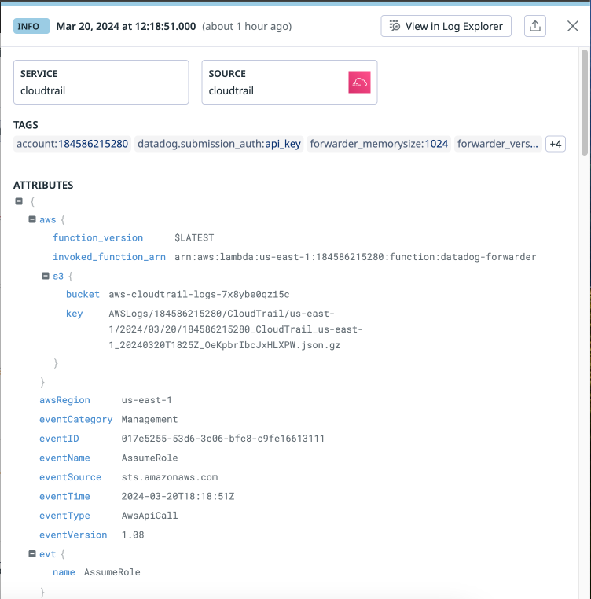

4. ログをスクロールします。`userIdentity`ファセットグループには、`vulnerable-role`を引き受けてセッションを作成したアイデンティティに関するデータが含まれています。`accountId`属性を見つけて、値をコピーします。

    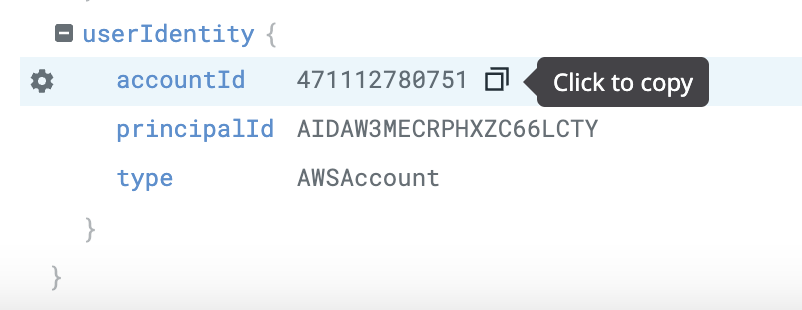

5. `esc`キーまたはXアイコンを使用して、ログとシグナルを閉じます。

6. Cloud SIEM investigatorで、**In**フィールドを**AWS Account**に変更します。

    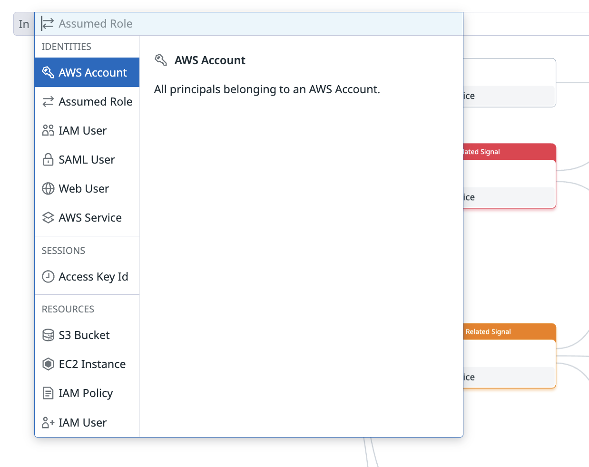

    > [!NOTE]
    > ログから特定のAWSアカウントIDを知らなくても、ここから調査を開始できます。たとえば、セキュリティシグナルを持つ外部のAWSアカウントIDを探すことができます。
    
7. **investigate**フィールドに、ログから取得した疑わしいAWSアカウントIDをコピーして、Enterキーを押します。

    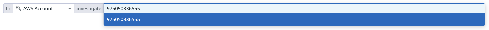

8. Cloud SIEM Investigatorが、`[[ アタッカー用のAWSアカウントID ]]`アカウントに焦点を当てた調査を準備して開きます。

9. Cloud SIEM Investigatorで、`[[ アタッカー用のAWSアカウントID ]]` AWSアカウントIDのノードにカーソルを合わせます。

    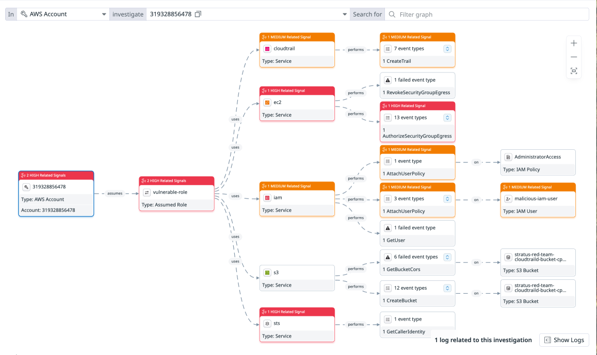

外部のAWSアカウントがあなたのAWSアカウントにロールを引き受け、いくつかのAWSサービスを使用して疑わしいアクションを実行している完全な攻撃パスが表示されます。

攻撃者のアクセスポイントを修復する
=== 

次に、侵害されたIAMロールが再び悪用される前に修正したいと考えています。次の手順を使用して、脆弱なIAMロールへのアクセスを遮断します：

1. Cloud SIEM Investigatorで、攻撃者のアカウントID番号にカーソルを合わせて、**View related signals**をクリックします。

    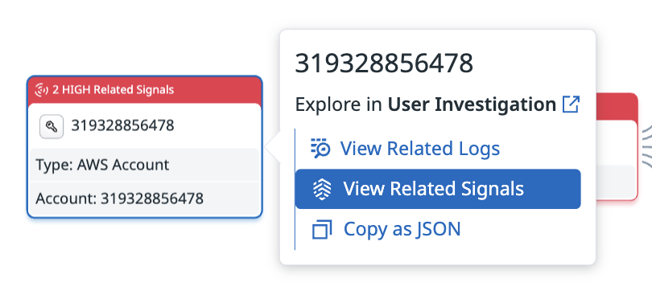

2. **New AWS account assuming a role into AWS account**シグナルをクリックします。

    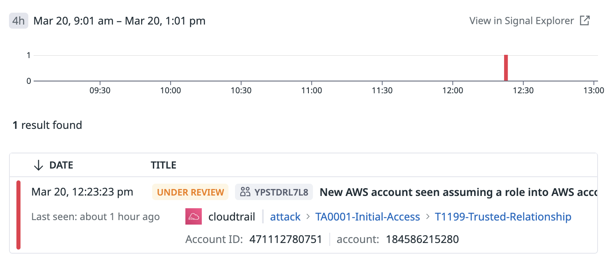

    > [!NOTE]
    > これは、Signals Explorerで以前に自分に割り当てたシグナルの1つでもあります。このシグナルを調査することは、`attacker-session`と外部AWSアカウントID番号を特定できたもう1つの方法です。

3. **New AWS account assuming a role into AWS account**セキュリティシグナルを開きます。

4. **JSON**タブをクリックします。

5. イベントJSONでロール名を見つけます。

    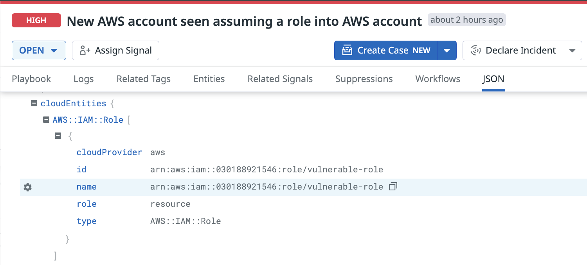

6. ロール名を使用して、ロールトラストポリシーを更新します。

    1. ラボ環境では、ファイル`revoke_older_sessions_policy.json`に、過去にロールを引き受けたユーザーへのすべてのアクセスを拒否するIAMポリシーが含まれています。次のコマンドを実行して、ポリシーを確認できます：

        ```run
        cat revoke_older_sessions_policy.json
        ```

        出力例：

        ```nocopy
        root@lab-host:~# cat revoke_older_sessions_policy.json
        {
            "Version": "2012-10-17",
            "Statement": [
                {
                    "Effect": "Deny",
                    "Action": [
                        "*"
                    ],
                    "Resource": [
                        "*"
                    ],
                    "Condition": {
                        "DateLessThan": {
                            "aws:TokenIssueTime": "2025-06-27T20:17:09Z"
                        }
                    }
                }
            ]
        }
        ```
    
    2. 次のコマンドを実行して、`revoke_older_sessions_policy.json`を`vulnerable-role`にアタッチします：

        ```run
        aws iam put-role-policy \ 
            --role vulnerable-role \
            --policy-name RevokeOlderSessions \ 
            --policy-document file://revoke_older_sessions_policy.json \
            --profile lab-aws-account
        ```

        出力は期待されません。

        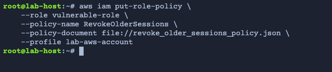

        > [!NOTE]
        > AWSユーザーであれば、AWS IAMコンソールの**Revoke sessions**タブに慣れているかもしれません。AWSコンソールで**Revoke active sessions**を選択すると、AWSは`revoke_older_sessions_policy.json`と同じように機能する`AWSRevokeOlderSessions`というインラインIAMポリシーをアタッチします。
    
    3. アクティブなセッションを取り消すことに加えて、このロールで新しいセッションを作成できないようにしたいと考えています。ファイル`deny_assume_role_policy.json`には、`sts:AssumeRole` API呼び出しを使用してロールを引き受ける試みを拒否するIAMポリシーが含まれています。次のコマンドを実行して、ポリシーを確認できます：

        ```run
        cat deny_assume_role_policy.json
        ```

        出力例：

        ```nocopy
        root@lab-host:~# cat deny_assume_role_policy.json
        {
        "Version": "2012-10-17",
        "Statement": [
            {
            "Effect": "Deny",
            "Principal": {
                        "AWS": "*"
                    },
            "Action": "sts:AssumeRole"
            }
        ]
        }
        ```
    
    4. 次のコマンドを実行して、`deny_assume_role_policy.json`ポリシーを使用して`vulnerable-role`のassume roleポリシーを更新します：

        ```run
        aws iam update-assume-role-policy \
            --role-name vulnerable-role \
            --policy-document file://deny_assume_role_policy.json \
            --profile lab-aws-account
        ```

        出力は期待されません。

        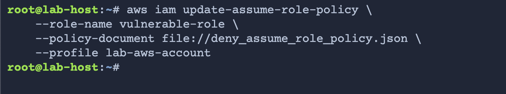

        > [!NOTE]
        > 将来的には、[Workflow Automation](https://docs.datadoghq.com/security/cloud_siem/investigate_security_signals#run-workflow-automation)を実行することで、このような修復アクションを自動化できます。

素晴らしい！侵害されたIAMロールで作成されたアクティブなセッションを取り消し、外部アカウントによって新しいセッションを作成できないようにトラストポリシーを修正しました。

シグナルをアーカイブする
===

1. Datadogで、[Signals Explorer](https://app.datadoghq.com/security?query=&column=time&order=desc&start=1710880125686&end=1710966525686&paused=false)に戻ります。

2. **New AWS account assuming a role into AWS account**シグナルの詳細に戻ります。

    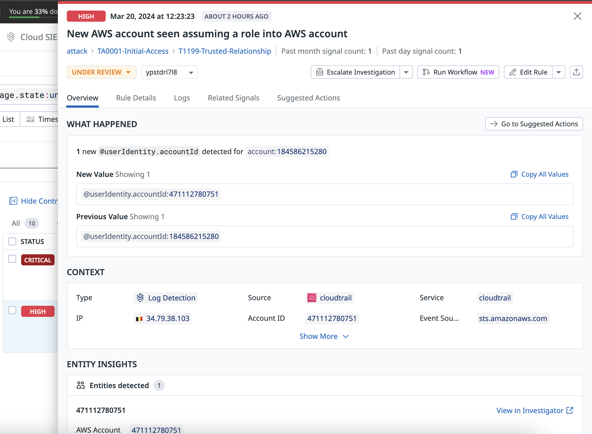

3. **NEXT STEPS**セクションで、**Mark as Archived**をクリックします。

    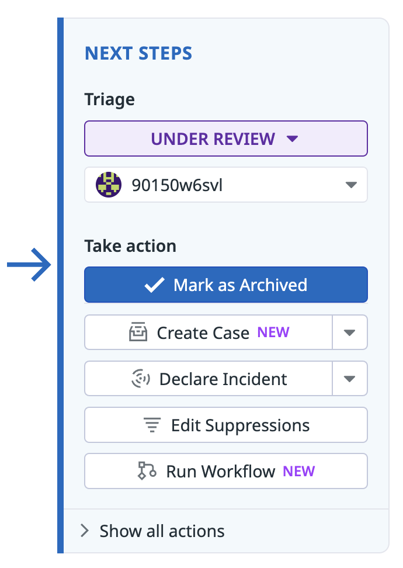

4. **Change Status**モーダルで、**Reason**フィールドを**Remediated**に変更します。

5. **Archive**をクリックします。

    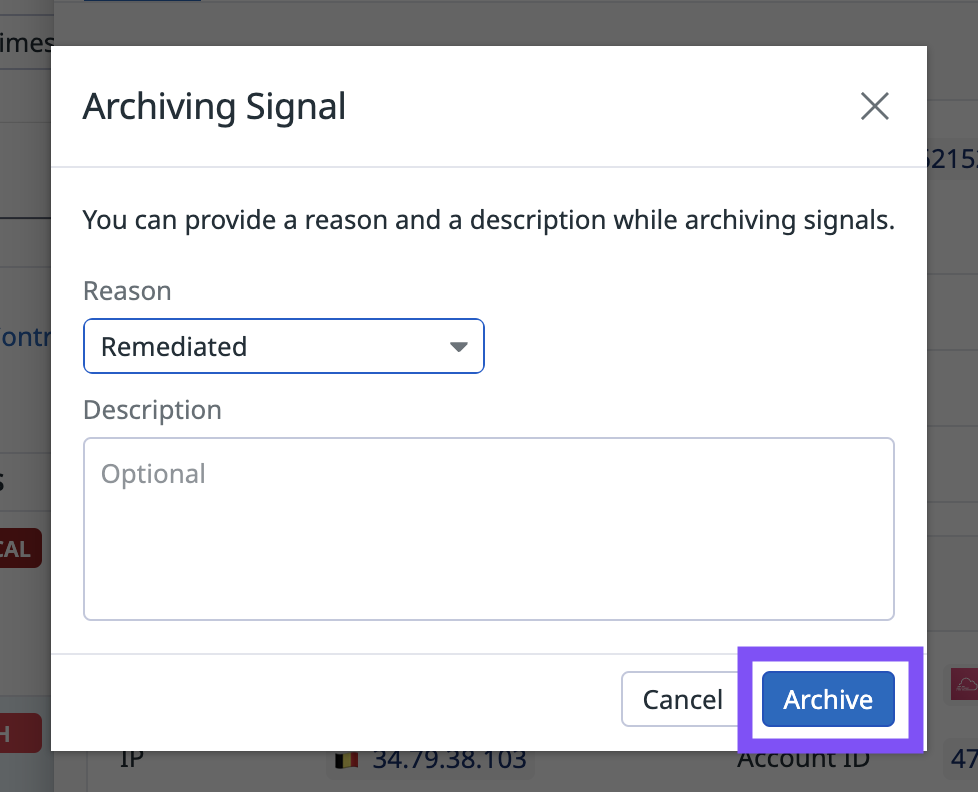

修復を続ける
===

最初のアクセスポイントに関連するセキュリティシグナルを修復してアーカイブしたので、同じ攻撃に関連する他のシグナルを調査します。これを行うには多くの方法がありますが、1つのオプションは`attacker-session`に関連するすべてのシグナルを調査することです。

1. **[Cloud SIEM Signals Explorer](https://app.datadoghq.com/security?query=@workflow.rule.type:(%22Log%20Detection%22%20OR%20%22Signal%20Correlation%22)&product=siem)** に戻ります。

2. 次のクエリを使用して、`attacker-session`に関連するすべてのシグナルを見つけます。

    ```
    @userIdentity.session_name:attacker-session 
    ```

    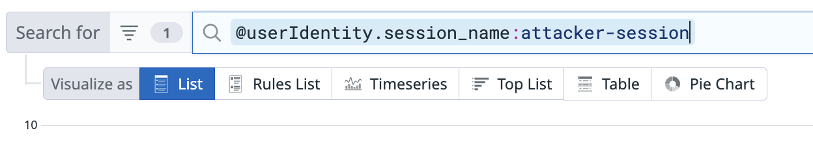

3. **Open**タブをクリックします。

    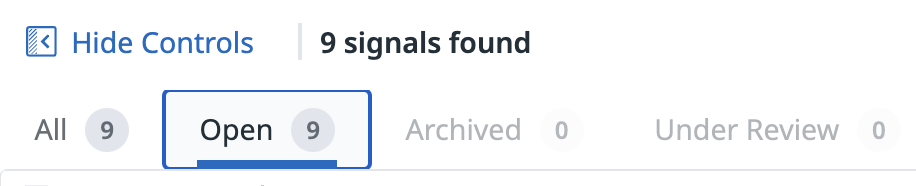

    [クエリフィルタ](https://app.datadoghq.com/security?query=%40workflow.rule.type%3A%28%22Log%20Detection%22%20OR%20%22Signal%20Correlation%22%29%20%40userIdentity.session_name%3Aattacker-session%20%40workflow.triage.state%3Aopen&agg_m=count&agg_m_source=base&agg_t=count&column=time&fromUser=false&order=desc&product=siem&start=1727229023674&end=1727315423674&paused=false)は次のようになります：

    ```copy
    @userIdentity.session_name:attacker-session @workflow.triage.state:open
    ```

4. これで、調査の初期に見つけた`attacker-session`に関連するオープンなシグナルのリストが表示されます。これは、攻撃者が実行した他のアクションを修復するための素晴らしい出発点となります。

    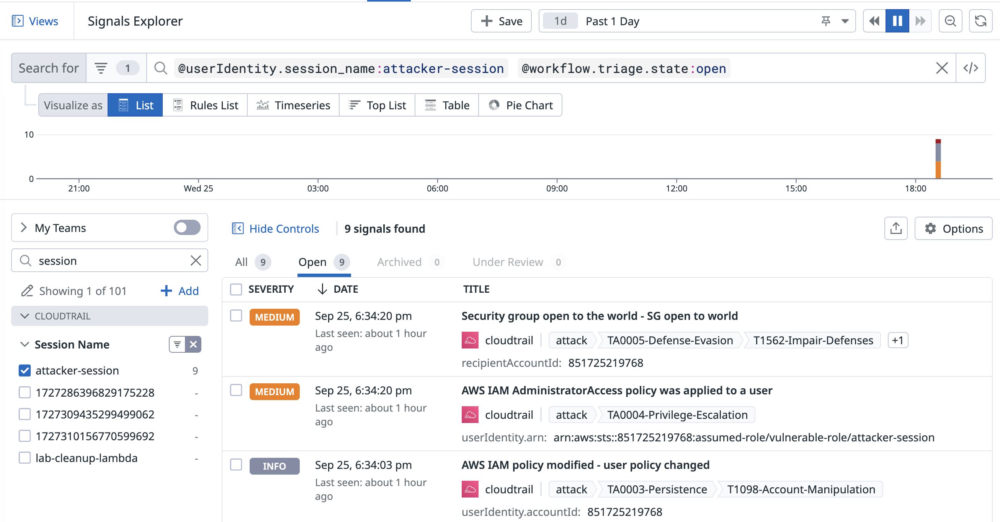

ラボのまとめ
===

素晴らしい！Signals ExplorerとCloud SIEM Investigatorを使用して、AWS環境に対する多面的な攻撃を検知し調査しました。侵入脅威シグナルをトリアージし、攻撃パスと攻撃者のアクセスポイントを特定し、環境の修復を開始しました。

**Next**ボタンを使用して、オプションのCloud SIEM Capture the Flagゲームで新しいスキルをさらにテストしてください。


