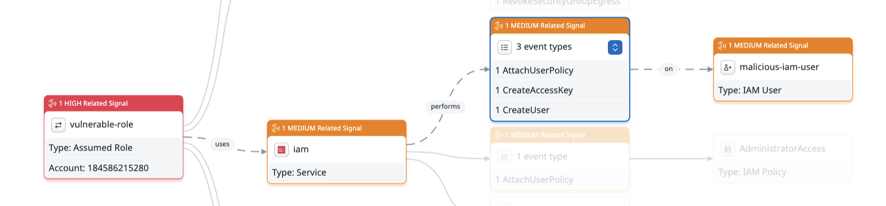
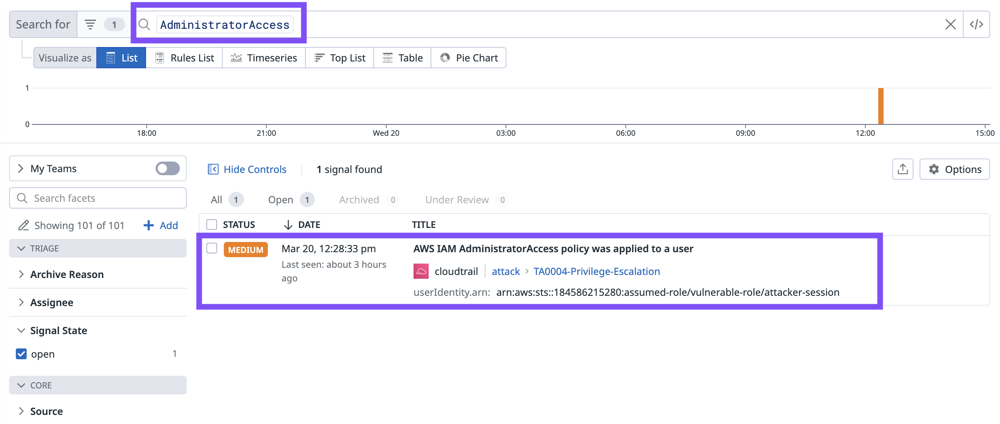
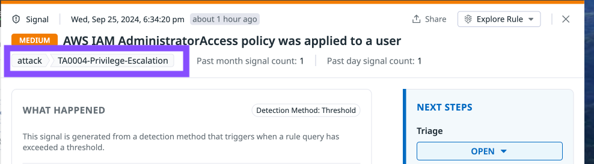
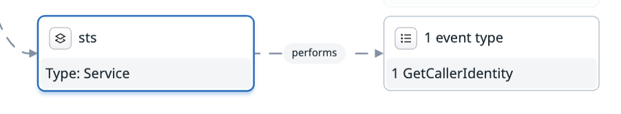
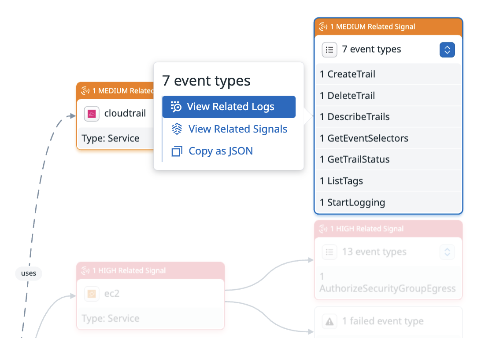
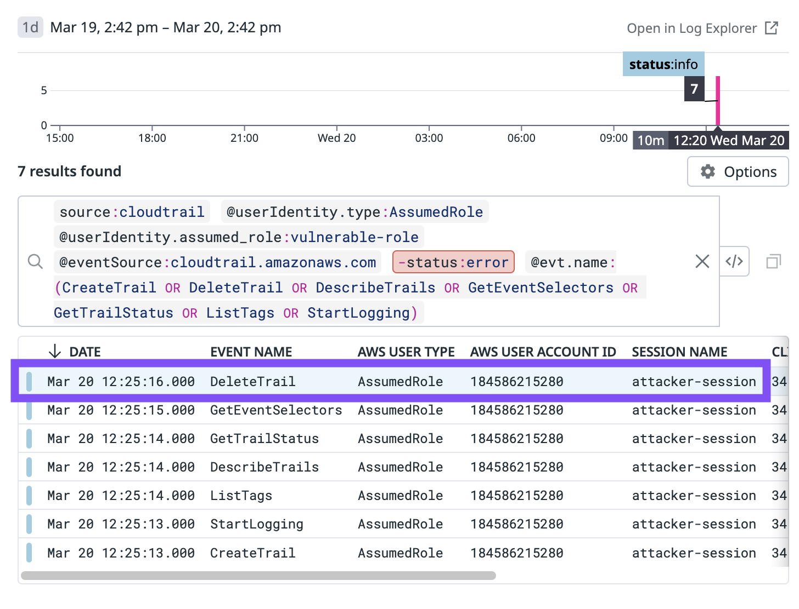
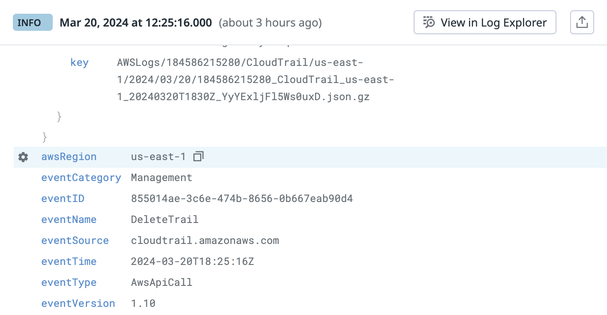
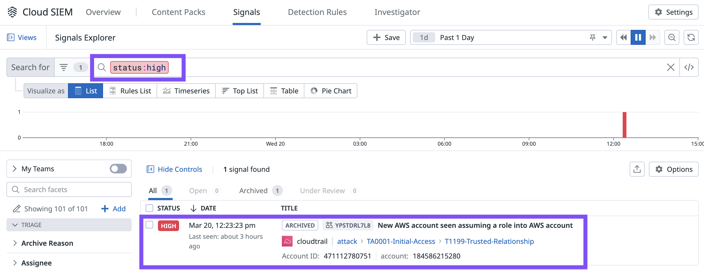
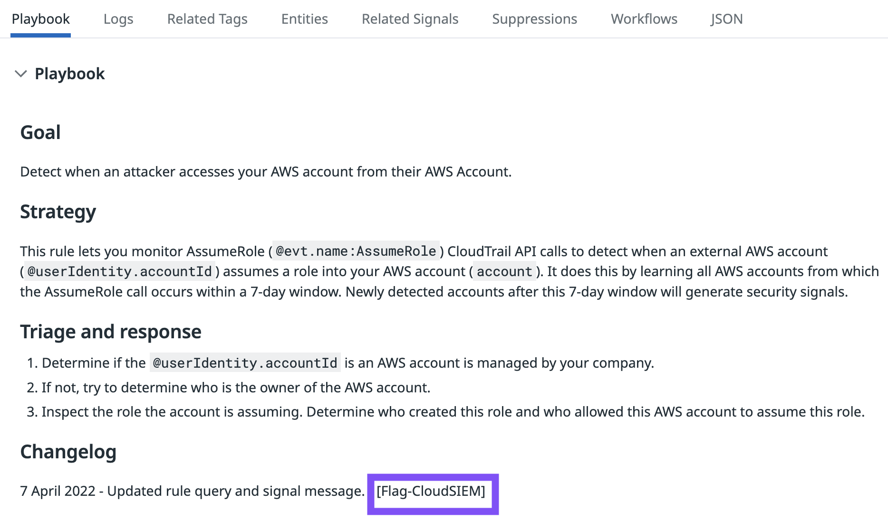

Cloud SIEM Capture the Flag（オプション）
=== 
> [!NOTE]
> **Next**ボタンを使用してCapture the Flagアクティビティをスキップし、ラボを終了します。

Signals ExplorerとCloud SIEM Investigatorを使用して、ラボAWSアカウントの攻撃に関連する情報を見つけます。一部のフラグはIPアドレスやAWSリソース名などの値ですが、他のフラグは`[Flag-<flag_value>]`形式の文字列です。

**フラグを見つけるためにDatadogから離れる必要はありません。**

CTFをプレイするには、ラボナビゲーションの**[Capture the Flag tab](tab-3)**をクリックします。各フラグについて、ヒントを表示したり、答えを表示したりできます。すべてを見つけようとする際に、無制限に回答を送信できます。

フラグの見つけ方の例を見たい場合は、以下の折りたたまれたセクションを展開してください。

楽しんでください！ラボを終了する準備ができたら、**Next**ボタンを使用してください。

<Solutions>

<strong>Flag 1 Solution</strong>

 <strong>malicious-iam-user</strong>  Cloud SIEM Investigatorを使用して、作成されたIAMユーザーの名前を見つけます。  

<strong>Flag 2 Solution</strong>

 <strong>TA0004-Privilege-Escalation</strong>  この値を見つけるには複数の方法があります。  1つの戦略は、Signals Explorerで文字列"AdministratorAccess"を検索して、関連するシグナルを見つけることです。シグナルの詳細を開いて、MITREタクティクスを見つけます。 

<strong>Flag 3 Solution</strong>

 <strong>GetCallerIdentity</strong>  Cloud SIEM Investigatorを使用して、攻撃中に発生したstsイベントを見つけます。イベントタイプは1つだけです。 

<strong>Flag 4 Solution</strong>

 <strong>us-east-1</strong>  この値を見つけるには多くの方法があります。1つの方法は、CloudTrailイベントの関連ログを表示することです。 DeleteTrailイベントログを選択します。ログ内でリージョンを見つけます。

<strong>Flag 5 Solution</strong>

 <strong>[Flag-CloudSIEM]</strong>  Signals Explorerで高重要度の**New AWS account seen assuming a role into AWS account**シグナルを見つけます。 Playbookを読んでフラグを見つけます。 

