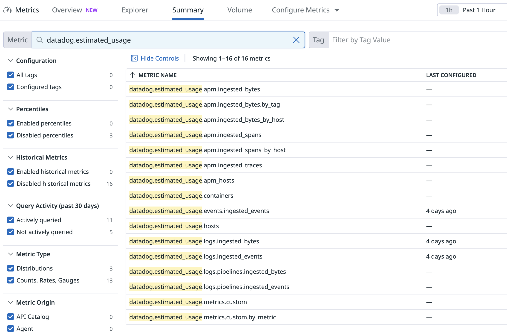

Throughout this course, each exercise will be broken down into a series of steps. To navigate between steps, click each header to expand or collapse the sections.

Logging into the Datadog Platform
=========================================================

Follow the steps below to get into the Datadog platform.

1. When this lab started, you were provisioned credentials to use to log in to the Datadog app. In the terminal to the left, run the following command to retrieve those credentials:
    ```sh,run
    creds
    ```

2. In a new browser window or tab, log in to the [Datadog account/organization](https://app.datadoghq.com/account/login) using those credentials.

    _Hint:_ Just double-click the username and password for them to be copied to your clipboard.

    > [!NOTE]
    > If you are already a Datadog user, make sure to log out of your account first, then log in with these credentials to ensure you're in the correct Datadog account for this lab. (Please do not use Incognito mode.)

Once you're in, move to the next step.

Plan and Usage & Usage Attribution - The First place to Look
=========================================================


The first place to take for usage is directly in the UI you can access the **Plan and Usage** page by clicking on [Your Account Name > (Organization Settings) Plan & Usage](https://app.datadoghq.com/billing/usage)


> [!IMPORTANT]
> If this is the first course you have undertaken (or it has been some time since you completed your last one), it is likely that there won't be any data to look at. If you'd like to see what a populated version of the Plan & Usage page would look like, please take a look [here](https://docs.datadoghq.com/account_management/plan_and_usage/usage_details/)


From there you can see the consumption for your org with a summary per SKUs.

For more **granular usage analysis** and **chargeback/showback** scenario, the **Usage Attribution** feature enables detailed breakdowns of usage based on **custom tags**. This allows teams to better understand and allocate costs — for example, by `cost_center` or `team`.

If the feature is enabled for your organization, you’ll see a **Usage Attribution** tab on the **Plan & Usage** page:


The Usage Attribution tab provides the following:

- View which **tag keys** are currently being used to break down usage (you can select up to three).
- Add or change the tag keys used for attribution.
- Visualize usage trends over time, broken out by selected tags.
- Access summarized usage reports at the end of each month.
- Download **month-to-date** and **hourly CSV exports** for further analysis.

More documentation is [available here](https://docs.datadoghq.com/account_management/billing/usage_attribution)

<!--
Estimated Usage Dashboards - Dig a little deeper
=========================================================

Another way to look at real-time estimated usage is by looking at Datadog's out-of-the-box dashboards.

Click on the [Dashboard](https://app.datadoghq.com/dashboard/lists?q=estimated&p=1) section and filter by "estimated" keyword.


These OOTB dashboard can help have visibility on unexpected spike and allow to prevent on-demand usage.

Feel free to have a look at the **Estimated Usage Overview** dashboard and its content.

-->
Estimated Usage Metrics - Proactive Cost Management
=========================================================

Understanding estimated usage metrics is crucial for proactive cost management. These metrics give you real-time visibility into your consumption patterns BEFORE you receive your bill.

All dashboards from the previous section are based on the `datadog.estimated_usage.*` metrics, which provide near real-time estimates of your usage across different Datadog products. This allows you to:
- **Predict monthly costs** before the billing cycle ends
- **Identify cost spikes** as they happen, not after they've already impacted your budget
- **Set proactive alerts** to prevent unexpected charges
- **Correlate usage patterns** with deployments or system changes

You can explore these metrics in the [Metrics > Summary](https://app.datadoghq.com/metric/summary) menu by searching for "estimated_usage" in the search field.



These metrics are free and kept for 15 months by Datadog. So let's use them!

Creating Estimated Usage monitors - Proactivity in action
=========================================================

Now that we understand what estimated usage metrics are, let's create monitors to proactively detect unexpected spikes. These monitors are your first line of defense against cost increases, alerting you to usage anomalies before they impact your bill.

We'll use log metrics as an example to demonstrate this monitoring approach.

Logs ingestion can suddenly spike due to:
- A misconfigured application generating excessive debug logs
- A DDoS attack creating verbose security logs
- A deployment issue causing error loops

Without proactive monitoring, these issues may only be discovered when your monthly bill arrives - potentially weeks after the incident resulting in significant unexpected charges.

The Log ingestion estimated usage metrics available are:
- `datadog.estimated_usage.logs.ingested_bytes`
- `datadog.estimated_usage.logs.ingested_events`

To detect log spikes, the best approach is to set up an [Anomaly Monitor](https://docs.datadoghq.com/monitors/types/anomaly/) on the `datadog.estimated_usage.logs.ingested_events` metric.

Let's set it up!

1. First, navigate to [Monitors > New Monitor](https://app.datadoghq.com/monitors/create) and select **Anomaly**.
2. In the **Define the metric** section, select the `datadog.estimated_usage.logs.ingested_events` metric.
3. Set the "Evaluate the bounds for the last" parameter to 5 minutes so this can trigger quickly for our lab.
4. In the **from** field, add the `datadog_is_excluded:false` tag to monitor indexed logs and not ingested ones.
5. In the **sum by** field, add the `service` and `datadog_index` tags, so that you are notified if a specific service spikes or stops sending logs in any index.
6. Set the alert threshold to `80`% and warning threshold to `70`%.
7. Set the Alert title to:
    ```
    An unexpected amount of logs has been indexed in the index: {{datadog_index.name}}
    ```
8. The Description:
    ```
    1. [Check Log patterns for this service](https://app.datadoghq.com/logs/patterns?from_ts=1582549794112&live=true&to_ts=1582550694112&query=service%3A{{service.name}})
  
    2. [Add an exclusion filter on the noisy pattern](https://app.datadoghq.com/logs/pipelines/indexes)
    ```
8. Best practice is to always set a `Tag` and `Team` in the Metadata section.
9. Click **Create**.

Just like that you set up a monitor that will alert you if Datadog detects an abnormal spike with indexed logs!

You can set up the anomaly monitor for other metrics like:
- `datadog.estimated_usage.hosts` for infrastructure
- `datadog.estimated_usage.apm.ingested_spans` for APM
- `datadog.estimated_usage.metrics.custom` for custom metrics

> [!NOTE]
> You can find other log usage monitoring strategies [here](https://docs.datadoghq.com/logs/guide/best-practices-for-log-management/#monitor-log-usage).

Creating estimated usage monitors via Terraform - Proactive Automation
===========================================================

Now that we know how to create monitors manually, let's explore creating them programmatically via Terraform.

Using terraform alows you to create multiple monitors consistently across environments and mainly track and deploy changes when needed. It ultimately ensure consistent monitor configurations.

We'll use Terraform to create monitors for all major Datadog products:
- APM Host count
- APM Indexed Spans
- APM Ingested Spans
- Custom Events
- Custom Metrics
- Error tracking
- Infra Host count
- Logs Indexed
- Logs Ingested

> [!NOTE]
> You don't need to understand fully this terraform script but it is interesting to know that all monitors can be created programmatically either via our [Datadog API](https://docs.datadoghq.com/api/latest/monitors/) or via Terraform [Datadog provider](https://registry.terraform.io/providers/DataDog/datadog/latest/docs) (or other configuration tools like Jenkins)

### Explore the Terraform Configuration

The Terraform script is available in the `monitors` directory on the IDE tab.

In the directory you can find:
- `main.tf` -> Configures the [Datadog provider](https://registry.terraform.io/providers/DataDog/datadog/latest/docs) to manage your org via Terraform
- `common_variables.tf` -> Contains variable definitions for the monitor threshold based on your contract.
- `variables.tf` -> Contains variable definitions for the Terraform configuration
- `modules/` folder -> Contains the core scripts to create monitors for each product

### Run the Terraform Script

Let's create all the monitors automatically:
```sh,run
cd monitors
terraform init
terraform apply --auto-approve
```

### Verify the Results

To validate the script ran properly, navigate to [Monitors > Monitor List](https://app.datadoghq.com/monitors/manage) where you'll find many new 
> [!NOTE]
> If you want to reuse this script, you can find the open source code [here](https://github.com/abruneau/datadog_usage_monitoring/tree/master). It also includes additional dashboards which can be useful. This is not officially supported by Datadog, but can be a great starting point for setting up usage monitoring. Also note that you'll want to configure proper thresholds based on your business requirements.

Datadog Cloud Cost Monitoring
=========================================================

You probably know that Datadog offers a [Cloud Cost Management](https://docs.datadoghq.com/cloud_cost_management) feature that allows best in class monitoring of your cloud costs and usage.

But did you know that you can also monitor Datadog usage and impact with it ?


Billing APIs
=========================

> [!WARNING]
> These APIs will not work with the Trial orgs provided by this lab.

If you have multiple orgs or business, manual cost monitoring through the UI or using monitors might not scale well. For instance it can be difficult to:
- Automate cost reporting
- Integrate with existing tools
- Build custom cost allocation dashboards

Billing APIs are ideal to tackle those challenges.

Today the available APIs are:
- [Estimated Cost](https://docs.datadoghq.com/api/latest/usage-metering/#get-estimated-cost-across-your-account)
- [Billable Usage](https://docs.datadoghq.com/api/latest/usage-metering/#get-billable-usage-across-your-account)
- [Hourly Usage by product family](https://docs.datadoghq.com/api/latest/usage-metering/#get-hourly-usage-by-product-family)
- [Historical Cost](https://docs.datadoghq.com/api/latest/usage-metering/#get-historical-cost-across-your-account)
- [Projected Cost](https://docs.datadoghq.com/api/latest/usage-metering/#get-projected-cost-across-your-account)
- [Usage Summary](https://docs.datadoghq.com/api/latest/usage-metering/#get-usage-across-your-account)

(PREVIEW) Usage Monitors
=========================================================

Soon it will be possible to create "usage" monitors directly from the monitor menu.


> [!NOTE]
> Usage Monitors are currently in preview so may not be visible within your training/trial Org. If you are undertaking an instructor led version of this course, the trainer will provide you with a demo of this using the Datadog offical Demo Org.


(BONUS) Allotment calculator
====================================

As we have seen during the presentation, allotments can be tricky to understand and manage.

Datadog also provides a tool to understand what has been allotted to you according to the current contract.

For example, a host allows you to run 5 to 10 containers according to the type of hosts (pro or enterprise).

Using the *Allotment calculator* you can estimate what would extra containers cost.
[Allotment calculator](https://www.datadoghq.com/pricing/allotments)


Next step
===================

We just saw all the different out of the box tools available in Datadog to estimate and understand cost and usage.
- Using **Plan & Usage** page
- Using **Estimated Usage** dashboards
- Setting up pro-active alerts via `estimated_usage` metrics
- Using **Cloud Cost Management**
- Using **Datadog APIs**

Now let's have a look in practice on how to reach the best ROI for the logs consumed using **Logging without Limits**.

> [!NOTE]
> If you want to move to the next step you can also **skip** and we will configure everything for you.
