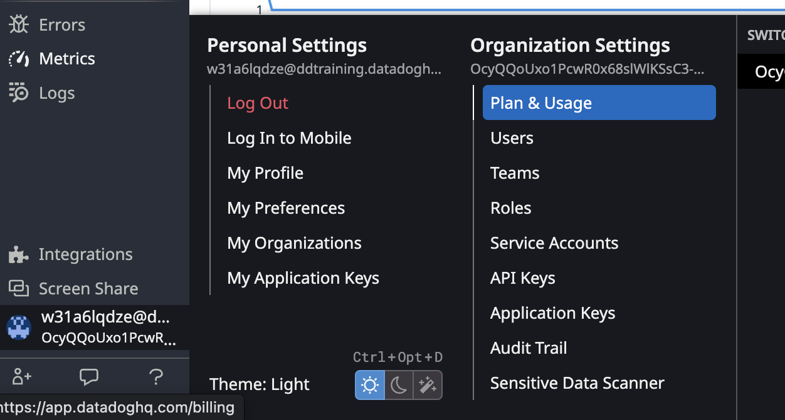
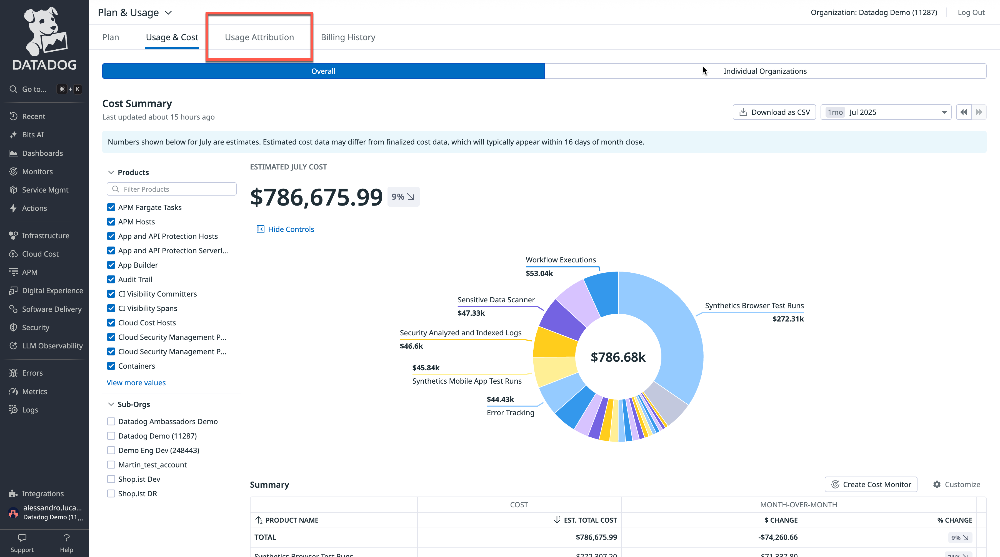
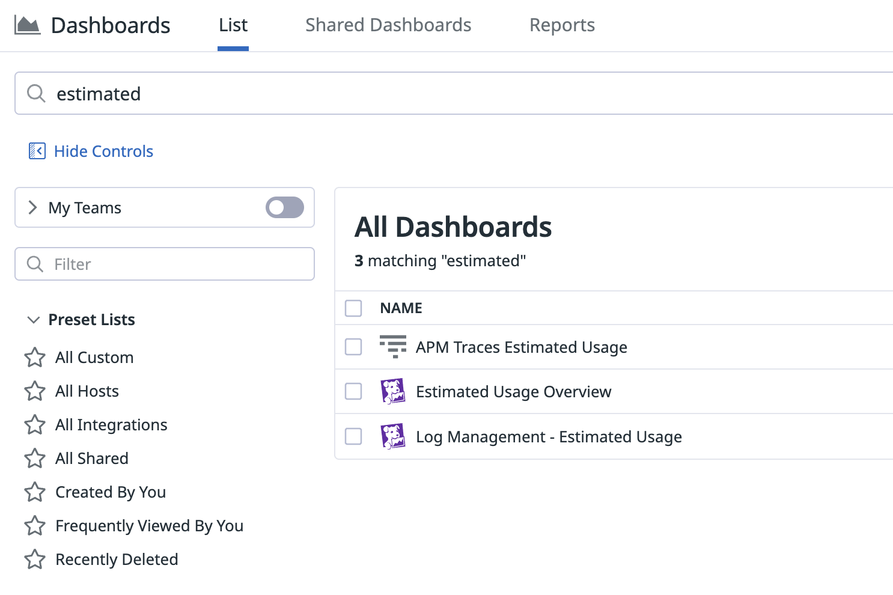
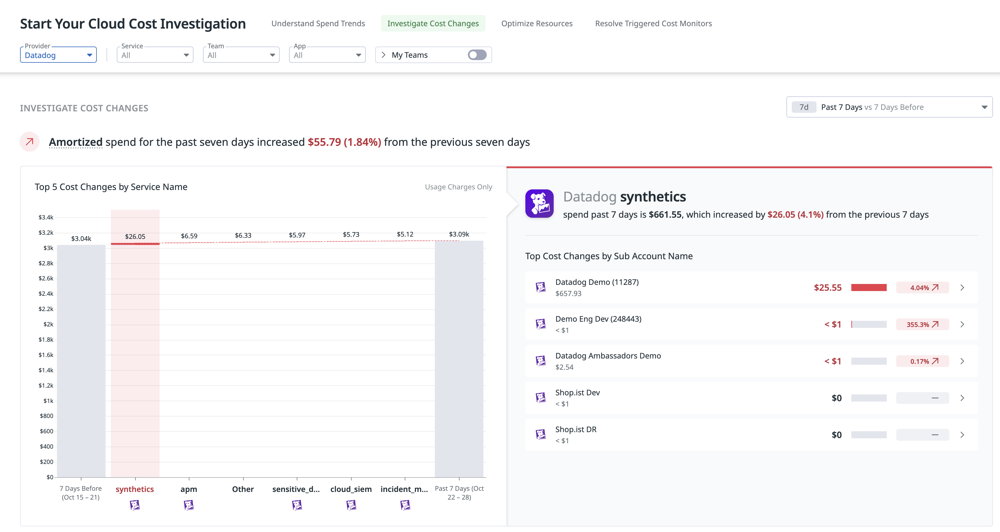
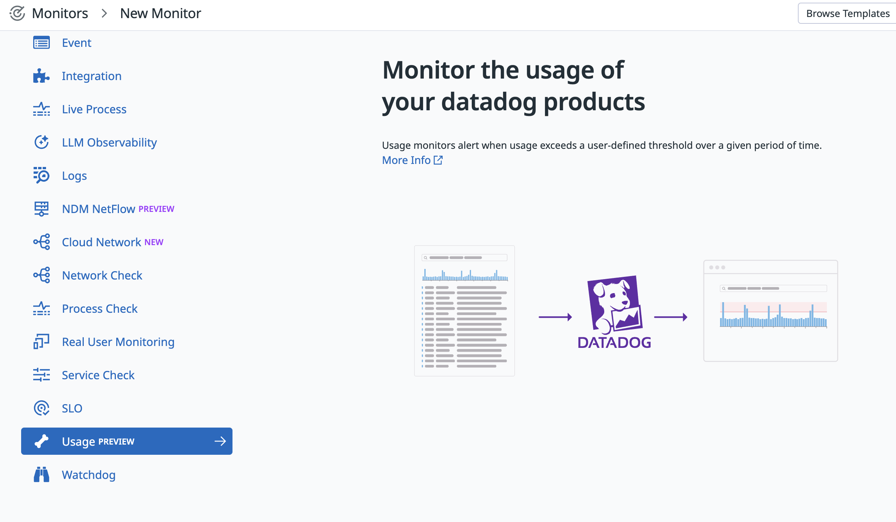

このコースでは、各演習がいくつかのステップに分かれています。ステップ間を移動するには、各見出しをクリックしてセクションを展開または折りたたみます。

Datadog プラットフォームへのログイン
=========================================================

以下の手順に従って Datadog プラットフォームに入ります。

1. このラボが開始されたとき、Datadog アプリにログインするための認証情報が付与されています。左のターミナルで次のコマンドを実行して取得します。
    ```sh,run
    creds
    ```

2. 新しいブラウザウィンドウまたはタブで、その認証情報を使って [Datadog アカウント／組織](https://app.datadoghq.com/account/login) にログインします。

    _ヒント:_ ユーザー名とパスワードをダブルクリックするとクリップボードにコピーされます。

    > [!NOTE]
    > すでに Datadog ユーザーの場合は、先にアカウントからログアウトしてから、これらの認証情報でログインし、このラボ用の正しい Datadog アカウントに入っていることを確認してください。（シークレット／プライベートモードは使わないでください。）

ログインできたら、次のステップに進みます。

Plan & Usage と Usage Attribution — 最初に見る場所
=========================================================


利用状況を確認する最初の場所は UI 内です。**Plan & Usage** ページは、[アカウント名 >（組織設定）Plan & Usage](https://app.datadoghq.com/billing/usage) から開けます。



> [!IMPORTANT]
> 初めてこのコースを受講する場合（または前回の受講から間が空いている場合）、参照できるデータがまだないことが多いです。データが入った状態の Plan & Usage ページの例は、[こちら](https://docs.datadoghq.com/account_management/plan_and_usage/usage_details/) を参照してください。


ここでは組織の消費量を SKU ごとのサマリーで確認できます。

より**細かい利用分析**や**チャージバック／ショーバック**のシナリオでは、**Usage Attribution** 機能により、**カスタムタグ**に基づいた利用の詳細な内訳が可能です。チームはコストの把握や配分をよりよく行えます。例: `cost_center` や `team` など。

組織で機能が有効な場合、**Plan & Usage** ページに **Usage Attribution** タブが表示されます。



Usage Attribution タブでは次ができます。

- 利用の内訳に使われている**タグキー**の確認（最大 3 つまで選択可能）
- 帰属に使うタグキーの追加・変更
- 選択したタグ別の利用推移の可視化
- 月末の利用サマリーレポートへのアクセス
- さらなる分析のための**月累計**および**時間単位の CSV エクスポート**のダウンロード

詳細は [こちらのドキュメント](https://docs.datadoghq.com/account_management/billing/usage_attribution) を参照してください。

<!--
Estimated Usage Dashboards - Dig a little deeper
=========================================================

Another way to look at real-time estimated usage is by looking at Datadog's out-of-the-box dashboards.

Click on the [Dashboard](https://app.datadoghq.com/dashboard/lists?q=estimated&p=1) section and filter by "estimated" keyword.



These OOTB dashboard can help have visibility on unexpected spike and allow to prevent on-demand usage.

Feel free to have a look at the **Estimated Usage Overview** dashboard and its content.

-->
Estimated Usage メトリクス — 先回りのコスト管理
=========================================================

推定利用メトリクス（estimated usage metrics）を理解することは、先回りのコスト管理に不可欠です。これらのメトリクスは、請求書が届く**前に**消費パターンをリアルタイムに可視化します。

前セクションのダッシュボードはすべて `datadog.estimated_usage.*` メトリクスに基づいており、各 Datadog プロダクト横断で利用のほぼリアルタイムな見積もりを提供します。次が可能になります。
- 請求サイクルが終わる**前に月額コストを予測**
- 予算に影響した**後**ではなく、発生中の**コストスパイクを特定**
- 想定外の課金を防ぐ**先回りのアラート設定**
- デプロイやシステム変更と**利用パターンを相関**

これらのメトリクスは無料で、Datadog により 15 か月保持されます。積極的に使いましょう。

Estimated Usage モニタの作成 — 先回りを実践
=========================================================

推定利用メトリクスが何か分かったので、想定外のスパイクを先回りで検知するモニタを作成します。これらのモニタはコスト増に対する第一線の防御であり、請求に影響する前に利用の異常を知らせます。

この監視アプローチの例としてログメトリクスを使います。

ログ取り込みは次のような理由で急増することがあります。
- デバッグログを過剰に出すアプリの設定ミス
- 冗長なセキュリティログを生む DDoS 攻撃
- エラーループを引き起こすデプロイの問題

先回りの監視がないと、こうした問題は月次請求が届くまで気づかないことがあり、インシデントから数週間後に大きな想定外課金につながる可能性があります。

利用可能なログ取り込みの推定利用メトリクスは次のとおりです。
- `datadog.estimated_usage.logs.ingested_bytes`
- `datadog.estimated_usage.logs.ingested_events`

ログのスパイクを検知するには、`datadog.estimated_usage.logs.ingested_events` メトリクスに [Anomaly Monitor](https://docs.datadoghq.com/monitors/types/anomaly/) を設定するのが最適です。

設定しましょう。

1. まず [Monitors > New Monitor](https://app.datadoghq.com/monitors/create) に移動し、**Anomaly** を選択します。
2. **Define the metric** セクションで、`datadog.estimated_usage.logs.ingested_events` メトリクスを選択します。
3. 「Evaluate the bounds for the last」パラメータを 5 分に設定し、このラボではすぐにトリガーされるようにします。
4. **from** フィールドに `datadog_is_excluded:false` タグを追加し、インデックス済みログを監視し、取り込みのみのものは対象外にします。
5. **sum by** フィールドに `service` と `datadog_index` タグを追加し、特定のサービスがスパイクした場合や、どのインデックスでもログ送信が止まった場合に通知されるようにします。
6. アラート閾値を `80`%、警告閾値を `70`% に設定します。
7. Alert title を次のように設定します。
    ```
    An unexpected amount of logs has been indexed in the index: {{datadog_index.name}}
    ```
8. Description:
    ```
    1. [Check Log patterns for this service](https://app.datadoghq.com/logs/patterns?from_ts=1582549794112&live=true&to_ts=1582550694112&query=service%3A{{service.name}})
  
    2. [Add an exclusion filter on the noisy pattern](https://app.datadoghq.com/logs/pipelines/indexes)
    ```
8. メタデータセクションでは、常に `Tag` と `Team` を設定するのがベストプラクティスです。
9. **Create** をクリックします。

これで、Datadog がインデックス済みログの異常なスパイクを検知したときにアラートするモニタができました。

他のメトリクスにも Anomaly モニタを設定できます。
- インフラ向け `datadog.estimated_usage.hosts`
- APM 向け `datadog.estimated_usage.apm.ingested_spans`
- カスタムメトリクス向け `datadog.estimated_usage.metrics.custom`

> [!NOTE]
> その他のログ利用監視の戦略は [こちら](https://docs.datadoghq.com/logs/guide/best-practices-for-log-management/#monitor-log-usage) を参照してください。

Terraform による estimated usage モニタの作成 — 先回りの自動化
===========================================================

手動でのモニタ作成が分かったので、Terraform でプログラム的に作成する方法を見ます。

Terraform を使うと、複数のモニタを環境間で一貫して作成でき、必要に応じて変更を追跡・デプロイしやすくなります。最終的にモニタ設定の一貫性が保たれます。

主要な Datadog プロダクトすべてに対してモニタを Terraform で作成します。
- APM Host count
- APM Indexed Spans
- APM Ingested Spans
- Custom Events
- Custom Metrics
- Error tracking
- Infra Host count
- Logs Indexed
- Logs Ingested

> [!NOTE]
> この Terraform スクリプトを完全に理解する必要はありませんが、すべてのモニタは [Datadog API](https://docs.datadoghq.com/api/latest/monitors/) または Terraform の [Datadog provider](https://registry.terraform.io/providers/DataDog/datadog/latest/docs)（または Jenkins など他の構成ツール）でプログラム的に作成できることは知っておくと有用です。

### Terraform 構成の確認

Terraform スクリプトは IDE タブの `monitors` ディレクトリにあります。

ディレクトリ内の内容:
- `main.tf` → Terraform で組織を管理するための [Datadog provider](https://registry.terraform.io/providers/DataDog/datadog/latest/docs) の設定
- `common_variables.tf` → 契約に基づくモニタ閾値の変数定義
- `variables.tf` → Terraform 構成の変数定義
- `modules/` フォルダ → 各プロダクト用モニタ作成の中核スクリプト

### Terraform の実行

すべてのモニタを自動で作成します。
```sh,run
cd monitors
terraform init
terraform apply --auto-approve
```

### 結果の確認

スクリプトが正しく動いたか確認するには、[Monitors > Monitor List](https://app.datadoghq.com/monitors/manage) に移動すると、多数の新しいモニタが表示されます。
> [!NOTE]
> このスクリプトを再利用したい場合、オープンソースのコードは [こちら](https://github.com/abruneau/datadog_usage_monitoring/tree/master) にあります。役立つ追加のダッシュボードも含まれます。Datadog 公式サポートの対象ではありませんが、利用監視の出発点として有用です。また、閾値はビジネス要件に合わせて適切に設定してください。

Datadog Cloud Cost Management
=========================================================

Datadog にはクラウドのコストと利用をクラス最高水準で監視できる [Cloud Cost Management](https://docs.datadoghq.com/cloud_cost_management) 機能があることはご存じでしょう。

Datadog の利用と影響もそれで監視できるのはご存じでしたか。




Billing APIs
=========================

> [!WARNING]
> これらの API は、このラボで提供されるトライアル組織では動作しません。

複数の組織や事業がある場合、UI やモニタだけでの手動コスト監視はスケールしにくいことがあります。例:
- コストレポートの自動化
- 既存ツールとの連携
- カスタムのコスト配分ダッシュボードの構築

こうした課題には Billing API が適しています。

現在利用可能な API は次のとおりです。
- [Estimated Cost](https://docs.datadoghq.com/api/latest/usage-metering/#get-estimated-cost-across-your-account)
- [Billable Usage](https://docs.datadoghq.com/api/latest/usage-metering/#get-billable-usage-across-your-account)
- [Hourly Usage by product family](https://docs.datadoghq.com/api/latest/usage-metering/#get-hourly-usage-by-product-family)
- [Historical Cost](https://docs.datadoghq.com/api/latest/usage-metering/#get-historical-cost-across-your-account)
- [Projected Cost](https://docs.datadoghq.com/api/latest/usage-metering/#get-projected-cost-across-your-account)
- [Usage Summary](https://docs.datadoghq.com/api/latest/usage-metering/#get-usage-across-your-account)

（プレビュー）Usage Monitors
=========================================================

まもなく、モニタメニューから直接「usage」モニタを作成できるようになります。



> [!NOTE]
> Usage Monitors は現在プレビューのため、トレーニング／トライアル組織では表示されないことがあります。講師付きでこのコースを受講する場合、講師が Datadog 公式デモ組織を使ったデモを行います。


（ボーナス）Allotment calculator
====================================

プレゼンテーションで見たように、アロットメント（割当）は理解や管理が難しいことがあります。

Datadog は、現在の契約に基づいてどのような割当がされているか把握するツールも提供しています。

例: ホスト 1 台あたり、ホストの種類（pro または enterprise）に応じて 5〜10 コンテナを実行できます。

*Allotment calculator* を使うと、追加コンテナがいくらになるか見積もれます。
[Allotment calculator](https://www.datadoghq.com/pricing/allotments)


次のステップ
===================

Datadog に標準で用意されている、コストと利用の見積もり・把握のためのツールを一通り見ました。
- **Plan & Usage** ページ
- **Estimated Usage** ダッシュボード
- `estimated_usage` メトリクスによる先回りアラート
- **Cloud Cost Management**
- **Datadog APIs**

次は実践として、取り込んだログで最良の ROI を得る方法として **Logging without Limits** を見ていきます。

> [!NOTE]
> 次に進みたい場合は **スキップ** しても構いません。こちらで必要な設定を行います。
