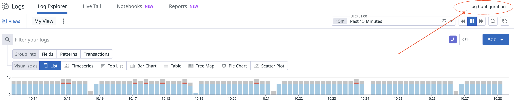
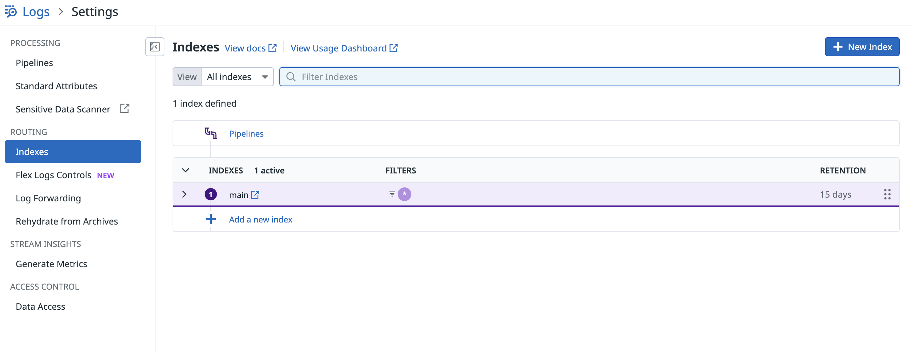
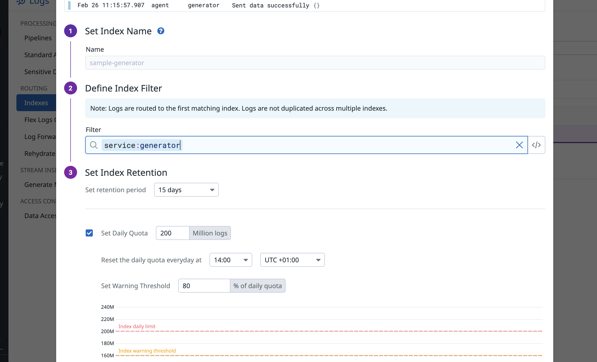
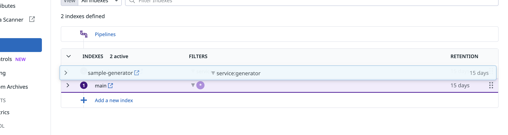
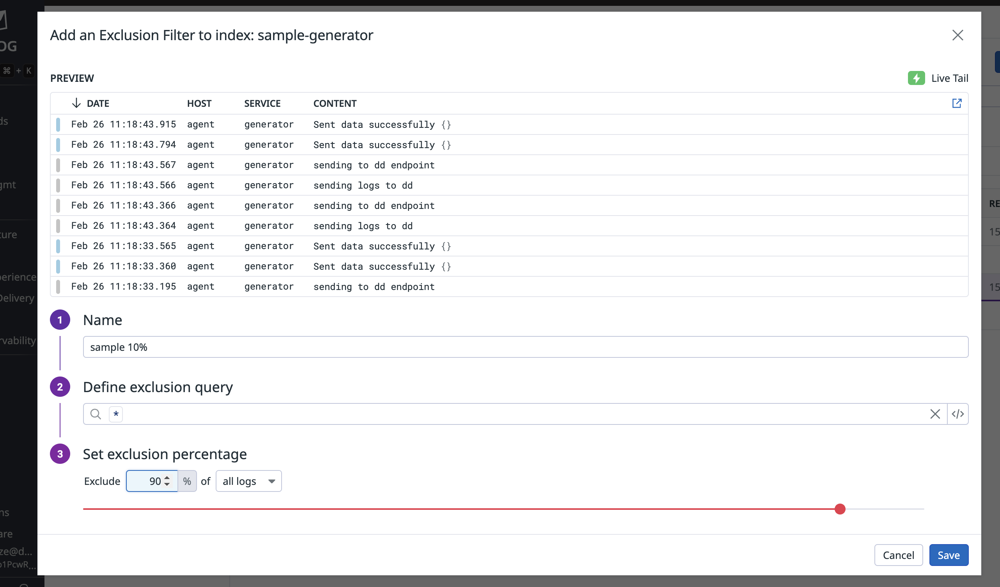
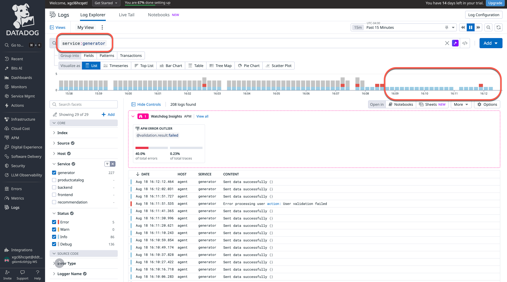

---

Datadog のログ管理は、**ログの取り込みとインデックス作成を分離**することで従来の制約を取り除き、すべてのログをコスト効率よく収集・処理・アーカイブできます。概要は [Logging without Limits](https://docs.datadoghq.com/logs/guide/getting-started-lwl/) を参照してください。

*Logging without Limits* では次が可能です。
- トラブルシューティングと分析のためにどのログをインデックス化・保持するかを動的に選択（必要に応じてフィルターを上書き）
- 強化済みログを長期のクラウドストレージに追加コストなしでアーカイブ
- インフラ全体で取り込まれたすべてのログの **Live Tail** を観察・クエリ（保持しないログも含む）
- インデックス化していなくても、取り込まれたログは引き続きメトリクスとセキュリティシグナルを生成します。

コスト効率のよいログインデックス・クォタの設定
=========================================================

ベストプラクティスは、明確なフィルターとインデックスごとに異なるログ保持期間を持つ複数インデックスを用意することです。

保持期間とサンプリング率の異なる複数インデックスを作ると、次が実現できます。
- 戦略的フィルタリングによるインデックスコストの削減
- [可変の保持期間](https://docs.datadoghq.com/logs/guide/best-practices-for-log-management/#set-up-multiple-indexes-for-log-segmentation) によるストレージコストの最適化（例: デバッグログ 7 日 vs セキュリティログ 15 か月）
- 上限到達でインデックスを停止する日次クォタによるコストスパイクの防止
- 重要ログを適切に保持することによるコンプライアンス維持

では、インデックスの作成とクォタ設定の手順を見ます。

[Logs > Explorer](https://app.datadoghq.com/logs) で、右上の「Log Configuration」ボタンをクリックします。



Logs Settings メニューに移動し、[Pipelines](https://docs.datadoghq.com/logs/log_configuration/pipelines/?tab=source#manage-your-pipelines)、[Sensitive Data Scanner](https://docs.datadoghq.com/security/sensitive_data_scanner/)、[Log Forwarding](https://docs.datadoghq.com/logs/log_configuration/forwarding_custom_destinations/?tab=http)、[Rehydrate from Archives](https://docs.datadoghq.com/logs/log_configuration/rehydrating?tab=amazons3)、そして最重要の [Indexes](https://docs.datadoghq.com/logs/log_configuration/indexes) を設定できます。

> [!NOTE]
> [Flex logs](https://docs.datadoghq.com/logs/log_configuration/flex_logs/#flex-logs-for-multiple-organization-accounts) により、ストレージとコンピュートを分離し、取り込み価格をさらに下げることもできます。

1. [(ROUTING) Indexes](https://app.datadoghq.com/logs/pipelines/indexes) セクションをクリックします。



2. 新しいインデックスを作成します
   1. 名前を `sample-generator` に設定
   2. クエリを `service:generator` に設定
   3. **Configure Storage Tier and Retention** でストレージ階層（保持）を選択 — このラボではデフォルトで 15 日になります。
      > [!NOTE]
      > 保持期間はコストに影響します。
   4. [daily quota](https://docs.datadoghq.com/logs/log_configuration/indexes/#set-daily-quota) を有効化
   5. Warning Threshold を 80% に設定
   6. 設定が下図のようになっていることを確認
      
   7. `Save` をクリック


**インデックスの順序は重要です。** キャッチオールの `main` インデックスが `sample-generator` の**後**に並ぶようにしてください。順序が違うとフィルターが一致しません。
右側の 6 点アイコンをドラッグして並べ替えできます。



インデックスを開き、除外フィルターを追加して、そのログの 10% だけを残すこともできます。



インデックス日次クォタのアラート設定
=========================================================

以前 `estimated_usage` の **metrics monitor** を作成したのと同様に、日次クォタが近づいた／到達したときに通知する監視は、**event Monitors** で設定できます。

設定手順はこの [best practices](https://docs.datadoghq.com/logs/guide/best-practices-for-log-management/#alert-on-indexes-reaching-their-daily-quota) ドキュメントを参照してください。

このモニタは、いずれかのインデックスが日次クォタに達したときすぐにアラートし、ログデータ損失を防ぐための迅速な対応が可能になります。

インデックス済みログ量が指定閾値を超えたときのアラート
=========================================================

インフラの任意のスコープでインデックス済みログ量が想定外に増えたときに通知するモニタの設定も推奨します。このモニタは **Logs Monitor** になります。

**Threshold monitors** で、具体的な量の上限や許容範囲（例: 「1 時間あたり 1GB を超えない」）を設定できます。

詳細はこの [documentation](https://docs.datadoghq.com/logs/guide/best-practices-for-log-management/#alert-when-an-indexed-log-volume-passes-a-specified-threshold) を参照してください。

コスト最適化のための不要ログのフィルタリング
=========================================================

インデックスの作成と取り込みの監視が分かったので、ビジネスに関連するログだけを残す方法を試します。
これは **Logging without limits** の基盤である *Only Ingest What You Need*（必要なものだけ取り込む）です。

このセクションでは、最適なログフィルタリングのための複数の戦略を扱います。

ログコストを下げる最も効果的な方法のひとつは、本番環境で実用的な洞察を与えない不要なログレベルを除外することです。

典型的な本番のログレベル:
- ERROR: デバッグに不可欠
- WARN: 監視に重要
- INFO: 本番では多くの場合不要
- DEBUG: 通常は開発中のみ必要

最も効果的なのは、Datadog の除外フィルターを使ってインデックスレベルで不要なログレベルを除外することです。

手順は次のとおりです。

1. [Logs > Configuration > Indexes](https://app.datadoghq.com/logs/pipelines/indexes) に移動
2. `sample-generator` インデックスをクリック
3. `+Add Exclusion Filter` をクリック
4. 次のように設定:
   - Name: `Exclude DEBUG logs`
   - Query: `status:debug`
   - Exclusion Percentage: `100%`
5. `Add Exclusion Filter` をクリック

[Logs](https://app.datadoghq.com/logs) に移動し `service:generator` でフィルタすると、DEBUG ログは表示されなくなっているはずです。


環境に適用できる高度な除外パターンの例:

```
# 複数条件で除外
Query: status:debug OR (status:info AND service:cache-service)

# 環境で除外
Query: env:development status:(debug OR info)

# ログ内容で除外
Query: @message:"Starting application" OR @message:"Health check passed"

# ヘルスチェックを除外
Query: @http.url_details.path:"/health" OR @http.url_details.path:"/ping"

```
最後の 2 つは特定のノイズの多いパターン向けです。環境で繰り返し現れるパターンに注意し、上記の方法で適切なサンプリングを実装してください。

### エージェントレベルのフィルタリング

Datadog Agent にログを Datadog に送る**前**にフィルターをかけることもでき、ネットワーク帯域と取り込みコストを削減できます。

この場合、**Log Live View** ではログが見えなくなる点に注意してください。

詳しくは [Advanced Log Collection Configurations](https://docs.datadoghq.com/agent/logs/advanced_log_collection/?tab=configurationfile) を参照してください。


フィルタリング効果の監視
=========================================================

フィルタリング実装後は、次の確認手順を踏むことを推奨します。

1. ボリューム削減の検証:
   - Metrics Explorer で `datadog.estimated_usage.logs.ingested_events` を監視
   - フィルタリング実装前後の比較

2. [Plan & Usage](https://app.datadoghq.com/billing/usage) でログコストを確認

3. 運用への影響がないことの検証:
   - エラー検知に影響がないか
   - デバッグ能力が維持されているか
   - アラート網羅の有効性を監視

ログアーカイブと Rehydration
=========================================================

ログアーカイブは、低コストのクラウドストレージにログを保存しつつ、必要時にアクセスできる長期保持をコスト効率よく実現します。

アーカイブが解決する代表的な課題:
- 何年ものログ保持を求めるコンプライアンス要件
- 規制目的の監査証跡
- アクセス頻度の低いデータを安価なストレージに置くことによるコスト最適化

Datadog はインデックス前に強化済みログをクラウドストレージに転送でき、除外やサンプリングのルールに関わらずログを保持できます。

### アーカイブの設定

本番では、次のようにアーカイブを構成します。
1. 適切な IAM 権限でクラウドストレージ（AWS S3、Azure Blob、Google Cloud Storage）を用意
2. [Logs > Configuration > Archives](https://app.datadoghq.com/logs/pipelines/archives) に移動
3. 圧縮を有効にしてストレージコストを抑えたアーカイブを作成
4. クエリフィルターでログ種別を整理

ログ強化時にタグを適切に付け、取得と Rehydration のコストを最適化します（例: セキュリティログとアプリログなどデータ種別別）。

> [!NOTE]
> アーカイブ設定には外部クラウドストレージの認証情報が必要で、このトレーニング環境では利用できません。ただしアーカイブ設定 UI を開いて、利用可能なオプションを把握できます。

**参考:** [Log Management archive documentation](https://docs.datadoghq.com/logs/log_configuration/archives/?tab=awss3)

### Log Rehydration — アーカイブデータへのアクセス

Rehydration により、必要なときにアーカイブ済みログを Datadog に戻して分析できます。

アーカイブが構成された本番では、次を行います。
1. [Logs > Configuration > Rehydrate from Archives](https://app.datadoghq.com/logs/pipelines/historical-views) に移動
2. 期間とクエリフィルターを指定
3. 宛先インデックス（理想的には短期保持の専用インデックス）を選び、表示される見積もりコストを確認してから実行

> [!NOTE]
> Rehydration には履歴データのある既存アーカイブが必要で、このトレーニング環境では利用できません。

Rehydration コストを抑えるベストプラクティス:
- 具体的なクエリのみ使う — 実際に必要なログだけを Rehydration
- 期間を限定してコストを最小化
- 短期保持（例: 1〜7 日）の専用インデックスに Rehydration
- 大量の Rehydration はオフピークを優先

> [!IMPORTANT]
> Rehydration されたログは保持期間中、インデックス済みログとして課金されます。コスト管理には狭いクエリと短い保持を使ってください。

**参考:** [Log Management Rehydration documentation](https://docs.datadoghq.com/logs/log_configuration/rehydrating?tab=amazons3)

Flex Logs
========================================================

別の節約方法として、**コンピュートとストレージ**を分離します。

Flex Logs は、ストレージ保持とクエリ容量を分離してログの保存とクエリを柔軟かつコスト効率よく行う方法です。保持期間と割り当てコンピュートを独立して調整でき、長期ログ保持、コンプライアンス要件、臨時の履歴クエリに向きつつコストを最適化できます。


詳細は [Flex Logs documentation](https://docs.datadoghq.com/logs/log_configuration/flex_logs) を参照してください。

> [!NOTE]
> 近日、**Flex Frozen (Archive Search)** という新機能により、Datadog 管理の長期ストレージに保存されたログをクエリできるようになります。
> 
> ログ階層選択のベストプラクティス:
> - **Standard Indexing** — 頻繁にクエリする短期ログ（3〜15 日）、例: アプリケーションログ
> - **Flex Logs** — 中期的（30〜90 日）で時折緊急クエリが必要なログ、例: セキュリティ、トランザクション、ネットワークログ
> - **長期保持**（1 年以上）でクエリ頻度が低いログ、例: 監査・設定ログ:
>   - **Flex Frozen** — 運用負荷を抑えた管理、コンプライアンス向け
>   - **External Archives** — ストレージコスト最低

次のステップ
=========================================================

さまざまな種類のモニタの作り方を学びました。
- **Metrics Monitors**
- **Logs Monitors**
- **Event Monitors**

また、**Logging without limits** を適用し、可観測性の目標に必要なものだけをインデックス化しながら、取り込んだログから最大の価値を得る方法も見ました。

次のセクションでは、取り込んだ各トレースから最大の価値を得るために **Ingestion Control** を扱います。
