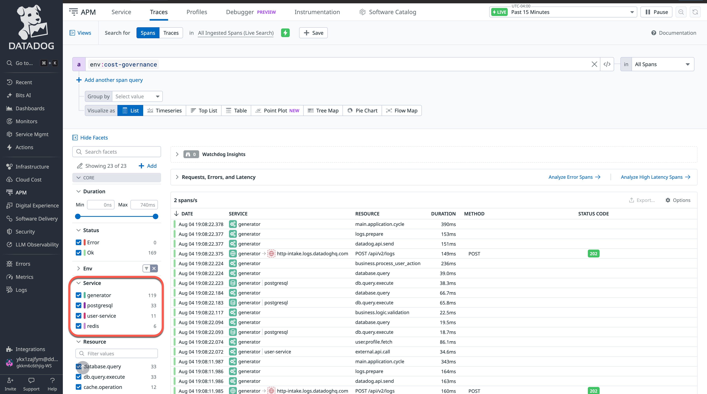
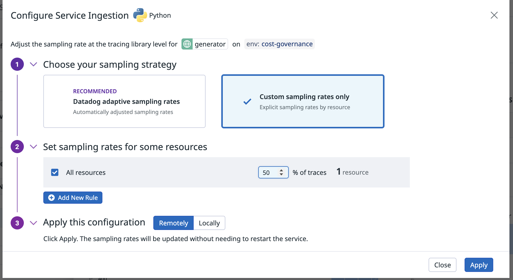
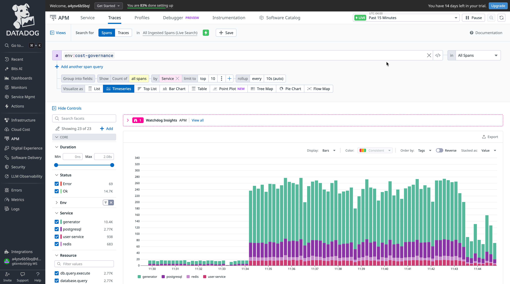
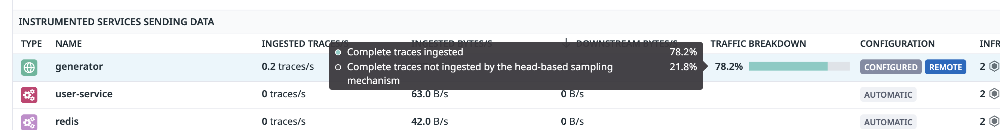
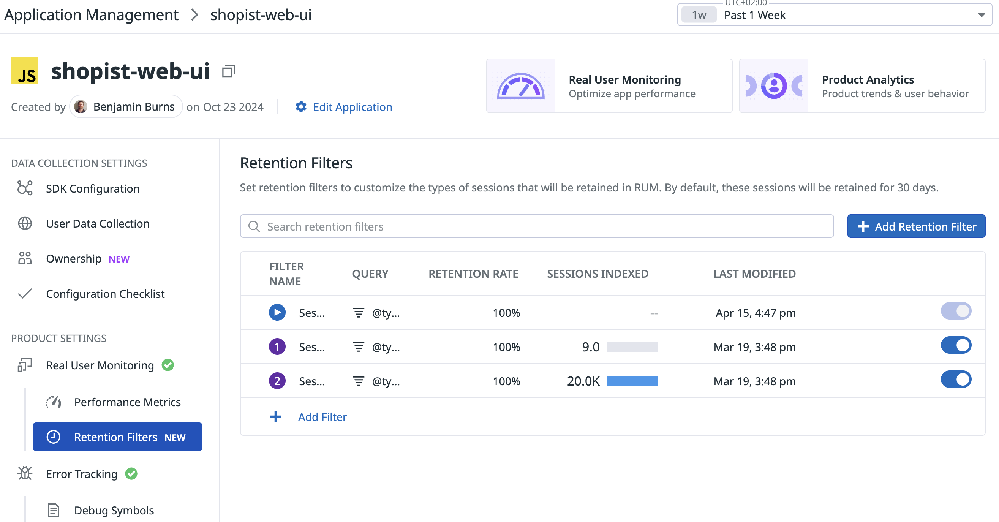

---

APM のトレースは適切に管理しないと、Datadog の請求で最大のコスト要因のひとつになり得ます。高トラフィックのアプリが毎時数百万トレースを生成すると、契約上のスパン割当をすぐに超え、大きな超過課金につながります。鍵は、インテリジェントなサンプリングでコストを抑えつつ可観測性を維持することです。

このセクションでは、APM トレースの取り込みをどう制御するかを扱います。

APM クイックイントロ
==========================================================

まず、このラボ環境での APM トレーシングの仕組みを理解します。

[APM > Traces](https://app.datadoghq.com/apm/traces) では、アプリケーションによって APM トレースが生成されているのを確認できます。

これらのトレースを Datadog に送るため、ラボアプリはコード変更なしの自動インストゥルメンテーションで計装されています。

**IDE** タブで **compose.yml** を開くと、APM 自動インストゥルメンテーションの設定例が見られます。

下記の **services.agent** 設定により、Datadog Agent がトレースとトレースメトリクスを受け付けます。
- `DD_APM_ENABLED=true` — APM 収集を有効化
- `DD_APM_NON_LOCAL_TRAFFIC=true` — コンテナからのトレースを受け付け

下記の **services.generator** 設定により、アプリがトレースを生成してエージェントに送ります。
- エントリポイントで `ddtrace-run python gen.py` を使用し Python アプリを自動計装
- `DD_SERVICE=generator` — トレースのサービス名
- `DD_TRACE_SAMPLE_RATE=1.0` — トレースを 100% サンプル
- `DD_PROFILING_ENABLED=true` — プロファイリングデータを有効化

**自動でトレースされるもの:**
- データベース操作（PostgreSQL クエリ）
- HTTP リクエスト（外部 API 呼び出し）
- キャッシュ操作（Redis のやりとり）
- ビジネスロジック処理
- エラートレース

このラボアプリは、サンプリング手法を安全に試し効果を観察する環境です。本番でトレース量がはるかに大きい場合、これらのサンプリング制御はコスト管理に不可欠になります。

APM Ingestion Control の方法
==========================================================

APM トレース取り込みを制御する主な UI は **Datadog UI** です。一部の設定は Agent 上でも直接行えます。

APM トレース取り込みを調整する方法は次の 3 種類です。

1. **Adaptive Sampling**（全サービス）: Datadog が目標の月次ボリューム（例: アロットメントや希望データ量 GB）に合わせてサンプリングを自動調整します。UI で設定できます。

   

2. **Service-level or resource controls**（サービス単位）: ノイズの多いサービスからのトレースを減らすため、特定サービス向けにライブラリレベルのサンプリングを設定します。Adaptive とカスタムのサンプリング率の両方に対応。UI またはトレーシングライブラリで設定可能。サービス全体またはサービス内の特定リソースを対象にできます。

   

3. **Agent-level Sampling Controls**（全サービス）: Agent できめ細かいサンプリングを設定します。
   - **Head-based sampling**（`ingestion_reason:auto`）: ルート（ヘッドスパン）で主にサンプリングし、関連スパン全体の可視性を維持
   - **Error span sampling**（`ingestion_reason:error`）: ヘッドベースで落ちる場合でもエラートレースを確実に取得
   - **Rare span sampling**（`ingestion_reason:rare`）: 一意なタグの組み合わせをキャッシュするルールで低頻度トレースを送り、まれ／異常な実行パスを捕捉
   - **Custom rule sampling**（`ingestion_reason:rule`）: 条件に基づくカスタムルールのサンプリング

   

現在の設定を確認するには、[APM > Traces > Ingestion Control](https://app.datadoghq.com/apm/traces/ingestion-control) に移動します。

UI ベースの設定はすべて Agent の **Remote Configuration**（`DD_REMOTE_CONFIGURATION_ENABLED=true`）を利用し、Agent の再起動なしですぐに反映されます。

UI が推奨ですが、特定ユースケース（例: OpenTelemetry）向けに他の設定方法もあります。[Ingestion Control documentation](https://docs.datadoghq.com/tracing/trace_pipeline/ingestion_controls/) を参照してください。

複数箇所にルールを設定したときの優先順位は [sampling rules precedence](https://docs.datadoghq.com/tracing/trace_pipeline/ingestion_controls/?tab=remotely#sampling-rules-precedence) を参照してください。

トレース取り込みの削減
==========================================================

実践してみましょう。

[APM > Traces](https://app.datadoghq.com/apm/traces) に移動し、処理済みトレースを可視化するよう表示を調整します。
1. **Visualize as** を `timeseries` に設定
2. **Group by** を `Service` に設定
3. 変化が分かるよう適切なタイムラインを設定

`generator`、`user-service`、`postgresql`、`redis` などのサービス横断でトレースのスパイクに注目してください。

サービスレベルの取り込み制御は次の手順で適用します。
1. [APM > Traces -> Ingestion Control](https://app.datadoghq.com/apm/traces/ingestion-control) に移動
2. **Manage Ingestion Per-Service** で `generator` サービスを選択
3. **Manage Ingestion Rate** をクリック
4. `Custom sampling rate only` を選択
5. `All resources` を選択
6. サンプリング率を `50%` に設定
7. `Remotely` を選択し、変更を即時反映（アプリの再起動不要）
8. 設定が下のスクリーンショットと一致することを確認
    
9. **Apply** をクリック

> [!NOTE]
> `generator` サービスの特定リソースだけにサンプリング率を設定することもできます。

数分後、[APM > Traces](https://app.datadoghq.com/apm/traces) に戻り、以前のタイムシリーズグラフで設定変更の効果を確認できます。

**Traffic Breakdown** にマウスを載せると、取り込まれなかったトレースの割合も確認できます。

> [!NOTE]
> 現在スパイクを起こしている Docker コンテナ（`spiker`）を特定できます。`docker kill spiker` を実行するとスパイクを止められます。コストスパイクを検知したあと、どれだけ速く対応できるかを示すデモです。

APM Retention Filters
========================================================

Retention filters は、取り込まれたスパンのどれをインデックス化するか（通常 15 日）を決め、コストと可視性のバランスを取ります。

Datadog は、環境・サービス・操作・リソース横断で異なるレイテンシ分布のスパンを保持する Intelligent Retention Filter に加え、サービスとエンドポイント横断の可視性を保ちエラーと高レイテンシのトレースを捕捉するデフォルトフィルターを提供します。スパンの属性やタグに基づくカスタム retention filter も定義でき、ビジネス上重要なトレースを残せます。

詳細は [Datadog docs](https://docs.datadoghq.com/tracing/trace_pipeline/#retention-filters) を参照してください。

> [!NOTE]
> APM retention filter をより深く扱うワークショップは、この [learning course](https://learn.datadoghq.com/courses/apm-rate-limit-retention) を参照してください。

RUM Without Limits
=========================================================

RUM Without Limits は、セッションデータの取り込みとインデックス化を分離し、RUM セッション量を柔軟に扱えます。次が可能になります。

- 事前のサンプリング決定やコード変更なしに、Datadog UI から動的に retention filter を設定
- エラーやパフォーマンス問題のあるセッションは保持し、ユーザー操作の少ないセッションなど重要度の低いものは破棄

セッションの一部だけを保持しても、Datadog はすべての取り込み済みセッションに対して [performance metrics](https://docs.datadoghq.com/real_user_monitoring/rum_without_limits/metrics) を提供し、アプリの健全性とパフォーマンスの正確で長期的な概要を保証します。

RUM Without Limits の設定:

1. [Digital Experience > Real User Monitoring > Applications](https://app.datadoghq.com/rum/list) に移動
1. アプリケーションを選択（このラボでは `Python web app`）
1. SDK 設定（`SDK Configuration`）を構成:
   - `sessionSampleRate` を 100% に設定
   - `sessionReplaySampleRate` を可観測性の要件に合わせて設定
   - `traceContextInjection: sampled` が有効であることを確認
1. Datadog UI で retention filter を設定:
   - `PRODUCT SETTINGS` の下の `Retention Filters` をクリック
   - 既存の retention filter を調整するか、可観測性の要件に基づいて新規追加

RUM セッションの retention filter 設定
========================================

[Digital Experience > Real User Monitoring](https://app.datadoghq.com/rum/performance-monitoring) では、セッションが有効化され Datadog に流れ込んでいるのを確認できます。

すべてのセッションの 75% を破棄しつつ、エラーのあるセッションは 100% 保持するよう retention filter を設定してみてください。RUM retention filter が取り込みコストをいかに大きく下げられるかを示します。

> [!NOTE]
> 対応 Web サーバーでは、サーバー側の [Single Step Instrumentation for RUM](https://docs.datadoghq.com/real_user_monitoring/application_monitoring/browser/setup/server/) も利用できます。

次は？
========================================================

このセクションでは、Datadog が UI で直接 retention filter を構成しすべてのトレースのコストを最適化する強力なツールを提供すること、さらに高度な制御が Agent レベルでも利用できることを学びました。

次のラボでは、カスタムメトリクスの最適化とコストを効果的に管理する方法を扱います。
