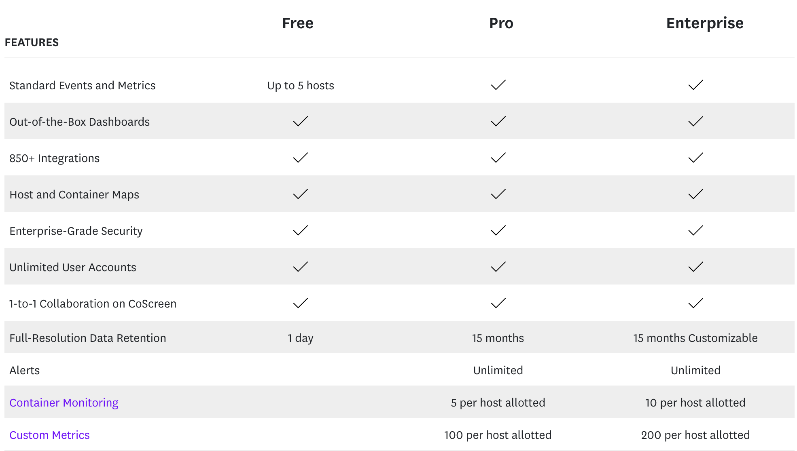
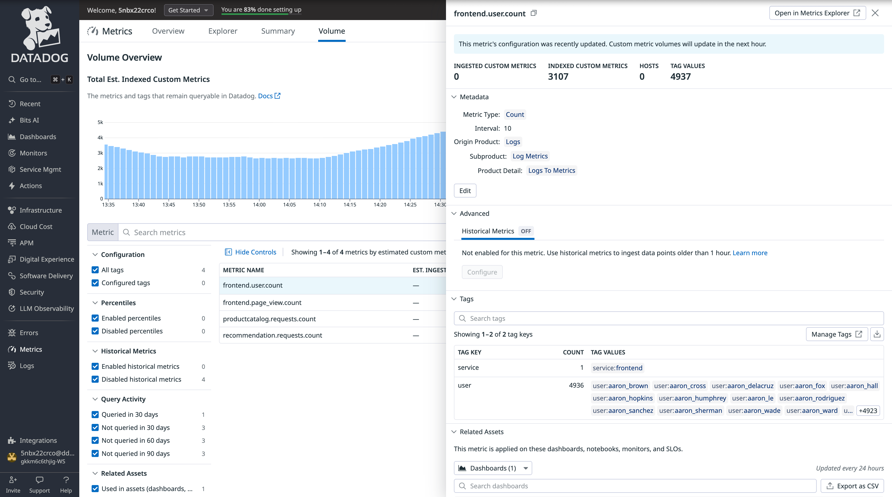
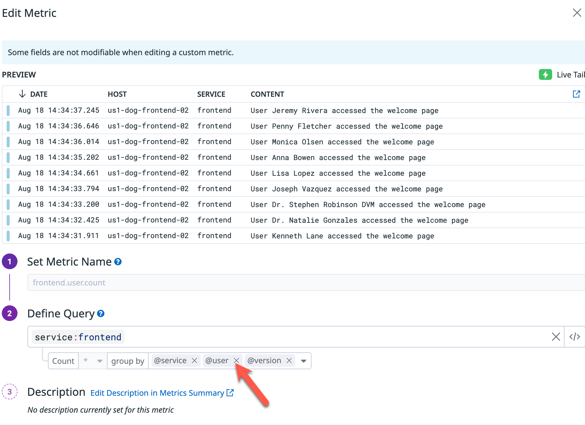
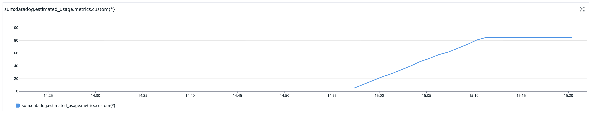

--- 

多くの標準インテグレーションは、カスタムとして課金されない組み込みメトリクスを提供します。可能な限り、独自のカスタムメトリクスを送るよりネイティブインテグレーション（例: NGINX インテグレーション）を利用してください。

ログやトレースから長期トレンドが必要な場合は、そのデータからメトリクス（例: `gauge` や `count`）を生成することを検討してください。メトリクスはトレンド分析に適した長期保持があります。

各ホストプランには、デフォルトでカスタムメトリクスのアロットメントが含まれます。



最も重要なのは、カスタムメトリクスの課金の仕組みを理解し、メトリクスに **境界のない（unbounded）** タグを使わないことです。
理由を整理します。

カスタムメトリクスのコスト課題
=========================================================

ユーザー ID、リクエスト ID、タイムスタンプなど、無限にユニーク値を取り得るタグである **unbounded tags** を誤って含めると、カスタムメトリクスはすぐに高コストになります。

ユニークなタグの組み合わせごとに、課金上は別のカスタムメトリクスとして数えられます。

### カーディナリティの計算の理解

カスタムメトリクスの課金は **cardinality**、すなわちユニークなタグの組み合わせの総数に基づきます。

```
式: Cardinality = Tag1 の値の数 × Tag2 の値の数 × Tag3 の値の数 × ...
```

### 賢い選択と高コストな選択

**良い例 — 境界のあるタグ:**
- メトリクス: `ecommerce.orders.total`
- タグ: `environment`（3 値）+ `region`（4 値）
- **Cardinality: 3 × 4 = 12 custom metrics**
- **コスト影響: 小さい**

**問題のある例 — 境界のないタグ:**
- 同じメトリクス: `ecommerce.orders.total`
- タグ: `environment`（3 値）+ `customer_id`（5 万のユニーク顧客）
- **Cardinality: 3 × 50,000 = 150,000 custom metrics**
- **コスト影響: 大きい — 契約内容による**

**重要な違い:** `customer_id` を足すと **unbounded** 次元ができ、コストが指数的に増えます。`user_id`、`session_id`、`request_id` のようなタグはメトリクスに使うべきではありません。

カーディナリティ管理
=========================================================

Datadog は、カスタムメトリクスのコストを特定・最適化・監視する包括的なツールを提供します。

カーディナリティの高いカスタムメトリクスを特定するには、[Metrics > Volume](https://app.datadoghq.com/metric/volume?sort=-volume_total) に移動します。

メトリクス `frontend.user.count` をクリックし、タグの内訳と関連アセット（例: モニターやダッシュボード）を確認します。

ここで、`user` タグがメトリクスの高カーディナリティの原因になっていることがすぐ分かります。


**Manage Tags** で、カーディナリティを下げるため境界のない `user` タグをメトリクスの group-bys から削除します。


**Update Metric** をクリックして変更を保存することを忘れないでください。

先回りの監視
=========================================================
[Metrics > Explorer](https://app.datadoghq.com/metric/explorer) で `datadog.estimated_usage.metrics.custom` を検索し、カスタムメトリクス支出の監視に使います。

約 5 分後、`frontend.user.count` から `user` タグを除外した変更以降、メトリクスが平坦になるのを確認できるはずです。


これらのメトリクスで [anomaly detection monitor](https://app.datadoghq.com/monitors/create/anomaly) を作成し、予算に影響する前に想定外のスパイクを捕捉してください。

次のステップ
=========================================================
Datadog でカスタムメトリクスがどのように使われ管理されるか、そして高カーディナリティを避ける方法が分かったので、次のセクションに進みましょう。

次のラボでは、SKU 管理と高度なコスト配分の戦略を扱い、コストガバナンスの理解を完成させます。

