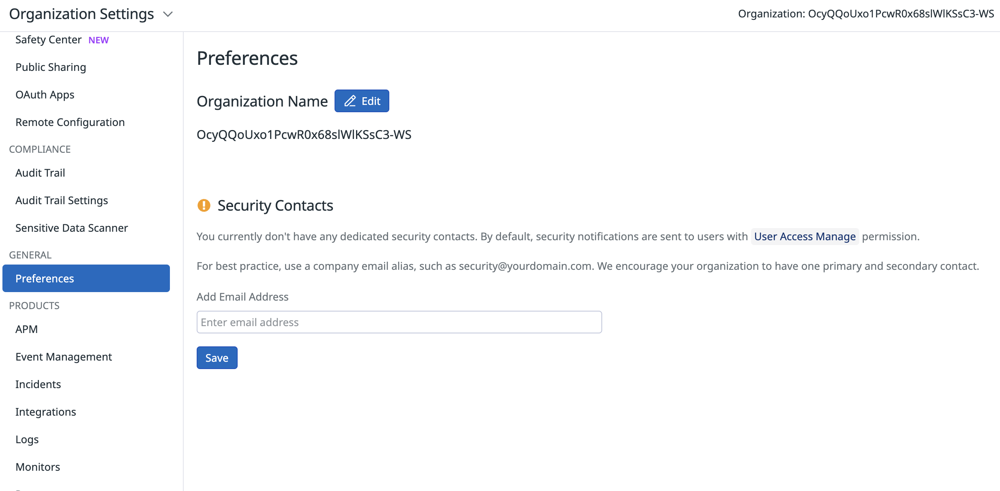
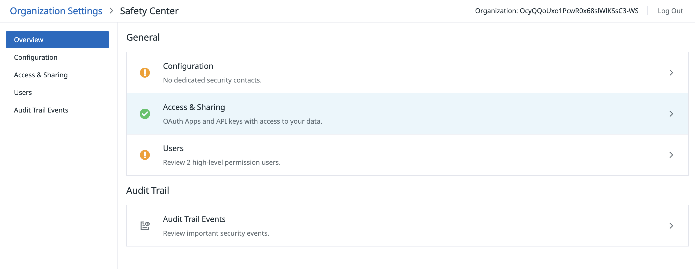
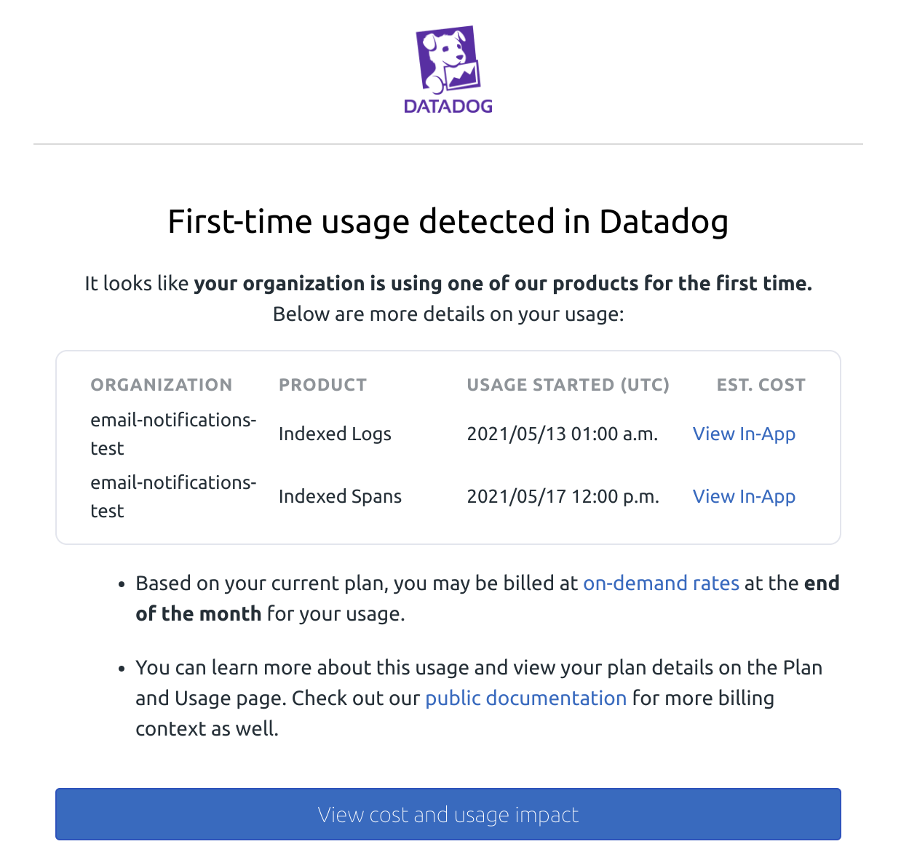
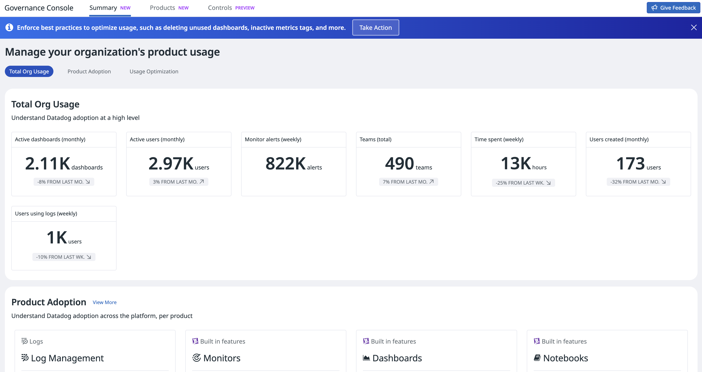

---

コスト管理のための Role-Based Access Control (RBAC)
=========================================================
次のようなコスト影響の大きい機能へのアクセスを制限するカスタムユーザーロールを作成します。
- プロダクトの有効化（APM、Security、RUM など）
- 取り込み設定の変更
- インデックス保持期間の変更

Datadog は 3 つの [default roles](https://docs.datadoghq.com/account_management/rbac/?tab=datadoghq-application#datadog-default-roles): **Admin**、**Standard**、**Read-only** を提供します。ただし効果的なコストガバナンスのためには、ビジネスルールに基づきより細かい権限を持つ追加のカスタムロールを定義することが推奨されます。

デフォルトに加えてよくあるカスタムロールの例:
- **Log Analyst**: ログは閲覧できるが、インデックス保持ポリシーは変更できない
- **Developer**: APM データにアクセスできるが、新しい APM 機能は有効化できない
- **Observer**: ダッシュボードとメトリクスは閲覧できるが、課金対象のモニターは作成できない

### ロール作成の手順

1. **ロール管理へのアクセス**:
   - Admin として [Datadog](https://app.datadoghq.com) にログイン
   - [Organization Settings > Roles](https://app.datadoghq.com/organization-settings/roles) に移動

2. **カスタムロールの有効化**（まだの場合）:
   - 設定の歯車アイコンをクリック
   - カスタムロールの **Enable** を選択

3. **新しいロールの作成**:
   - **New Role** をクリック
   - わかりやすい名前を入力（例: "Cost-Controlled Developer"）

4. **権限の設定**:
   - **Grant**: 必要な機能（APM、Logs、Metrics）への読み取りアクセス
   - **Restrict**: Billing 設定、プロダクトの有効化、保持期間の変更
   - 詳細は [Log Management Permissions](https://docs.datadoghq.com/account_management/rbac/permissions/?tab=ui#log-management) を参照

5. **保存と割り当て**:
   - **Save** をクリック
   - ユーザーを新しいロールに割り当て

ログ以外にも、コスト影響の大きい機能へのアクセスを制限できます。
- **API Management**: API と Application key の作成を制限 — 不正なインテグレーションを防止
- **Organization Settings**: Billing とユーザー管理を制限 — 不正なプラン変更を防止
- **Automation Tools**: App Builder と Workflow の作成を制限 — コンピュートリソース利用を制御
- **Infrastructure**: インテグレーションのインストールを制限 — 想定外のホスト／コンテナ課金を防止

**完全な参考:** [Datadog RBAC Permissions Documentation](https://docs.datadoghq.com/account_management/rbac/permissions/)

セキュリティ連絡先の設定
=========================================================

Datadog はセキュリティ連絡先を使い、インターネット上で見つかった侵害された API キーや、コストなどに影響し得るその他のセキュリティインシデントを通知します。

[Account name > Organization Settings](https://app.datadoghq.com/organization-settings) の **Safety Center** で、ロールとセキュリティ連絡先が適切に設定されているか確認できます。

**Safety Center** では、重要なセキュリティイベントへのクイックアクセスや、承認待ちのユーザー、高度な管理者権限を持つユーザーのハイライトも提供されます。

（プレビュー）初回利用通知（新 SKU 検出）
==========================================================

Datadog は、クライアントが初めて特定のプロダクトの利用を開始したときに、Billing Notification Service で通知します。

この通知は、新しいプロダクト利用の認識と、契約外利用の可能性の検知に役立ちます。通知はサブ組織レベルの初回利用に対して送られます。つまり同一アカウント内の別組織で以前に使われていても、サブ組織では初回利用通知が生成されます。

> [!NOTE]
> 各サブ組織は、所定のプロダクトについてこの通知を一度だけ受け取ります。

Datadog プロダクトの無効化方法（API & App Protection の例）
=========================================================

API & App Protection はホストあたり月額課金のため、組織全体での誤有効化は高コストになり得ます。

AAP が Datadog UI 経由で有効になった場合は、[こちら](https://docs.datadoghq.com/security/application_security/troubleshooting/?tab=java#remote-configuration) の手順に従ってください。

計装レベルで AAP が有効な場合は、環境変数 `DD_APPSEC_ENABLED=false` を設定し、アプリケーションまたはデプロイを再起動します。

他のプロダクトにも同様の無効化手順があります — 各ドキュメントを参照してください。

API と App Key のベストプラクティス
=========================================================

適切な API キー管理は、セキュリティとコスト管理の両面で重要です。侵害されたキーは不正利用と想定外の課金につながり得ます。

推奨されるベストプラクティス:
- API と Application key は少なくとも 90 日ごとにローテーション
- 環境（dev、staging、production）ごとに専用の API キーを使用
- 各キーのスコープと権限に **Principle of Least Privilege** を適用
- エージェント（ホスト）またはワークロードごとに固有の API キーを発行し、細かい失効と監査を可能にする
- キーはシークレットマネージャに保管し、ソース管理にコミットしない。実行時は環境変数またはシークレットマウントを使用
- 監査と失効を容易にするため、キーに所有者、環境、目的のタグを付与
- API 利用を監視し、異常パターンにアラート。露出が疑われる場合はすぐに失効とローテーション

これらの実践により、細かい制御、容易なアクセス失効、よりよい監査証跡が得られ、侵害されたキーによるコストの暴走を防ぎます。

（プレビュー）Governance Console
====================================

現在プレビュー中の Governance Console では次が可能です。
- 組織レベルでの導入健全性の追跡
- ベストプラクティスが整っていることの確認
- 説明責任の徹底と健全な導入の促進

ラボのまとめ
=========================================================
お疲れさまでした。Cost Governance ワークショップを完了しました。
