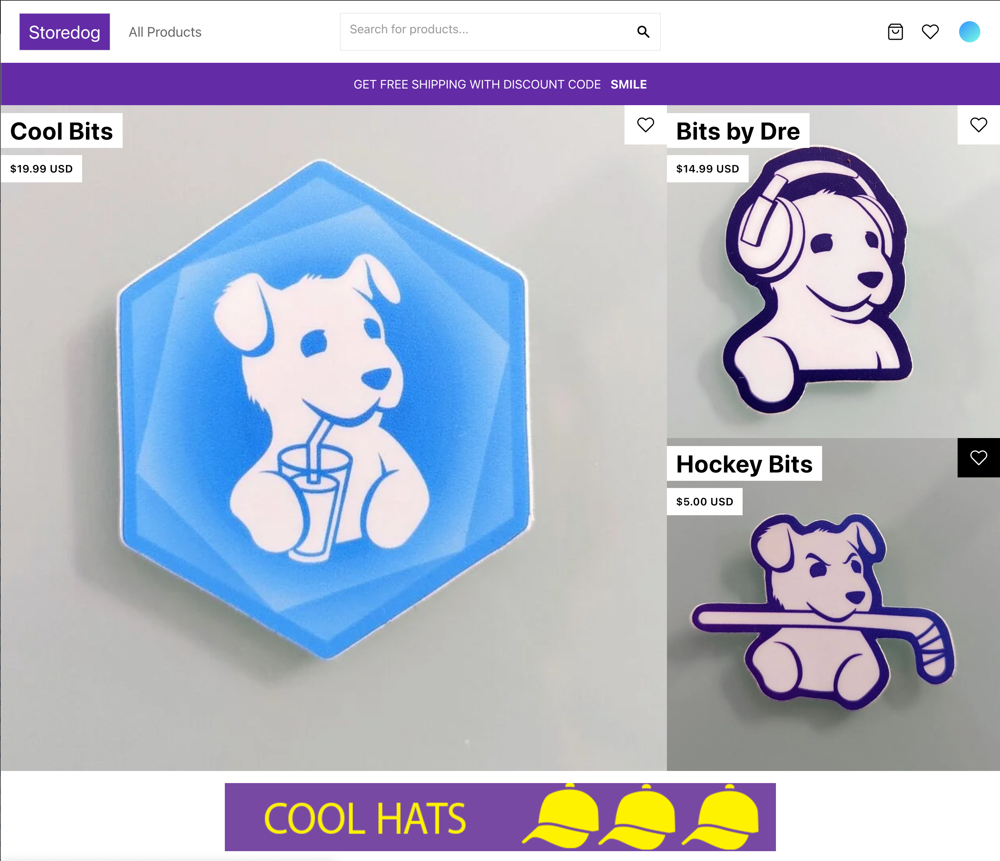
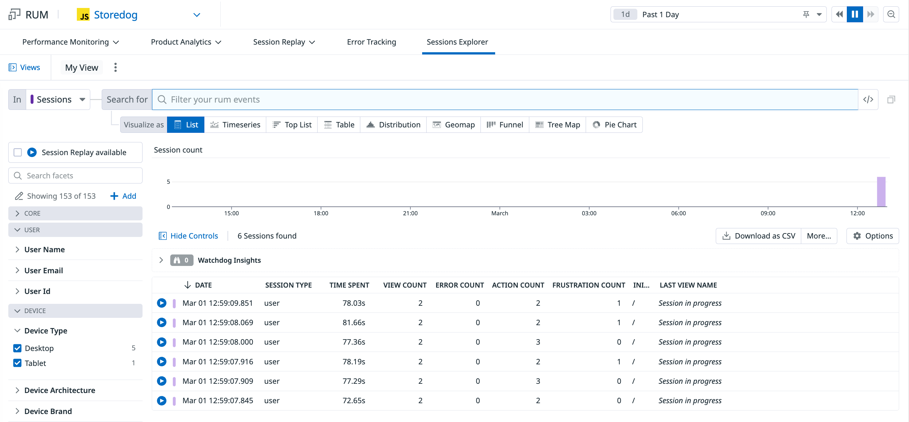
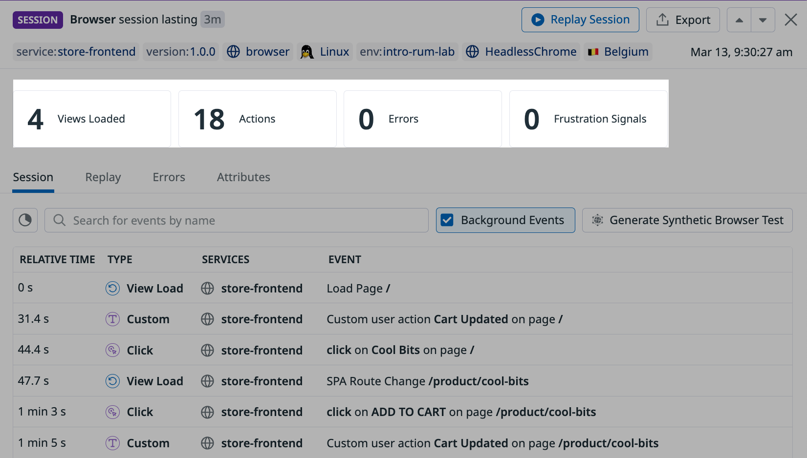
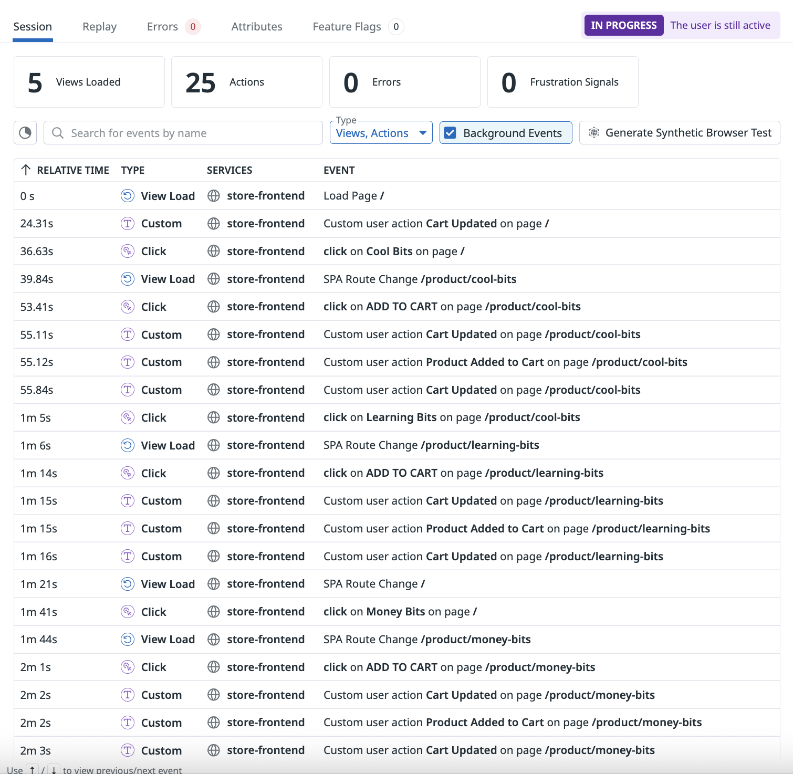
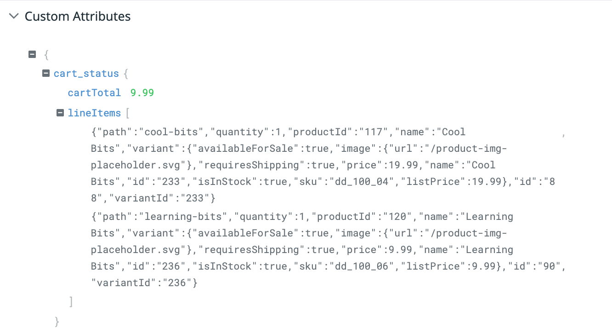
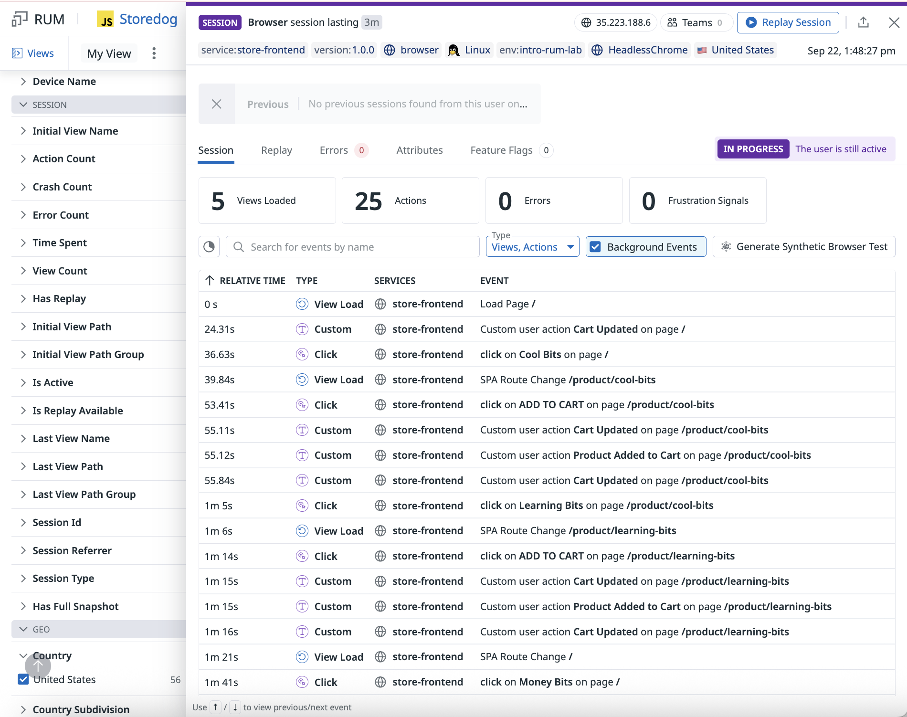
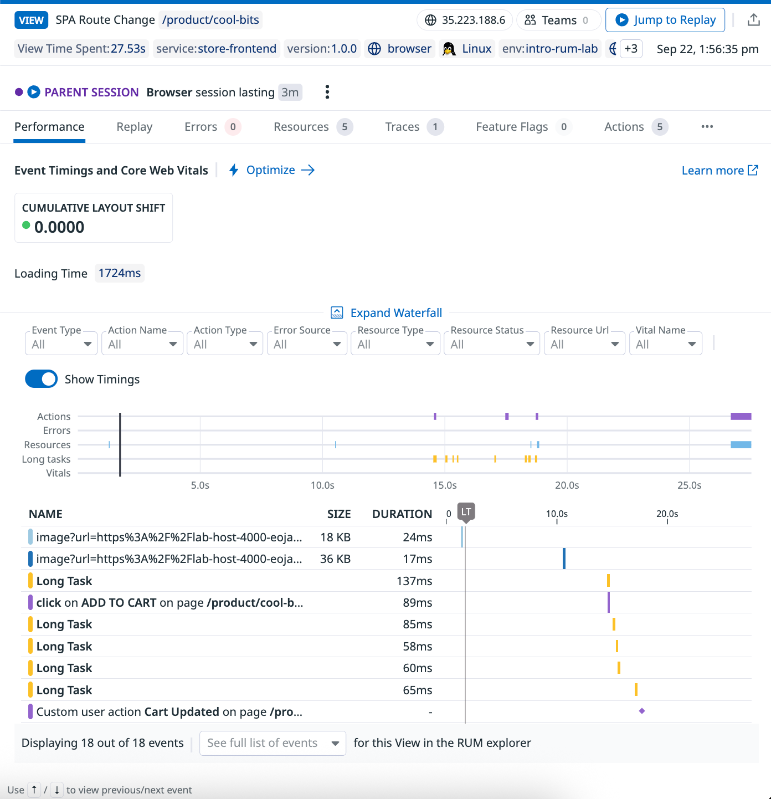
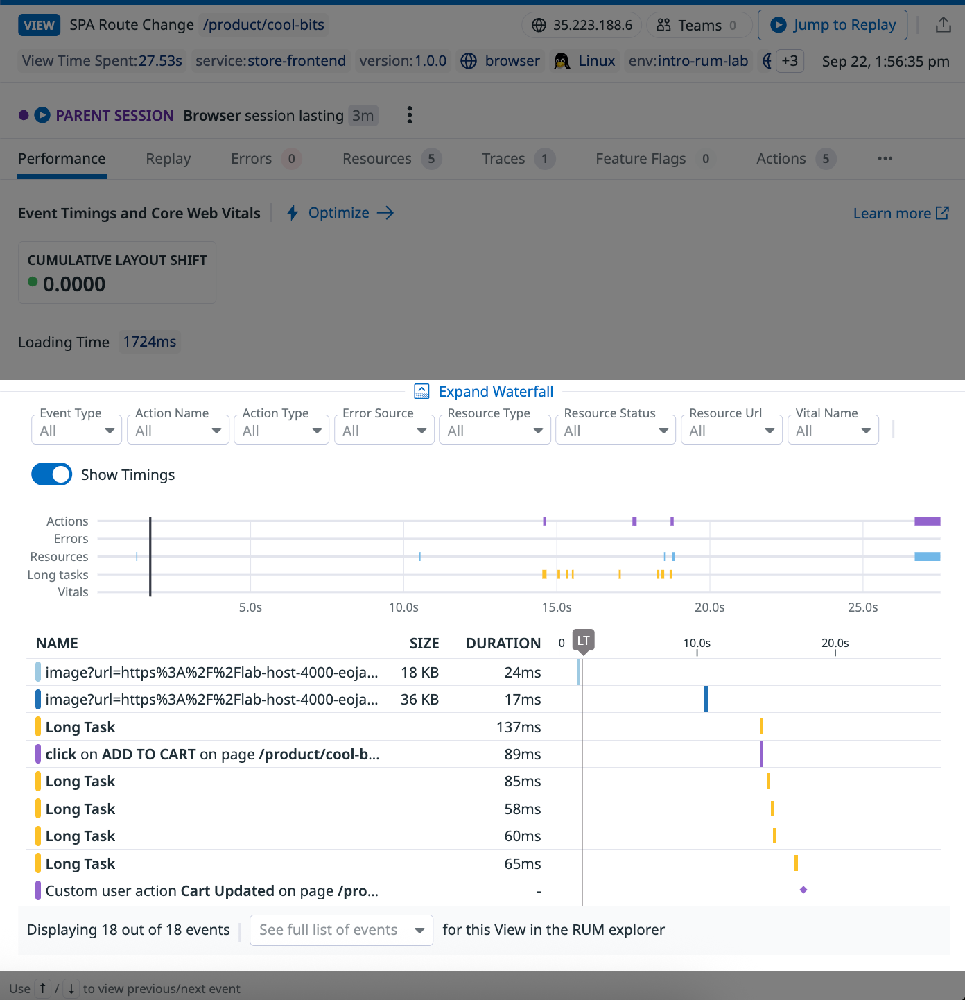
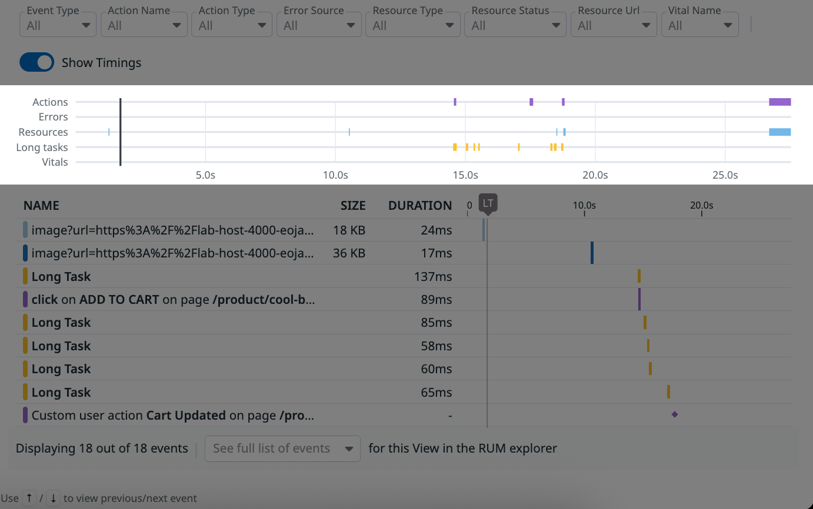
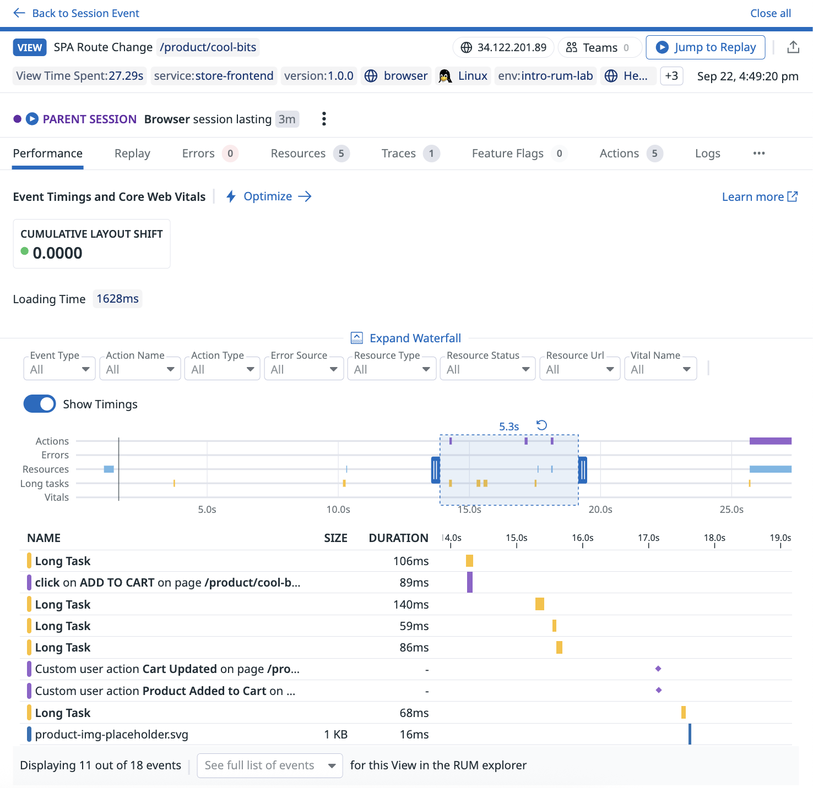

---

あなたはStoredogというeコマース企業のフロントエンド開発者です。

あなたの仕事は、Storedogのオンラインストアフロントのフロントエンドパフォーマンスとユーザーエクスペリエンス（UX）を維持・改善することです。しかし、これはいくつかの理由で困難です：

1. 新しいバージョンが以前のバージョンよりもパフォーマンスが高く、安定しているかどうかを追跡することが困難です。

2. 問題を解決するための各ステップ（再現、データ分析、根本原因の特定など）は労力がかかります。特に一貫性のないエラーや地域的なエラーの場合はなおさらです。

3. どの最適化がユーザーエクスペリエンスを最も改善するかが常に明確ではありません。これにより、開発リソースをどこに投入するかを特定することが難しくなります。

Storedogは最近、DatadogのReal User Monitoring (RUM)サービスに投資しました。これらの課題に対処できるかどうか、RUMを探索する準備が整いました。

ラボ環境
===

このラボでは、各セクションが一連のステップに分かれています。セクション間を移動するには、各ヘッダーをクリックしてセクションを展開または折りたたみます。

**terminal**はUIのメインパネルにあります。Datadogトレーニングアカウントの資格情報がすでにterminalに表示されています。これらの資格情報は、今後のステップで使用します。

terminalの上には、追加の**Storedog**タブと**Help**タブがあります。**Storedog**タブは、このラボのデモアプリケーションをブラウザで開きます。（これは次のセクションで行います。）

**Help**タブには、このラボ環境に関するトラブルシューティングガイダンスとよくある質問が含まれています。ラボ中に問題が発生した場合は、ここの情報を参照してください。

このラボの後半のセクションには、デモStoredogアプリケーションのソースコードファイルをナビゲートできる**IDE**タブも表示されます。

Storedogのユーザーエクスペリエンス
===

次に、少し時間を取ってStoredogを見学してください。Storedogのユーザーエクスペリエンスに精通することで、RUMデータをよりよく理解できるようになります。

1. 上部の**Storedog**タブをクリックして、ブラウザでサイトを開きます。

2. サイトをナビゲートして、外観と動作を確認します。以下を試してください：

   1. いくつかの製品を表示します。

   2. いくつかの製品をショッピングカートに追加します。

   3. ショッピングカートを開いて、内容を確認します。

   4. チェックアウトプロセスを完了して、選択した製品を「購入」します。

User sessions
===

RUMはすでにStoredogにインストールされ、設定されています。

Storedogのユーザーエクスペリエンスを理解したので、次にDatadogでそのデータを検査します。RUMの最も基本的な構成要素である**user session**から始めます。

1. terminalに表示されている資格情報を使用して、[app.datadoghq.com](https://app.datadoghq.com/)にログインします。

   > [!NOTE]
   > terminalで`creds`コマンドを実行することで、いつでも資格情報を表示できます。

2. Datadogで、左側のメインナビゲーションメニューを見つけます。**Digital Experience**にカーソルを合わせます。**Real User Monitoring**の下にある**[Explorer](https://app.datadoghq.com/rum/sessions)**をクリックします。
   
   これが**RUM Sessions Explorer**です。

   

   このリストの各エントリは、Storedogでの一意の**user session**を表しています。

   

   > [!NOTE]
   > _"No sessions found"_というメッセージが表示された場合は、少し待ってからページを更新してください。StoredogデータがRUMに入力されるまでに数分かかる場合があります。
    
   user sessionは、ユーザーがアプリケーションを訪れた記録されたインスタンスです。これには、2つの一般的なカテゴリのデータが含まれます：

   - **User Journey**：ユーザーが行ったすべての記録。訪問したページ、クリックした要素など。ブラウザ、オペレーティングシステム、地理的エリアなど、アプリケーションへのアクセス方法の詳細も含まれます。

   - **Frontend Performance**：セッション中のサイトのパフォーマンス。これには、ロード時間、エラー、リソース、関連するマイクロサービスの詳細などが含まれます。
      
   セッションは最大4時間続くことができますが、15分間の非アクティブがあると終了します。

3. 最も高い**action count**（リストの6番目の列）を持つセッションを見つけて開きます。

      すべてのaction countが`0`の場合は、少し待ってからページを更新してください。

4. 結果として表示される詳細パネルで、上部近くの数値に注目してください。

   

      > [!NOTE]
      > Datadogアカウントの特定の値は、このコース全体のサンプル画像と異なる場合があります。**_これは正常で予期されたことです_**。
      > 
      > このラボ環境は、RUMデータを生成するためにStoredogのモックトラフィックを送信します。実際のユーザーをシミュレートするために、トラフィックパターンは部分的にランダム化されています。

   これらの値は、セッションの概要を一目で提供します：

      - **Views Loaded**：ユーザーがアクセスしたページの数。セッションには複数のビューを含めることができます。

      - **Actions**：ユーザーが実行したアクションの数。これには、要素のクリックからカスタムインストルメント化されたアクションまで、すべてが含まれます。

      - **Errors**：セッション中にスローされたエラーの総数。

      - **Frustration Signals**：Datadogは、ユーザーエクスペリエンスを低下させることが知られているインタラクションが記録されたときに自動的に表示します。Frustration Signalsには3つのタイプがあります：

        - **Rage Clicks**：1秒間に3回以上要素をクリックする。

        - **Dead Clicks**：アクションを生成しない静的要素をクリックする。

        - **Error Clicks**：JavaScriptエラーが発生する直前に要素をクリックする。

これらのRUMイベントタイプについては、コース全体でさらに学習します。

User session events
===

パネルのさらに下には、セッション内のすべての記録されたイベントの時系列リストがあります。

これは、ユーザーがアプリとどのようにやり取りしたか、そしてセッションで何を達成したかを正確に示しています。

各イベントには、相対時間、サービス名、簡単な説明、タイプが含まれます。3つのタイプが表示されるはずです：

  - **View Load**：新しいページへの移動。
  - **Click**：ページ要素のクリック。
  - **Custom**：アプリケーションのコードに手動でインストルメント化されたアクション。

> [!NOTE]
> 3つのイベントタイプが表示されない場合は、セッションを終了し、Sessions Explorerから別のセッションを選択してください。高い**action count**を持つセッションを目指してください。

## カスタムRUMアクションについて

RUMは、ClickやView Loadなどの多くのイベントを自動的に収集します。しかし、一部のアプリでは、UXが業務にどのように影響するかを完全に理解するために、ビジネス固有のコンテキストが必要です。

例えば、eコマース企業として、Storedogの目標は製品を販売することです。販売を行うには、ユーザーがカートに製品を入れ、チェックアウトを完了する必要があります。このプロセスのスムーズな完了は、Storedogの成功に_不可欠_です。

このため、Storedogには3つのカスタムRUMアクションがインストルメント化されています：

- **Cart Updated**：ユーザーのショッピングカートが何らかの方法で更新されました。
- **Product Added to Cart**：新しいアイテムがショッピングカートに追加されました。
- **Successful Checkout**：チェックアウトプロセスが正常に完了しました。

1. セッション詳細パネルで、<code>Custom user action <strong>Cart Updated</strong>...</code>で始まる**Custom**アクションを見つけて選択します。

      > [!NOTE]
      > <code>Custom user action <strong>Cart Updated</strong>...</code>イベントが表示されない場合は、セッションを終了し、Sessions Explorerから別のセッションを選択してください。高い**action count**を持つセッションを目指してください。

2. 結果として表示されるパネルの下部にある**Custom Attributes**までスクロールします。

      

      これは、カスタムアクションがDatadogに送信する追加データです。カートアイテムの合計コストと各カートアイテムの詳細が含まれます。
      
      これにより、標準RUMデータを補完して、次のような質問に答えることができます：

      - _カートから最も頻繁に削除されるアイテムは何ですか？_
      - _特定の値を超える/下回るカートは放棄される可能性が高いですか？_
      - _どのタイプのユーザーエクスペリエンスが以下をもたらしますか？_
        - _...より多くの完了したチェックアウト？_
        - _...カートに追加されたより多くのアイテム？_
        - _...より少ない放棄されたカート？_
      - _最適でないユーザーエクスペリエンスの1時間あたりにどれだけの潜在的な収益が失われていますか？_

3. パネルを終了してセッションの詳細に戻ります。

      

パフォーマンス、UX、売上の相関関係を明らかにすることで、Storedogの全員がビジネスをよりよく理解できるようになります。また、フロントエンド開発チームに実用的なガイダンスを提供します。

カスタムRUMアクションの詳細については、このコースの最後で説明します。

User session performance
===

ユーザーがアプリとどのようにやり取りしたかを見ることは、話の片側だけを語っています。アプリがユーザーにとってどのように機能したかを理解することも重要です。

次に、user sessionと個々のRUMイベントの両方のパフォーマンスデータにアクセスする方法を学習します。

選択したセッションのイベントリストが表示されるはずです：

1. このリストから、<code>SPA Route Change <strong>/product/</strong>...</code>で始まる**View Load**イベントをクリックします。このイベントタイプには、プレビューに最適なさまざまなサンプルパフォーマンスデータがあります。

      

      これにより、選択したイベントのパフォーマンスデータが開きます。

      

2. 下部のチャートに注目してください。これは**Performance Waterfall**です。

      

      Performance Waterfallは、選択したイベントまたは期間中の相互に関連するフロントエンドプロセスの順序と期間を伝えます。
      
      これを使用して、パフォーマンスをよりよく理解し、パターンを特定し、問題やエラー中に何が起こるかを可視化します。

3. 上部の水平線は**view minimap**です。
   
      

      これらの線は、このビューイベントの合計期間を表しています。

      線の上の色付きブロックは、このビューで発生したイベントを表しています。5つのカテゴリがあり、それぞれが線と割り当てられた色で示されています：

      - **Actions**：このビューでユーザーが実行したアクション
      - **Errors**：このビューでスローされたエラー
      - **Resources**：このビューの一部としてロードされたリソース
      - **Long Tasks**：50ms以上メインスレッドをブロックしたイベント
      - **Vitals**：[Custom Vitals](https://docs.datadoghq.com/real_user_monitoring/browser/monitoring_page_performance/#create-custom-performance-telemetry)の期間を表示

4. minimap上でクリックしてドラッグし、セレクタを開きます。色付きブロックが多いエリアの上にセレクタを配置します：
   
      

      イベントのリストは、選択に基づいて変更されます。

5. 詳細については、任意のリストエントリをクリックできます。**Custom User Action**イベントをクリックしてみてください。

      結果として表示されるパネルは見覚えがあるはずです。以前にカスタム**Cart Updated**イベントを探索したときに、同様のパネルを見ました。

6. アクション詳細パネルを終了して、ビュー詳細パネルに戻ります。

      

まとめ
===

このセクションでは、個々のuser sessionを調査する方法を学習しました。相互に関連するイベントがコンテキスト内でどのように表示されるか、それらの間をナビゲートする方法、特定のイベントにドリルダウンする方法を見ました。

これが、ユーザーのインシデントレポートやサポートチケットの調査にどのように役立つかを理解しています。

ただし、セッションは1人のユーザーのエクスペリエンスのみを表しています。Storedogにはサポートする_多くの_顧客がいます。

次のセクションでは、RUMが複数のセッションからデータを集約して、トレンドやその他の洞察をどのように表示するかを確認します。

下の**Next**ボタンをクリックして進みます。

