トレンドを発見し、全体的なパフォーマンスを測定するために、RUMは大量のセッションデータを集約します。これにより、次のような大局的な質問に答えることができます：

- _「ほとんどのユーザーにとって、どのリソースのロードが最も遅いですか？」_
- _「EMEAのパフォーマンスはAMERとは異なりますか？」_
- _「そのエラーはChromeでのみ表示されますか？」_
- _「Storedogの最新バージョンは以前のバージョンよりもパフォーマンスが高いですか？」_

このセクションでは、これらのタイプの質問などに答えるためのRUMデータのクエリについて探索します。

Saved viewsと事前構築されたクエリ
===

まず、いくつかの事前構築されたクエリをプレビューして、RUMが表示できる洞察のタイプに慣れます。

1. Datadogで、[Digital Experience > Real User Monitoring > Explorer](https://app.datadoghq.com/rum/sessions)に移動します。

2. 左上隅の**Views**を選択します。
   
      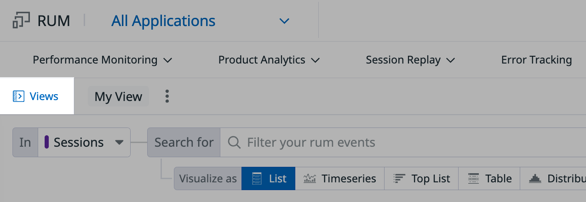
   
      これにより、保存されたSessions Explorerビューを含むサイドバーが開きます。それぞれには、セッションデータをフィルタリングおよび/または可視化するための事前構築されたクエリが含まれています。

      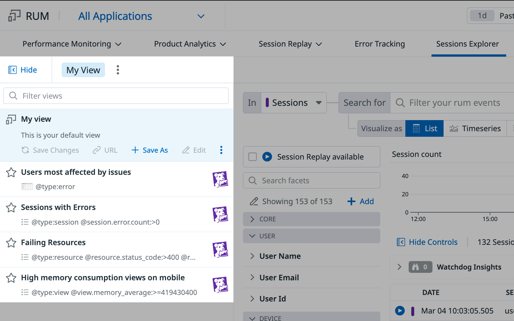

3. Viewsサイドバーで、**Sessions with Errors**をクリックします。Explorerの変化に注目してください：

      1. **Search for**にクエリが含まれるようになりました：`@session.error.count:>0`

      2. セッションのリストには、1つ以上のエラーを持つセッションのみが表示されます。

           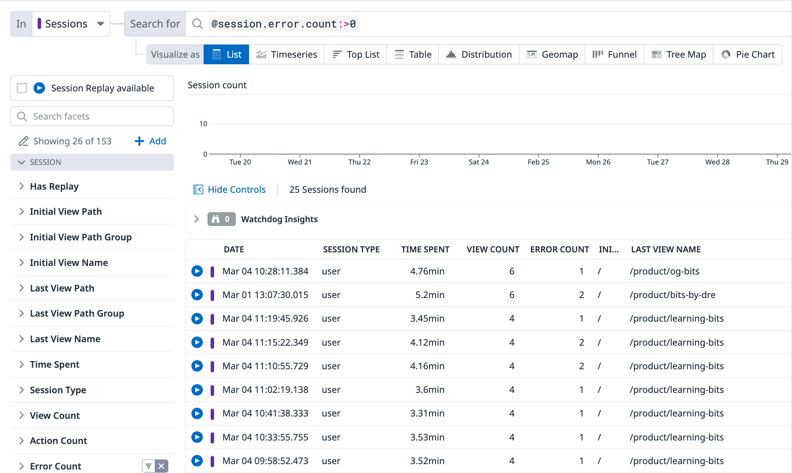

4. 次に、**Failing Resources**を選択してみてください。再び、変化に注目してください：

      1. **Search for**に新しいクエリが含まれています：`@resource.status_code:>400 @resource.type:(fetch OR xhr)`

      2. **Search for**の左側の**In**フィールドに**Resources**がリストされています。

      3. Sessions Explorerのリストが異なって見えます。user sessionsをリストする代わりに、リソースのリストが表示されています。

            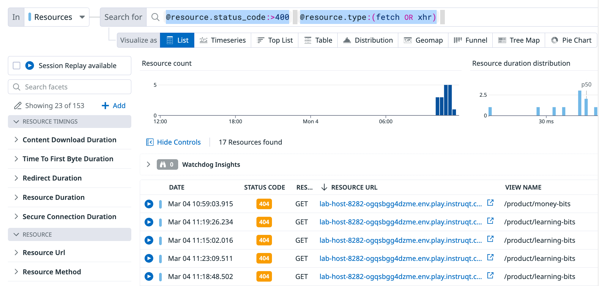

その名前にもかかわらず、Sessions Explorerはセッション以上のものをクエリします。また、ビュー、アクション、リソース、エラー、long tasksなど、セッションに_関連付けられた_イベントもクエリできます。

セッション階層
===

1. Sessions Explorerで、**Search for**フィールドをクリアします。

2. **Search for**の左側の**In**フィールドを展開して、オプションを表示します。

      

      これらの各項目は、RUMによって収集されるイベントのタイプです。

3. リストのインデントに注目してください。これは、これらのイベントタイプ間の関係階層を表しています。

      この階層を視覚化する別の方法は次のとおりです：

      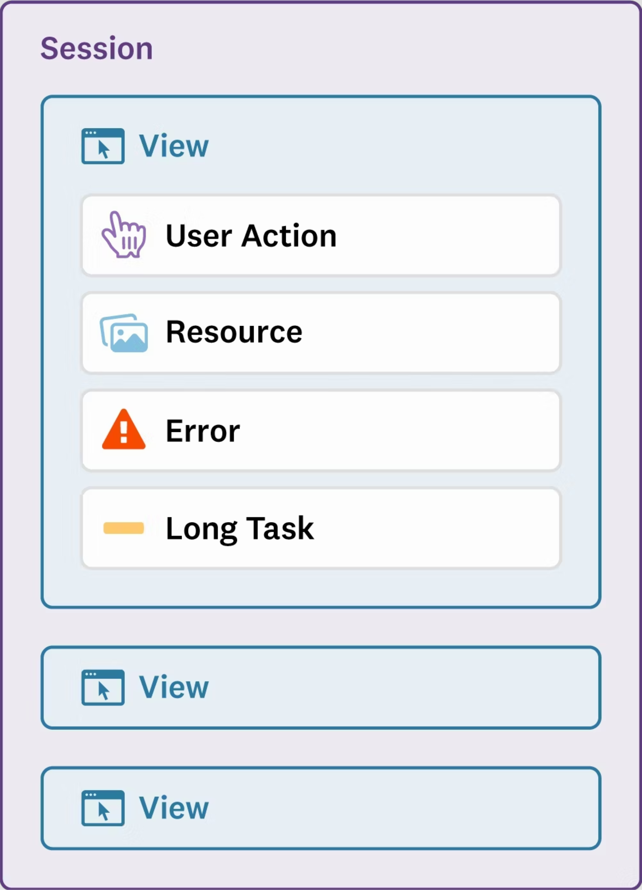

      **Session**には多くの**Views**が含まれます。**Views**には、**View**で発生した**Actions**、**Resources**、**Errors**、および/または**Long Tasks**の任意の組み合わせが含まれます。

4. Sessions Explorerでこれらのイベントタイプのいずれかをクエリできます。例えば、**Failing Resources** saved viewを再度確認してください。

      

      ここで注目すべき点がいくつかあります：
      
      - **In**フィールドに**Resources**がリストされているのは、現在リソースイベントをクエリしているためです。
      - 各リストエントリは**Resource**イベントです。
      - リスト列には、ステータスコードやURLなど、リソース固有の詳細が表示されます。

その関係にもかかわらず、各RUMイベントタイプは個別のオブジェクトです。それらが属するセッションの外でクエリできます。これにより、セッションのみを中心としない質問をすることができます：

- _「どの**view**がlong taskの発生率が最も高いですか？」_
- _「その**error**は過去1か月間にどのくらいの頻度で表示されましたか？」_
- _「**resource**のロード時間は地域によってどのように比較されますか？」_

Sessions Explorerで作業する際は、常に**In**フィールドがクエリしたいアイテムを反映していることを確認してください。このフィールドで誤ったイベントタイプを選択することは、よくある間違いです。

RUMデータのクエリ
===
    
Sessions Explorerで独自のクエリを構築して、パフォーマンスおよび/またはユーザーエクスペリエンスに関する無数の質問に答えることができます。

例えば、_「コンピュータから、電話やタブレットからStoredogにアクセスするユーザーは何人いますか？」_と疑問に思うかもしれません。これは、モバイルサイトの更新が優先事項であるかどうかを判断するのに役立ちます。

1. [Digital Experience > Real User Monitoring > Explorer](https://app.datadoghq.com/rum/sessions)に移動します。

2. **Visualize as**フィールドで、**Top List**を選択します。これにより、すぐ上に新しいオプションの行が表示されます。

3. **Group into fields**の下で、**Show**フィールドが**Count of `all sessions`**を読み取っていることを確認します。

4. **Group into fields**の下で、**by**を**`@device.type`**に更新します。

      完成したクエリとチャートは次のようになります：

      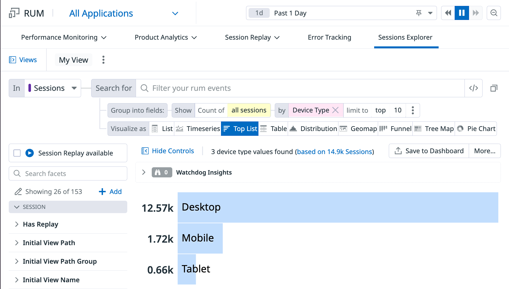

5. チャートの上にある**Save to Dashboard**と**More...**ボタンは、このクエリをさまざまな方法で保存、共有、またはエクスポートするオプションを提供します。

    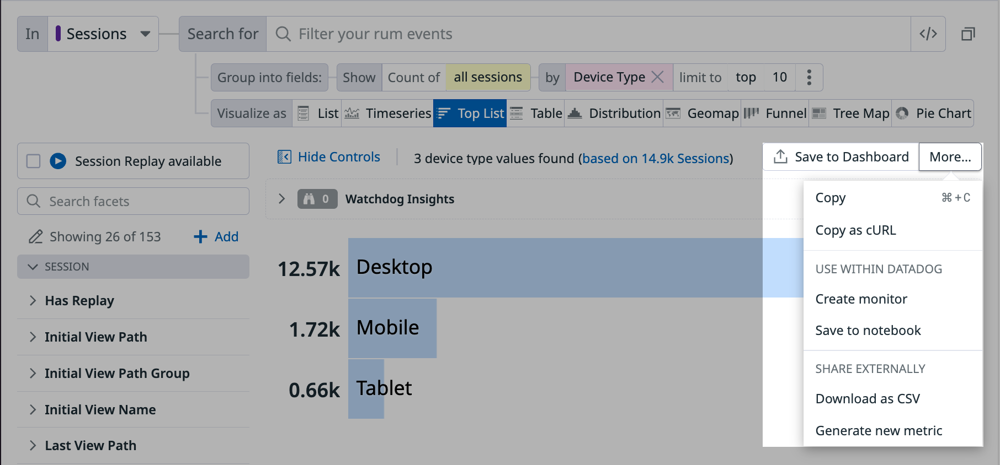

    また、このクエリをSessions ExplorerのSaved viewとして保持することもできます。

6. 左上の**Views**をクリックして、Viewsサイドバーを展開します。

7. **My view**サイドバーエントリをクリックします。

8. **My view**の下で**Save As**をクリックします。**New view**フォームが表示されます。

9. **Name**に`Sessions by Device Type`を入力し、**Save**をクリックします。

      クエリを含むビューが、**Views**サイドバーの**Sessions by Device Type**の下に保存されました。

      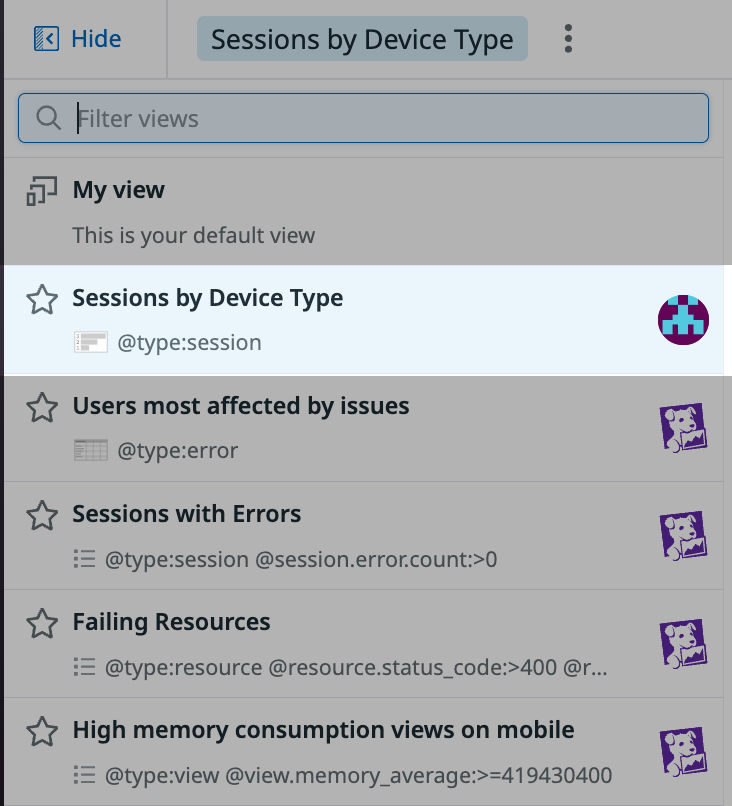

RUMデータのクエリに慣れたので、次のセクションでいくつかの実際のクエリを作成する練習をします。

さらなるクエリ練習（チャレンジ）
===

以下は、フロントエンドチームがStoredogについて持っていた質問のリストです。Sessions Explorerで、**これらの質問の_少なくとも2つ_に答えるクエリを構築してください**。

Datadogでのクエリ経験がある場合、またはチャレンジを好む場合は、独立してクエリを構築してみてください。

クエリが初めての場合、またはガイダンスを希望する場合は、各質問の下にある**Query Instructions**をクリックして手順を表示できます。

---

## 1. 異なるデバイスはStoredogでどれくらいの時間を過ごしますか？

上記で行ったように、セッション数でデバイス使用を測定することは、1つのアプローチにすぎません。デバイス使用を測定する別のアプローチを試してみてください：

**過去1日間に各デバイスタイプ（コンピュータ、タブレット、モバイル）がStoredogで費やした時間を比較してください。**

      
<strong>Query Instructions</strong>

            

                  
                        <ol>
                              <li><strong>In</strong>: Sessions </li>
                              <li><strong>Visualize as</strong>: Top List</li> 
                              <li><strong>Show</strong>: Sum of Time Spent</li>
                              <li><strong>By</strong>: Device Type</li>
                        </ol>
                  
            

            

                  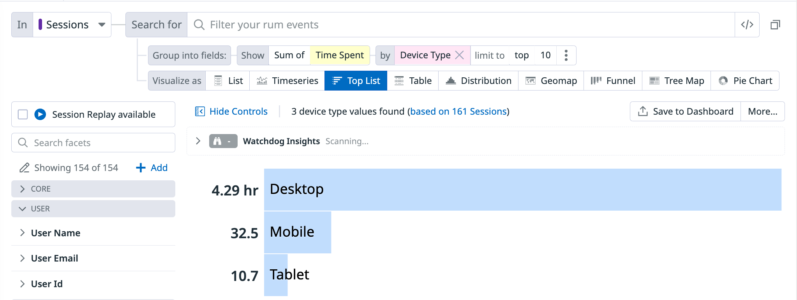
            

このデータは、過去1日間に異なるデバイスタイプがStoredogで費やした時間を示しています。これは、すべてのユーザーとセッションにわたる累積です。デスクトップがセッションの大部分を占めています。モバイルとタブレットデバイスの時間は少なくなっています。

この情報は、いくつかのことを教えてくれる可能性があります：

* モバイルとタブレットデバイスがサイトで非常に少ない時間を過ごす理由があるかどうかを確認する価値があるかもしれません。モバイル版のサイトは機能していますか？UXは許容できますか？
   
* 上記の質問への答えが「はい」の場合、このデータは、Storedogのモバイルサイトが現在最優先事項ではないことを示している可能性があります。

* 逆に、Storedogが積極的に使用を拡大しようとしている場合、このデータはモバイル使用率を増やす機会を示している可能性があります。これにより、次の四半期の会社の目標に情報を提供する可能性があります。

---

## 2. セッションあたりの平均エラー数は増加していますか、それとも減少していますか？

理想的には、すべての新しいデプロイメントでエラーの頻度が低下します。エラートレンドの測定は、デプロイメントの成功を判断する1つの方法です。試してみてください：

**Storedog `1.0.0`と`2.0.0`の間でセッションあたりの平均エラー数を比較してください。**

      
<strong>Query Instructions</strong>

            

                  
                        <ol>
                              <li><strong>In</strong>: Sessions</li>
                              <li><strong>Visualize as</strong>: Tree Map</li>
                              <li><strong>Show</strong>: Avg of Error Count</li>
                              <li><strong>By</strong>: Version</li>   
                        </ol>
                  
            

            

                  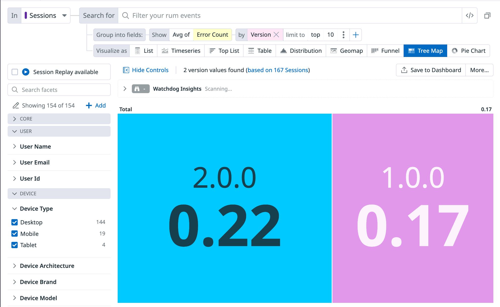
            

これは、バージョン`1.0.0`と`2.0.0`のセッションあたりの平均エラー数を定量化して比較します。このデータの使用例をいくつか示します：

* Datadogで何週間または何か月間データを収集した後、ベースラインを決定できます。つまり、任意の日にセッションあたり存在する平均エラー数です。これらの値をベースラインと比較して、エラーが通常よりも頻繁に発生しているかどうかを理解できます。

* チームがアプリの維持と改善を続けるにつれて、最近のデプロイメントがセッションあたりのエラーを減らす—またはさらには増やす—結果になるかどうかを確認できます。

---

## 3. 特定のブラウザでより多くのエラーが発生しますか？

すべてのブラウザが同じではありません。あるブラウザでエラーを引き起こすものが、別のブラウザでは常に問題を引き起こすとは限りません。ブラウザ間でUXがどのように異なるかを理解することで、すべての人に肯定的なエクスペリエンスを保証できます。

**上位10のブラウザ間でセッションあたりの平均エラー率を比較してください。**

      
<strong>Query Instructions</strong>

            

                  
                        <ol>
                              <li><strong>In</strong>: Sessions</li>
                              <li><strong>Visualize as</strong>: Pie chart</li>
                              <li><strong>Show</strong>: Avg of Error Count</li>
                              <li><strong>By</strong>: Browser Name</li>
                              <li><strong>Limit to:</strong> Top 10</li>
                        </ol>
                  
            

            

                  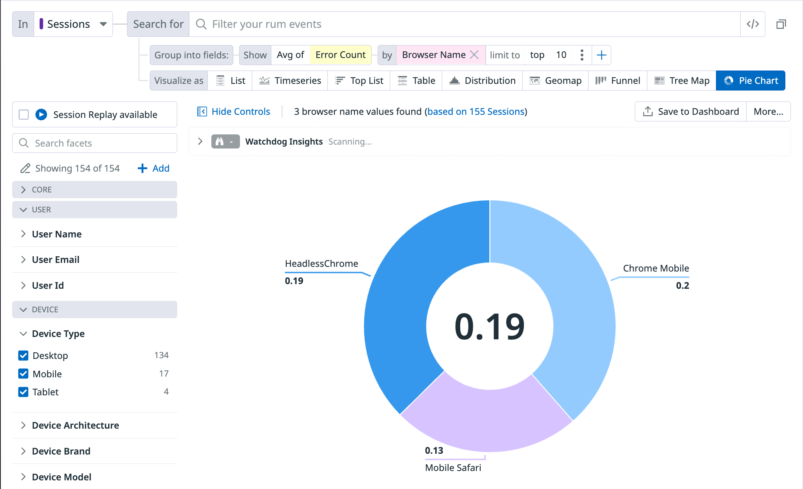
            

* この情報は、チームがすべてのブラウザでアプリケーションのパフォーマンスを一般的に監視できるように、ダッシュボードに追加するのに最適です。

* さらに、特定のエラーまたは停止のレポートを調査している場合、これは問題が特定のブラウザに分離されているかどうかを判断できます。

---

## 4. どのブラウザでリソースのロードが最も遅いですか？時間の経過とともにこれはどのように変化しますか？

Storedogがすべてのブラウザで同じようにパフォーマンスしないことがわかっています。時間の経過とともにブラウザ間のパフォーマンスを比較することで、これらの違いをよりよく理解してみてください。

具体的には、**過去1日間に異なるブラウザでリソースのロード（`Resource Duration`）にかかる平均時間を比較してください。**

> [!NOTE]
> クエリがデータを返さない場合は、Sessions Explorerページを更新してみてください。それでもデータが表示されない場合は、以下の**Query Instructions**を展開して、クエリが推奨されるソリューションと一致していることを確認してください。

      
<strong>Query Instructions</strong>

            

                  
                        <ol>  
                              <li><strong>In</strong>: Resources</li>
                              <li><strong>Visualize as</strong>: Timeseries</li>
                              <li><strong>Show</strong>: Avg of Resource Duration</li>
                              <li><strong>By</strong>: Browser Name</li>
                        </ol>
                  
            

            

                  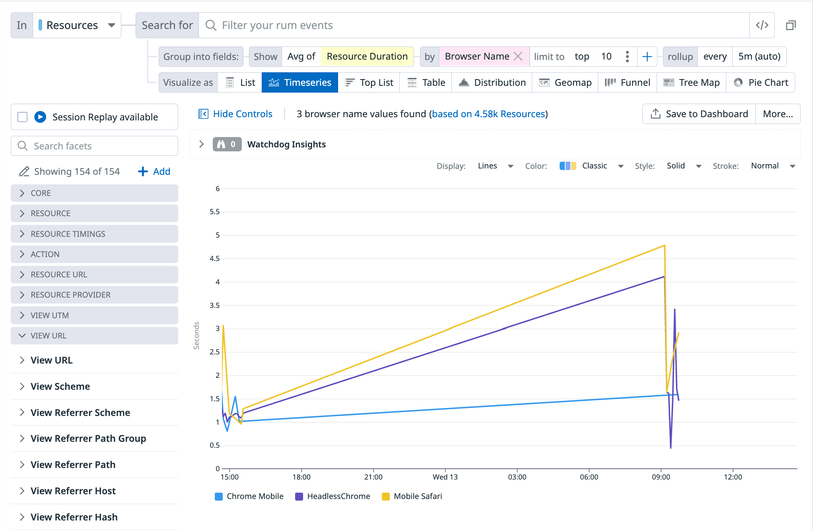
            

* 上記のクエリと同様に、このデータはチームがすべてのブラウザでアプリケーションのパフォーマンスを監視するのに役立ちます。

* さらに、これにより、リソースロード時間の突然の変化、または他の関連する問題が、単一のブラウザに分離されているかどうかを判断できます。

---

## 5. どのユーザーが最も多くのエラーに遭遇しましたか？

数週間前、RUMを導入する前に、Storedogはバグを経験しました。少数のユーザーのみが遭遇しましたが、その小さなグループは_大量の_エラーに対処し、ひどいエクスペリエンスを持っていました。

マーケティングはこれらのユーザーにクーポンを送信したかったのですが、影響を受けたアカウントを見つけることができませんでした。RUMがあるので、最近最も多くのエラーを経験したアカウントを特定できるかどうか疑問に思います。

**過去1日間に最も多くのエラーを受け取った25のユーザーアカウントのメールアドレスを見つけてください。**

      
<strong>Query Instructions</strong>

            

                  
                        <ol>
                              <li><strong>In</strong>: Errors</li>
                              <li><strong>Visualize as</strong>: Top List</li>
                              <li><strong>Show</strong>: Count of all errors</li>
                              <li><strong>By</strong>: User Email</li>
                              <li><strong>Limit to</strong>: Top 25</li>
                        </ol>
                  
            

            

                  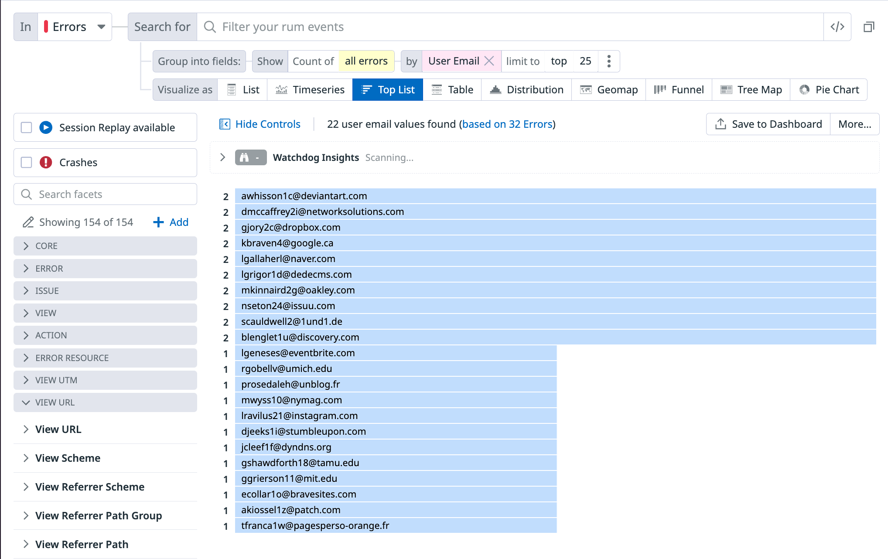
            

 

---

## 6. ホームと検索以外で、どのページが最も多くのビューを取得しますか？

StoredogのMarketingチームは、オンラインストアのトラフィックパターンに興味を持っています。

**ホーム（`/`）と検索（`/search`）以外で、最も多くのビューを受け取るページを特定し、時間の経過とともにこれがどのように変化するかを比較してください。**

_**ヒント:** 特定のビュー名をクエリから除外するには、Sessions Explorerの**Search for**フィールドを使用します。_

      
<strong>Query Instructions</strong>

            

                  
                        <ol>
                              <li><strong>In</strong>: Views</li>
                              <li><strong>Visualize as</strong>: Timeseries</li>
                              <li><strong>Show</strong>: Count of all views</li>
                              <li><strong>By</strong>: View Name</li>
                              <li><strong>Search for</strong>: <code>-@view.name:"/" -@view.name:"/search"</code></li>
                        </ol>
                  
            

            

                  
            

* Marketingにとって、このデータは、どのタイプの製品が最も関心を集めているか、サイトのどのエリアが最も有望な数の広告インプレッションを提供するか、または最近のバイラルマーケティングキャンペーンの影響を知らせる可能性があります。

* ユーザーエクスペリエンスの観点から、これはアプリを通じた一般的なユーザージャーニーを示すのに役立ち、それらを改善または変更する試みに情報を提供します。

まとめ
===

トレンド、洞察、一般的な質問への回答を表示するクエリを作成できるようになったので、実際の問題を解決する準備が整いました。

次のセクションでは、RUMを使用して、緊急のフロントエンドの問題を特定、調査、解決します。

**Next**をクリックして進みます。

