---

さらにRUM機能を探索しようとしているときに、一連の通知を受け取ります。

**StoredogのSupportチームは、顧客からの苦情の洪水を受けています。**ユーザーは、チェックアウトプロセスを完了できないと主張しています。

これらの動揺した顧客は、すべて同様のエクスペリエンスを説明しています：

* チェックアウトプロセスを完了しようとします
* チェックアウトの最後のステップ中に何かが「壊れる」または「フリーズする」
* 成功メッセージを受け取らず、注文が送信されたかどうかがわかりません
* 支払い情報を入力したため、請求されたかどうかも不明です

新たな緊急性を持って、この問題を調査するためにRUMの探索を続けます。

問題の調査
===

問題の範囲、影響、原因について、あなたの頭には質問が巡ります：

- _「この問題に至るまでに何が起こったのですか？」_
- _「関連するエラーメッセージはありますか？」_
- _「これはすべてのユーザーに影響していますか、それとも特定のサブセットのみですか？後者の場合、このサブセットは何が異なりますか？」_
- _「最後のデプロイメントはいつでしたか？」_

これらの質問に答えるために、RUMの**Performance Summary**から始めます。

**[Digital Experience > Real User Monitoring > Summary](https://app.datadoghq.com/rum/performance-monitoring)**に移動します。この中央ハブは、一般的なフロントエンドの懸念事項に対する一目でわかる詳細を提供します。

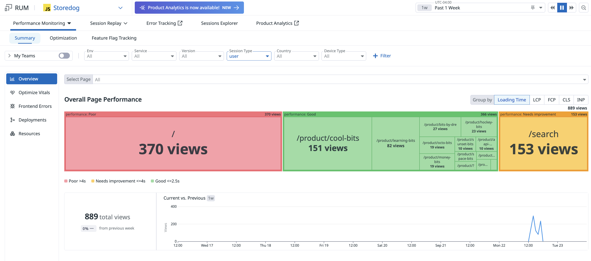

## Errors

下にスクロールして、**Debug Frontend Errors**セクションのチャートを確認します。

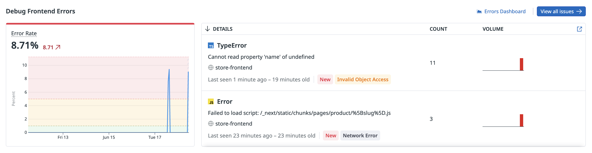

各エラーの**Error Rate**と**Count**が非常に高いことに気づきます。

これは、問題が多くのユーザーに影響していることを示唆しており、少数の人に分離されて**_いない_**ことを示しています。エラー率については、まもなく調査します。

## Deployments

注意を**Track Deployments**セクションに向けます。

すでに気づいたかもしれませんが、以前に探索したセッションはStoredog `1.0.0`を使用していました。最初のラボセクションからのこのセッションのように：

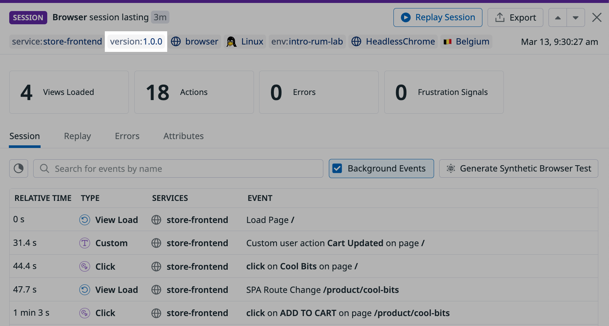

ただし、Deploymentチャートでここで確認できるように、**_Storedog `2.0.0`がその後デプロイされました_**：

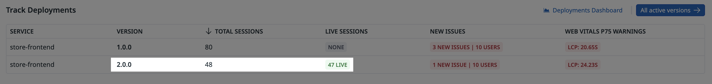

新しいデプロイメントには新しいコードが含まれ...バグの新しい機会が含まれます。これは、問題がどこで発生したかを説明できる可能性があります。

次に、Deploymentデータをさらに詳細に探索します。

Deploymentsの追跡
===

1. **Track Deployments**セクションには、2つのデプロイメントがあります：`1.0.0`と`2.0.0`。

    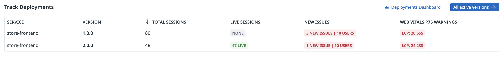

2. `2.0.0`のエントリを検査します。**New Issue**ラベルに注目してください。

    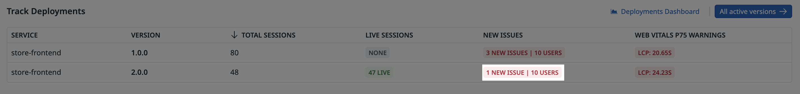

    これは、RUMが`2.0.0`で`1.0.0`では観察され_なかった_エラーを検出したことを意味し、**`2.0.0`デプロイメントが問題を導入したことを確認します**。

3. `2.0.0`リストエントリをクリックして詳細を開きます。

    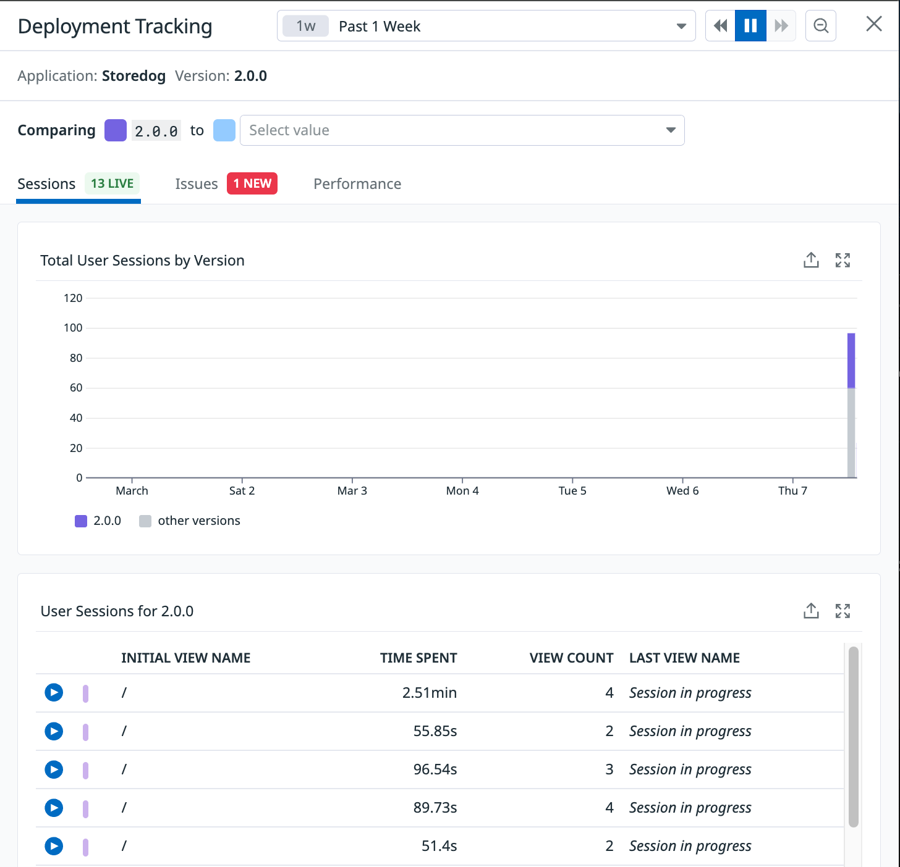

    1. 上部のチャートを使用すると、選択したバージョン（`2.0.0`）を他のRUM追跡バージョンと比較できます。
   
    2. ドロップダウンから`1.0.0`を選択して、時間の経過に伴うバージョン別の合計user sessionsを確認します。ユーザーの増加率が`2.0.0`にいることがわかります。

    3. 右上で、**Past 1 week**と書かれているフィールドを見つけます。これを**Past 1 Day**や**Past 4 hours**などのより小さい時間範囲に変更します。

4. 上部近くの**Issues**タブを開きます。

    これには、2つの異なるバージョン間のエラー数、率、詳細を比較するチャートが含まれています。

    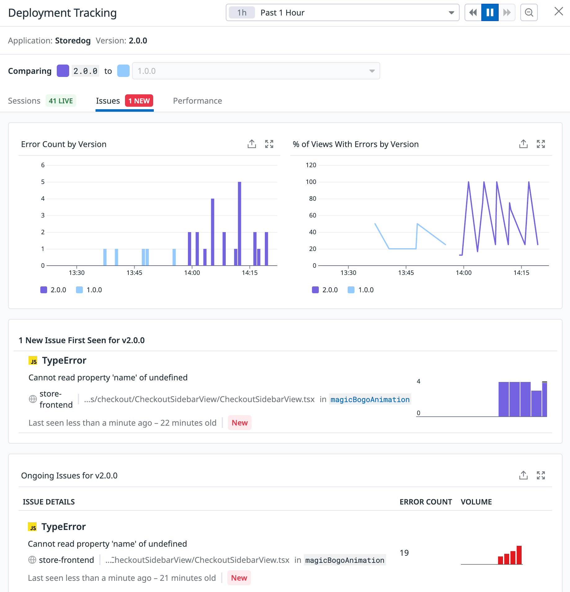

5. 下部近くの2つのリストを確認します：`2.0.0`で最初に見られた問題と、`2.0.0`で進行中の問題。`Cannot read property 'name' of undefined`の問題が両方にあることに注目してください。
    
    この問題の経過時間が顧客の苦情のタイミングと一致していることに気づきます。**これがユーザーが経験している問題である可能性があると疑います。**原因を特定して修正をリリースする前に、問題の範囲と影響を理解するために調査を続けます。

6. **1 New Issue First Seen for v2.0.0**の下で、`Cannot read property 'name' of undefined`の問題をクリックします。このエラーの詳細がRUM Error Trackingで開きます。

Errorsの追跡
===

類似のエラーが複数回発生した場合、RUMはインスタンスを**issue**にグループ化します。issueは、その影響、範囲、頻度、および発生時刻を特定および追跡できる中央の情報源として機能します。これにより、コンテキストとツールの間で切り替えたり、手動でデータを相関させたりする必要がなくなります。また、ノイズを減らすこともできます。

前のステップの後、Error Tracking詳細ページが表示されるはずです：

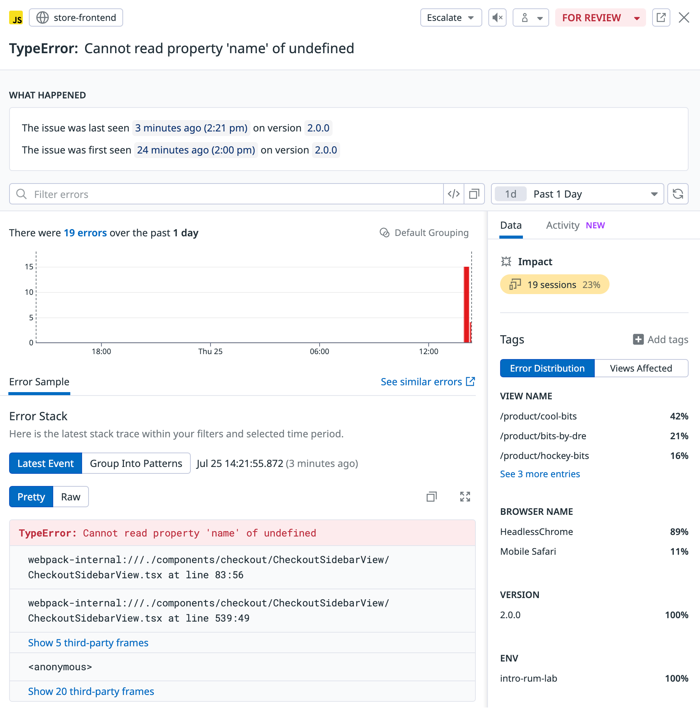

1. **What Happened**を確認して、問題のタイムラインを理解します。

    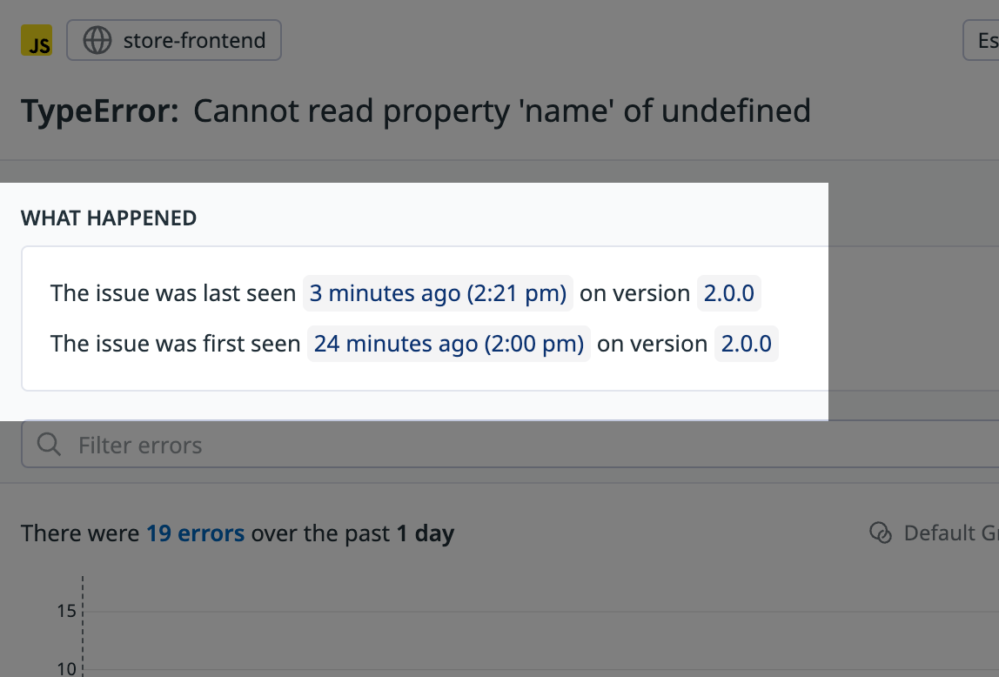

    RUMが最初にこの問題を`2.0.0`で記録したことがわかります。

2. **What Happened**の下には、発生のチャートがあります。問題が最近、Supportが苦情を受けた頃に始まったことがわかります。

    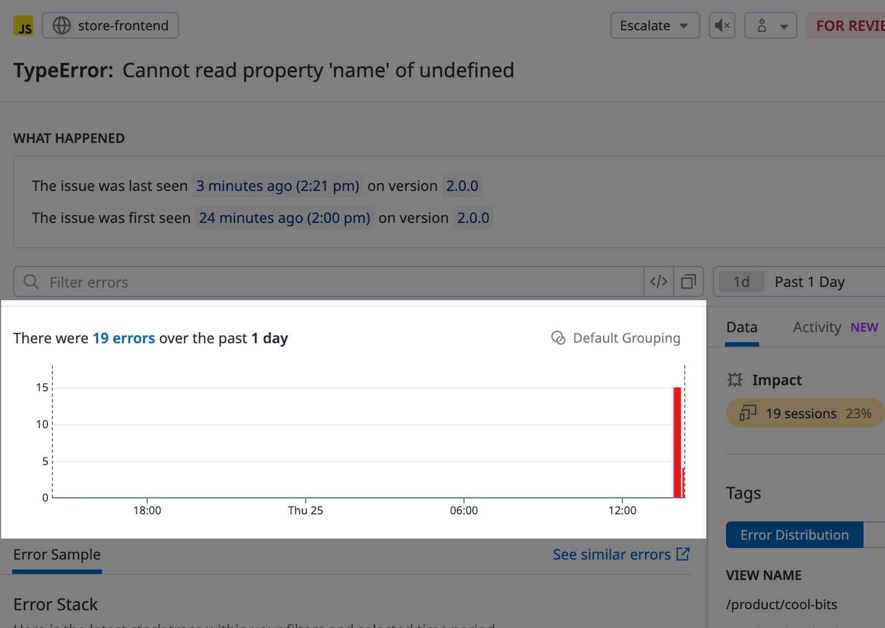

    サイドバーには、追加の一目でわかる詳細が含まれています：

      * **Impact**は範囲と重大度を伝えます。この問題は、全セッションの注目すべき数に影響しています。

      * **Tags**はRUMによって自動的に追加されます。これらのタグには、**View Name**、**Browser Name**、およびその他の関連属性が含まれます。独自のタグを追加することもできます。

           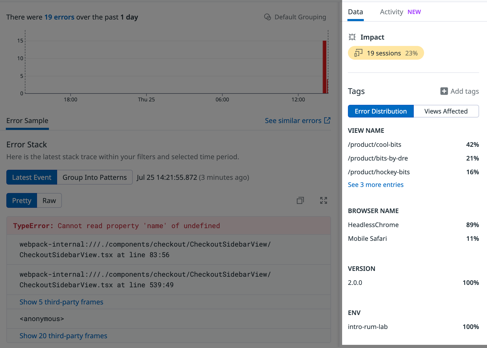

    エラーのあるセッションの大部分はChromeですが、問題はChromeに_限定_されていないことに気づきます。これは、より多くのユーザーがChromeを介してStoredogにアクセスしているためである可能性があります。

    エラーの概要がわかったので、イベントとアクションのシーケンスでエラーを見つけて、その原因に近づくことで、さらに調査できます。

コンテキスト内でissueを表示
===

エラーの直前と直後に何が起こったかを確認したいと思います。これにより、エラーがどのように現れるか、および他のフロントエンドプロセスとの関係が示されます。

1. エラー詳細ページの**Session Timeline**セクションまでスクロールします。**View more**をクリックして、このエラーを含むセッションのビュー、アクション、エラーの拡張リストを表示します。

    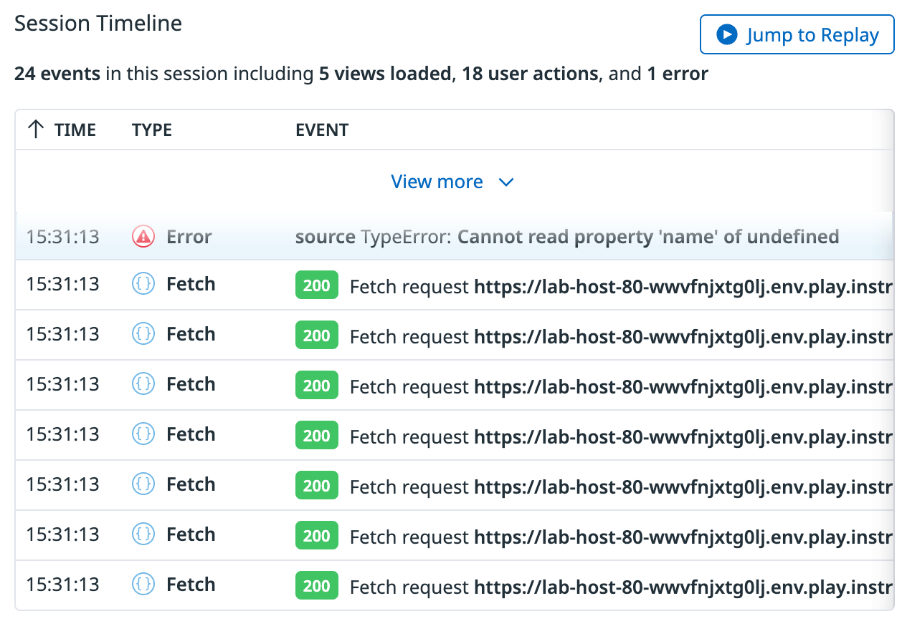

2. Session Timelineリストで、エラーの直前にユーザーが**Proceed to Checkout**をクリックしていることがわかります。

    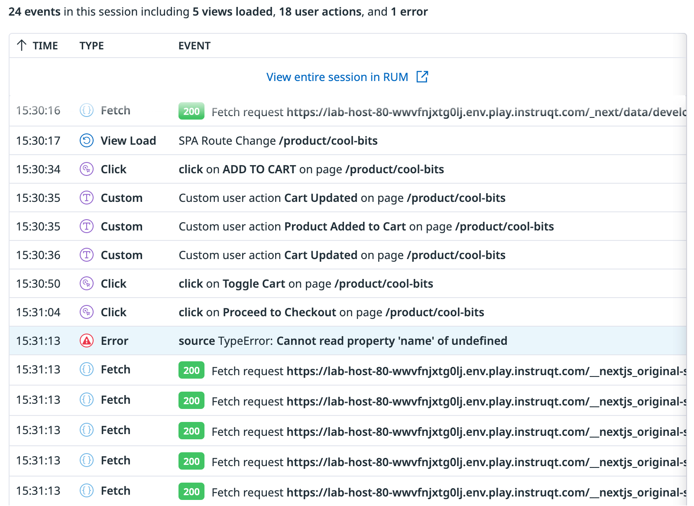

    次に、この問題がユーザーに対して_正確に_どのように現れるかを確認したいと思います。これにより、より深いコンテキストが提供され、これがユーザーが説明する問題であることを確認し、追加の手がかりを提供する可能性があります。

3. **Jump to Replay**をクリックして、RUM Session Replayに移動します。

Session Replayでの問題の再現
===

Session ReplayはRUMセッションデータを、実際のユーザーのエクスペリエンスのマルチメディア再現で補完します。

セッションに関連付けられたリプレイがある場合、あたかも隣に座っているかのように、ユーザーが見て行ったことの_正確な_再現を見ることができます。

これにより、エラーをより迅速に、より多くのコンテキストで特定、再現、解決できます。リプレイで描かれた使用パターンと設計の落とし穴も、開発に情報を提供できます。

前のステップの後、エラーを含むセッションのSession Replayが表示されます。

Session Replayプレーヤーは左側にあり、記録されたイベントのリストは右側にあります。

ここからissueページに移動したため、エラーが発生した瞬間がすでにプレーヤーにキューイングされており、イベントがリストで強調表示されています。

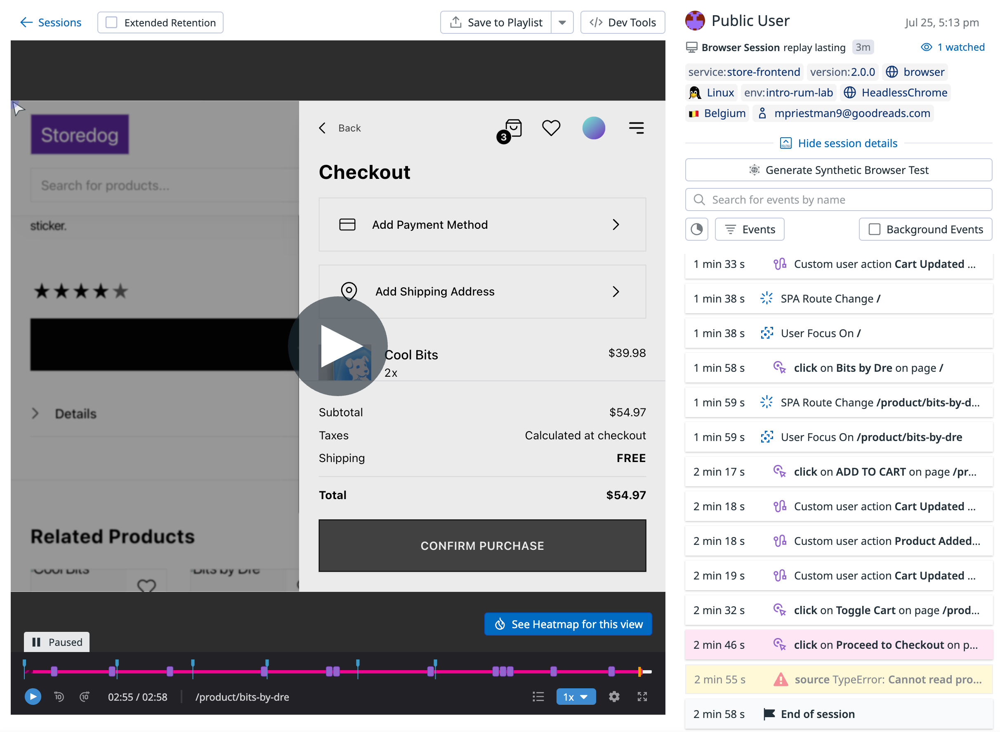

プレーヤーとリストは同期しています。プレーヤーで描かれているイベントは、リストで強調表示されます。試してみてください：

1. **Play**をクリックしてセッションの視聴を開始します。次の機能とオプションに注目してください：

    1. プレーヤーに表示されると、リスト内のイベントが強調表示されます。

    2. 任意のイベントをクリックして、プレーヤーを発生した瞬間に移動します。

    3. イベントにカーソルを合わせると、_Details_リンクが表示されます。これをクリックして、そのイベントのパフォーマンス詳細を開きます。

    4. 関心のある領域は、プレーヤーの進行状況バーに垂直の青い線でマークされています。これらにカーソルを合わせて詳細を確認します。クリックして、リプレイのその部分を視聴します。

2. エラーが表示されるまでSession Replayを視聴します（オプションで再視聴します）。イベントリストは、これがいつ起こるかを特定するのに役立ちます。

3. エラーはどのように見えましたか？何に気づきましたか？

    最初は微妙ですが、ユーザーがカートにいくつかのアイテムを追加し、チェックアウトを開始するのを観察します。

    ただし、**_Confirm Checkout_を複数回クリックしても何も起こりません**。注文を送信できず、ページを離れてセッションを終了します。

    RUMはこの時点で`source TypeError: Cannot read property 'name' of undefined`エラーを記録しますが、ユーザーは必ずしもこれを見るわけではありません。

これは、以前にサポートから提供された説明と一致します。**これが問題の質問であることを確認しました。**これで、原因の特定に向けて取り組むことができます。

      
<strong><em>オプション: Session Replayはどのように機能しますか？</strong>Session Replayについて詳しく学ぶには、このオプションのセクションを展開してください。</em>

        

            Session Replay RecorderはRUM Browser SDKの一部です。ページ上のイベントをテールして記録し、DOMとCSSのスナップショットを取得します。レコーダーは、DOM変更、マウス移動など、標準RUMデータよりも詳細な詳細をキャプチャします。
        

        

            次に、Datadogは該当するページを再構築し、適切な時間と間隔でイベントを再現します。これにより、エンドユーザーのビデオ録画ではないにもかかわらず、ユーザーセッションのビデオのような再現が得られます。
        

        

            設定中に、サンプリングレートを定義して、Session Replayを持つセッションの数を決定できます。機密性の高いユーザーの詳細または入力を難読化することもできます。
        

        

            Session Replayの詳細については、このコースの最後に提供されます。
        

Errorスタックトレースとイベント
===

Session TimelineとSession Replayを確認した後、エラーがどのように見えるか、ユーザーエクスペリエンスにどのように影響するか、発生するコンテキストを確認しました。

これで、最終的にソリューションに情報を提供する根本原因の特定を開始できます。

1. Session Replayから、RUM Error Trackingのissueのエントリに戻ります：

    イベントリストのエラーにカーソルを合わせると、**Details**ボタンが表示されます。

    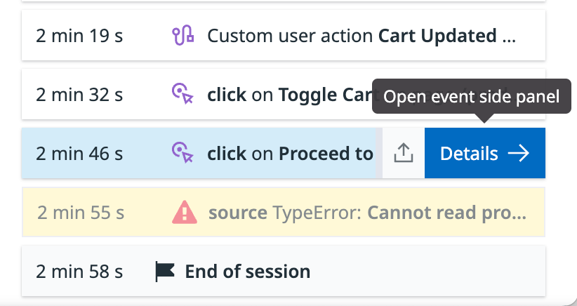

2. **Details**をクリックして、イベントサイドパネルを開きます。
3. パネルの右側で、**View in Error Tracking**リンクをクリックして、RUM Error Trackingのissue詳細ページに移動します。

    

4. このページのいくつかの部分はすでに確認しました。今回は、エラー発生のチャートの下にある**Error Stack**セクションを見つけます。

    このセクションには、エラーの記録されたインスタンスに含まれるメッセージが含まれています。表示には2つのオプションがあります：

    1. **Event**は、エラーの最近キャプチャされたインスタンスからのメッセージを表示します。

        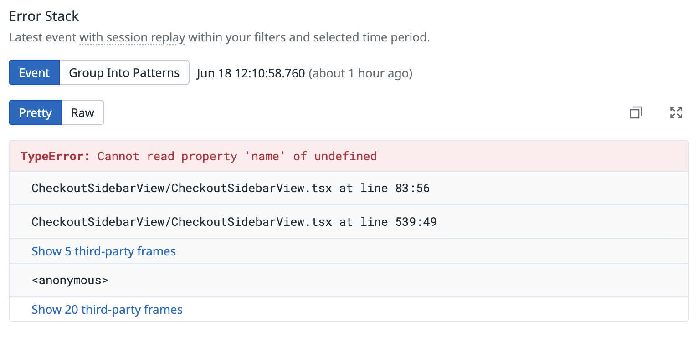

    2. **Group into Patterns**は、すべての一致するエラーメッセージを統合し、一意のメッセージまたは形式ごとに1つのエントリを表示します。**このオプションを選択してください。**

        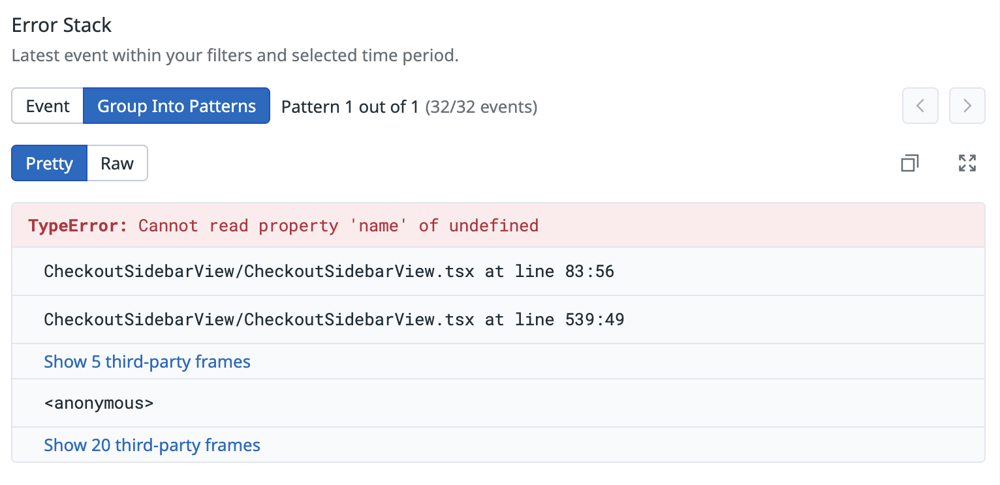

        `Pattern 1 out of 1`で示される1つのパターンのみが表示されます。これは、すべてのエラーメッセージがほぼ同一であることを意味します。

5. 次に、関連付けられたスタックトレースの詳細を確認します。特定のコードが言及されていることに注目してください。これが問題の正確な場所である可能性があります。

    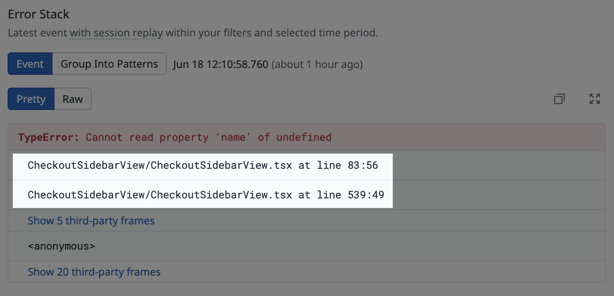

6. 上部の**IDE**タブを開き、**frontend/ CheckoutSidebarView.tsx**に移動します。

7. エラーメッセージには`Cannot read property 'name' of undefined`と書かれていました。Macで`Cmd + F`、Windowsで`Ctrl + F`を押して`name`を検索します。

    これにより、112行目付近の次のコードに導かれます：

    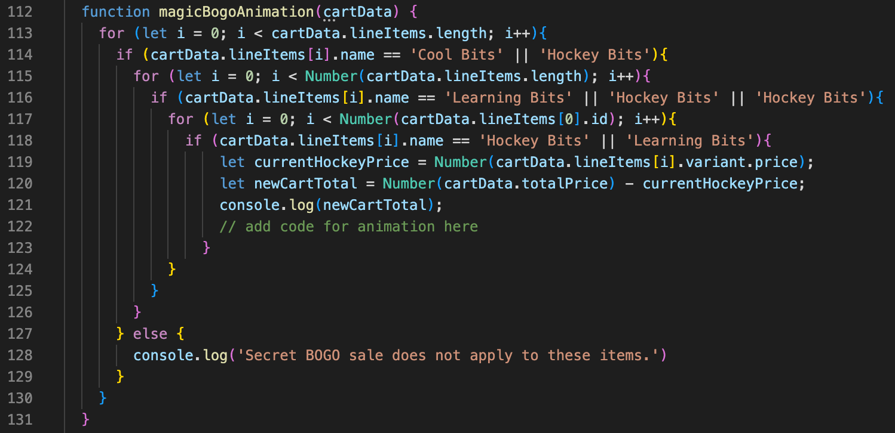

何かが_非常に_間違っていることがわかります。このコードは不完全で、不十分に書かれています。機能するとさえ思えません。**これは間違いなくエラーの原因です。**

これは`2.0.0`デプロイメントで追加されたはずです。チームに調査結果を持ち帰って、これがどのように起こったかを判断し、修正に取り組み始めます。

まとめ
===

Session Replay、Error Tracking、Deployment Trackingの詳細を確認した後、エラーを特定できました。

**Next**をクリックして修正をデプロイし、このアクティビティの最終セクションに進みます。

