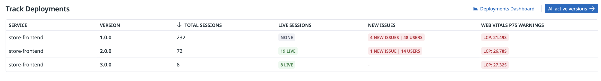
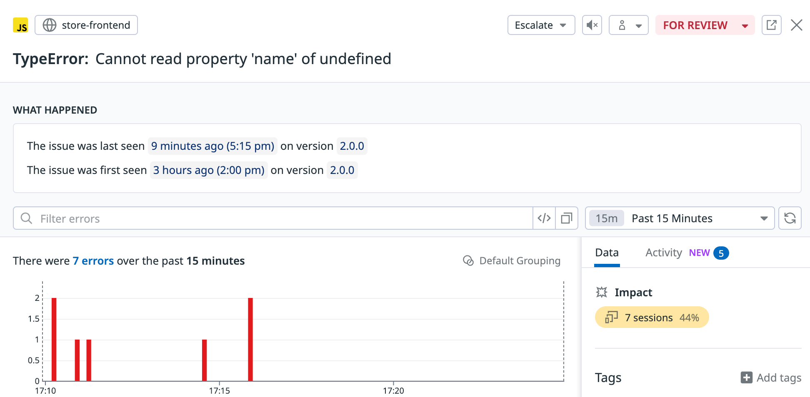
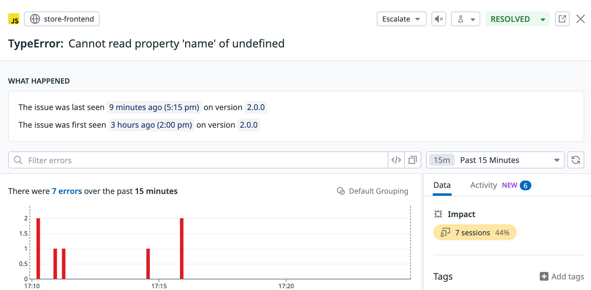

---

エラーが始まってから数時間が経ちました。チームメートと協議して修正を作成し、これがどのように起こったかを判断しました。ストーリーは次のとおりです：

Storedogの最初の有給インターンシップが数週間前に始まりました。

Marketingは「シークレットセール」のアイデアも探っています。これらのイベントは、選択したチャネルで静かに発表されます。セール中に、対象アイテムがチェックアウト時にカートにある場合、サプライズアニメーションが価格を更新します。

インターンは、概念実証アニメーションを作成するよう求められました。しかし、必要なサポートとガイダンスを受けませんでした。`CheckoutSidebarView.tsx`で見られる彼らの試みは失敗しました。

さらに悪いことに、インターンにStoredogリポジトリへのアクセスを許可する前に、必須のPRレビューやその他のセーフガードを実装した人はいませんでした。壊れたコードが誤って`main`にプッシュされ、デプロイメントがトリガーされました。

しかし、初心者として自分が犯した間違いを振り返り、インターンに共感します。間違いは学習プロセスの一部です。それらの間違いがプロダクションに入らないようにすることは、より上級の開発者の責任です。

あなたは次のことを計画しています：

- エラーが解決されたことを確認します。
- `main`にプッシュされるコードのPRレビュープロセスを実装します。
- インターンが毎日1対1のサポートを受けられるようにスケジュールを作成します。

RUMデータの回復
===

このアクティビティの最終セクションがロードされている間に、エラーを修正するためにStoredogの更新バージョンがデプロイされました。RUMデータを確認して、問題が解決されたことを確認できます：

1. **オプション**: IDEで、**frontend/CheckoutSidebarView.tsx**を開いて、更新されたコードを確認します。問題のあるアニメーション関数はもう存在しません。

2. **[Digital Experience > Real User Monitoring > Summary](https://app.datadoghq.com/rum/performance-monitoring)**に移動します。

3. **Deployments**の下に、3つのデプロイメントがあることに注目してください。`3.0.0`は、チームがデプロイしたばかりの修正です。

    

    > [!NOTE]
    > 3番目のデプロイメントが表示されない場合は、少し待ってからページを更新してください。新しいデプロイメントデータが入力されるまでに数分かかることがあります。

4. ページの上部で、**Error Tracking**をクリックして、追跡されたすべてのissueのリストを表示します。

    

    `Cannot read property 'name of undefined`エラーをクリックして、その詳細を開きます。

5. **What Happened**と**Total Errors by Version**の両方で、エラーのインスタンスが減少していることを確認します。

    サイドバーの上で、**Past 24 hours**と書かれている期間セレクタを**Past 15 minutes**に変更します。

    

    バージョン`3.0.0`で問題のあるコードを削除して以来、エラーのインスタンスは記録されていません。**問題が対処されたことを確信しています**。

6. パネルの上部で、**FOR REVIEW**と書かれた赤いドロップダウンを見つけます。

7. これをクリックして、**RESOLVED**を選択し、issueがもはやアクティブな懸念事項ではないことを示します。

    

ふう、問題を正常に特定して解決することができました。Storedogの通常レベルのパフォーマンスが現在復元されています。お疲れ様でした！

まとめ
===

このハンズオンのシナリオベースのアクティビティを通じて、次の方法を学習しました：

- デプロイメント間のパフォーマンスと使用を比較して、変更の影響を測定する
- エラー関連データを追跡および相関させることで、バグを追跡する時間を節約する
- ユーザーセッションの視覚的な再現を使用して、ユーザーがアプリとどのようにやり取りするかを確認する
- フロントエンドテレメトリーのトレンドと洞察を明らかにすることで、データ駆動型の意思決定を行う

**Next**をクリックしてラボを完了します。次に、**Mark Lesson Complete & Continue**をクリックしてください。

